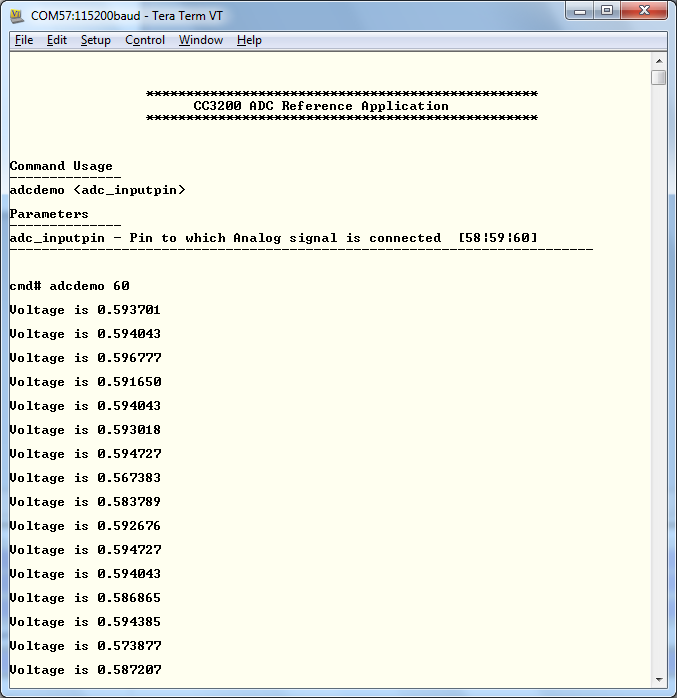

# Overview

The ADC peripheral converts a continuous analog voltage to a discrete
digital number. The CC3200 device includes ADC modules with four input
channels. Each ADC module features 12-bit conversion resolution for the
four input channels. It supports a sampling rate of 16 μs per channel.

# Application details

This application is a reference for usage of ADC DriverLib functions on
CC3200. Developers can refer to this simple application and re-use
the functions in their applications.

**adcdemo**: This command allows the user to exercise the ADC functionality
on CC3200. The command needs one parameter **<adc_inputpin>**. <adc_inputpin> is the pin to which analog signal is connected. This can 58, 59, or 60.
(Pin 57 can also be used for the ADC, but this example uses this pin by default for UART RX.)

Setup of signal generator for generating analog signal:

  - **Waveform** - Select any suitable waveform (sine, square, ramp)
  - **Input Frequency** - As ADC reaches nyquist rate at 31250 Hz, the input frequency should be between 50 Hz and 30 KHz.
  - **Input Amplitude** - Low level should be greater than 5 mV and high level should be less than 1.45 V.
  
  **Note** - If there is an output termination impedance setting on the signal/function generator, change it to infinite/High Z

## Source Files briefly explained

- **main.c** - The main file that contains the core-logic for analog to digital conversion. The functions in the file uses DriverLib calls to perform analog to digital conversion.
- **adc\_userinput.c** - The function in the file reads the input from the user, parses the input string and feed the core-logic functions in the main.c
- **pinmux.c** - UART0 pins are brought out in this file
- **startup\_\*.c** - Initialize vector table and IDE related functions
- **uart\_if.c** - Functions to display information over UART

# Usage

1.  Setup a serial communication application. Open a serial terminal on a PC with the following settings:
	- **Port: ** Enumerated COM port
	- **Baud rate: ** 115200
	- **Data: ** 8 bit
	- **Parity: ** None
	- **Stop: ** 1 bit
	- **Flow control: ** None
2.  Run the reference application.
      - Open the project in CCS/IAR. Build the application and debug to load to the device, or flash the binary using [UniFlash](http://processors.wiki.ti.com/index.php/CC3100_%26_CC3200_UniFlash_Quick_Start_Guide).
3.  A prompt will appear on the terminal. Enter the **adcdemo** command with your chosen input pin as shown above.

  

## Limitations/Known Issues
