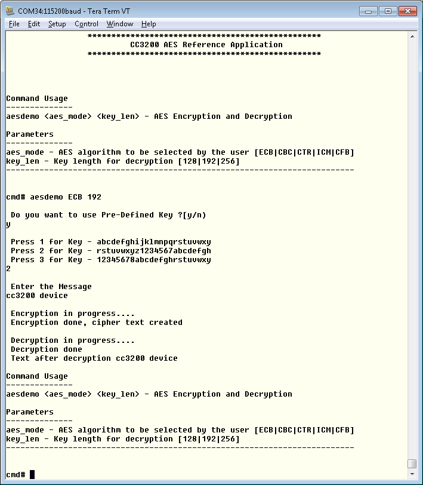

# Overview  

The Advanced Encryption Standard (AES) security modules provide
hardware-accelerated data encryption and decryption operations based on
a binary key. The AES is a symmetric cipher module that supports a 128-,
192-, or 256-bit key in hardware for both encryption and decryption. The
AES module is based on a symmetric algorithm, meaning that the
encryption and decryption keys are identical. To encrypt data means to
convert it from plain text to an unintelligible form called cipher text.
Decrypting cipher text converts previously encrypted data back to its
original plain text form.

# Application details  

This application is a reference to usage of AES DriverLib functions on
CC3200. Developers can refer to this simple application and re-use
the functions in their applications.

**aesdemo**: This command allows the user to exercise the AES functionality on CC3200. The command needs two parameters:

- **aes-mode** - Select an AES algorithm. The value can be ECB, CBC, CTR, ICM, or CFB.
- **key-len** -  Key length. The value can be 128, 192, or 256.

User will be prompted for inputs for key and plain text input. User can also undefine `USER_INPUT` in main.c to use the default test vectors for debugging (`psAESCBCTestVectors` in main.c).

## Source Files briefly explained

  - **main.c** - The main file that contains the core-logic for
    encryption and decryption. The functions in the file uses DriverLib
    calls to perform encryption and decryption.

**<u>Supporting files</u>**

  - **aes\_userinput.c** - This file is used in the USER-INPUT mode. The
    function in the file reads the input from the user, parses the input
    string and feed the core-logic functions in the aes\_main.c
  - **pinmux.c** - UART0 pins are brought out in this file.
  - **startup\_\*.c** - Initialize vector table and IDE related functions
  - **uart\_if.c** - Functions to display information on UART  

# Usage  

1.  Setup a serial communication application. Open a serial terminal on a PC with the following settings:
	- **Port: ** Enumerated COM port
	- **Baud rate: ** 115200
	- **Data: ** 8 bit
	- **Parity: ** None
	- **Stop: ** 1 bit
	- **Flow control: ** None
2.  Run the reference application.
      - Open the project in CCS/IAR. Build the application and debug to load to the device, or flash the binary using [UniFlash](http://processors.wiki.ti.com/index.php/CC3100_%26_CC3200_UniFlash_Quick_Start_Guide).
3.  A prompt will appear on the terminal. Enter the **aesdemo** command with your chosen inputs as shown above.

  

## Limitations/Known Issues
