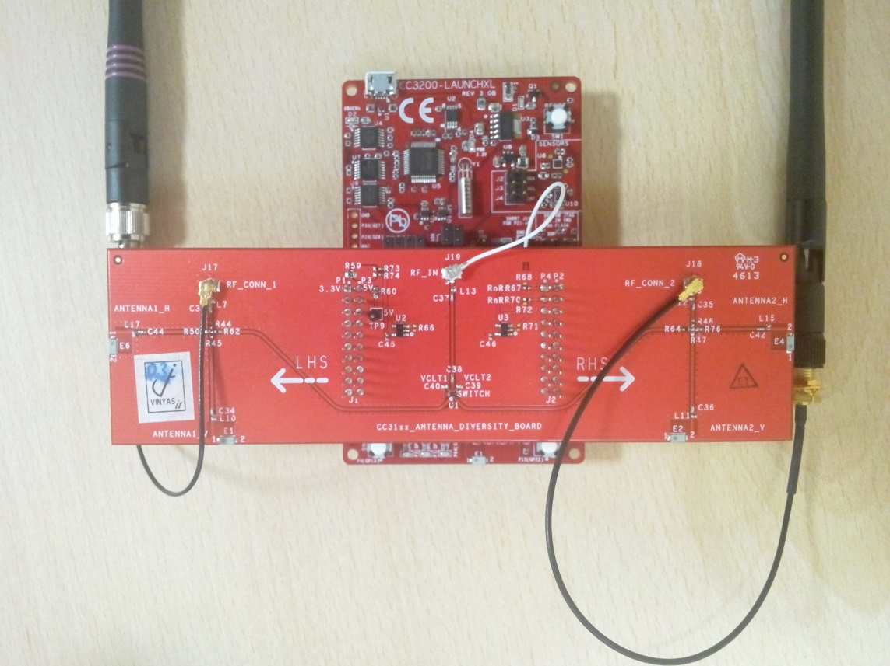

# Overview

Antenna selection is a method by which user can configure the WLAN
RF Antenna on the CC3200 device from a browser. The CC3200 device scans
the Access Points with 2 different antennas, stores the SSID and RSSI
information in the memory, and creates an HTML page. Users can open the
HTML page from their browser and select the antenna to configure. Users can also check the connection to the Access Point using the selected antenna.

## Prerequisites

  - SimpleLink Wi-Fi Antenna Selection BoosterPack ([CC3ANTENNABOOST](http://www.ti.com/tool/CC3ANTENNABOOST))

# Application details

## Program Flow

1.  Select Antenna 1
2.  Scans and Stores AP information
3.  Select Antenna 2
4.  Scans and Stores AP information
5.  Handles HTTP GET request to provide AP List
6.  Handles HTTP POST request to receive command to connect to AP with the selected antenna
7.  Connect to the selected AP

## Source Files briefly explained

- **main.c**: Select antenna, complete scans, and host internal HTTP server
- **startup\_\*.c** - Initialize vector table and IDE related functions

**Note:** This example uses TI-RTOS by default. The **ti\_rtos\_config** project  must be imported into the CCS workspace. This projects can be found in the **cc3200\_sdk/ti\_rtos** folder.

# Usage

1. Flash example user files (HTML, images, js) and pre-built application binary to CC3200 serial flash.
	- Start UniFlash for CC3100/CC3200. Open USF session file at **cc3200\_sdk\\example\\antenna\_selection\\html\\antenna\_selection.usf**
	- Set SOP jumper to SOP-2 position for flashing.
	- Select **Program**. 
2. Run the reference application.
	- Remove the SOP jumper and reset the LaunchPad to start the application **or**
    - Open the project in CCS/IAR. Build the application and debug to load to the device.
3. The CC3200 first starts up in Station mode and scans for visible Access Points. Next, the network processor restarts and starts in AP mode (Default SSID: mysimplelink-<MAC address\>). Connect a smartphone or PC to this AP.
4. Type "mysimplelink.net\\main.html" in a browser to open the Main HTML page hosted by the CC3200.
5. Select **Antenna Selection** to open the Antenna Selection page. You can also navigate to "mysimplelink.net\\antenna_selection.html" directly.
6. The Antenna Selection page displays the list of Access Point SSIDs and RSSIs with two antennas.
7. Select the AP by clicking the radio button. Provide **Security Type**, **Security Key** and
    **Profile Priority** in the corresponding fields.
8. Select the **Add** button. The CC3200 will switch to Station Mode and connect to the selected AP.
	- An alert message will display for successful or failed connection.
	- During the connection status check, the smartphone/PC might connect to different AP. The user may need to reconnect to the CC3200 AP again.

## Board Modifications

Below modifications are required on the CC3200-LP to work with the CC3ANTENNABOOST.

1.  Unmount R111 & Mount R110
2.  Connect the U.FL connectors, J18 on Launch Pad to J19 on Antenna
    Board with U.FL-U.FL connector cable.
3.  Stack the Launch Pad and Antenna Board as shown in the picture below

## Limitations/Known Issues

- Only 5 APs are displayed from each antenna's scan results
- Duplicate SSIDs are displayed when the SSID has multiple BSSIDs
