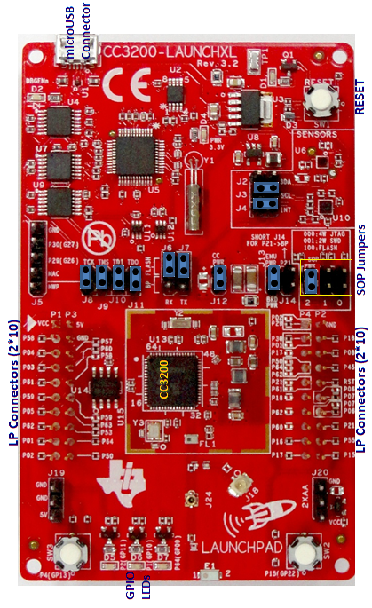

# Overview  

All digital pins of the device can be used as general-purpose
input/output (GPIO). GPIOs can be used for various purposes. The GPIO
module on the CC3200 consists of four GPIO blocks:

  - GPIO A0
  - GPIO A1
  - GPIO A2
  - GPIO A3

Each GPIO block provides eight GPIOs. The GPIO module supports 30
programmable GPIO pins, depending on the peripheral used.

# Application details  

The objective of this application is to showcase GPIO control using
Driverlib API calls. The LEDs connected to the GPIOs on the LaunchPad are used
to indicate GPIO output. The GPIOs are driven high and low periodically
in order to turn the LEDs on and off.

## Source Files briefly explained  

- **main.c**- Contains the core logic to drive GPIOs and inturn blink
the LEDs.
- **gpio\_if.c** - Contains the Driverlib API calls to drive the GPIOs
- **pinmux.c**- Generated by the PinMUX utility. GPIO pins are brought
out on the device boundry using the Driverlib Pinmux API calls.
- **startup\_\*.c** - Initialize vector table and IDE related functions

# Usage  

1.  Run the reference application.
      - Open the project in CCS/IAR. Build the application and debug to load to the device, or flash the binary using [UniFlash](http://processors.wiki.ti.com/index.php/CC3100_%26_CC3200_UniFlash_Quick_Start_Guide).
2.  Verify the LaunchPad LEDs (D5, D6 and D7) toggle on and off.

# Limitations/Known Issues  
