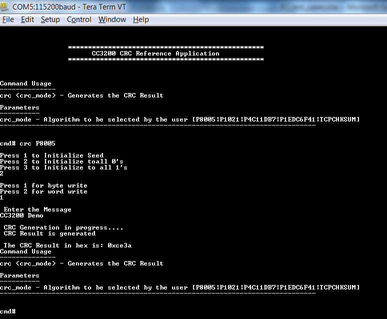

## Overview

The Cyclic Redundancy Check (CRC) computation module can be used for
message transfer and for safety system checks. The purpose of the CRC
engine is to accelerate CRC and TCP checksum operation. The result of
the CRC operation is a 32- and 16-bit signature that can be used to
check the sanity of data. The following features are supported:

- Four major CRC forms
	1.  CRC16-IBM as used by USB and ANSI
	2.  CRC32-IEEE as used by IEEE 802.3 and MPEG-2
	3.  CRC32C as used by G.Hn
	4.  CRC16-CCITT as used by CCITT/ITU X.25
- Checksum (TCP)
- Word and byte feed
- Byte and half-word swapping for input and output data
- Bit reversal  

## Application details

The application is a reference to usage of CRC DriverLib functions on
CC3200. Developers can refer to this simple application and re-use
the functions in their applications.

If the user wishes to use "Uart Terminal" to give some inputs and follow
the execution path prints, then they might do so by defining
"USER-INPUT" in the des\_main.c file.

- **crcdemo**: This command allows the user to excercise the CRC
    funcitonality on CC3200. The command needs a parameter, crc\_mode.
	- crc\_mode is the CRC algorithm that user can choose.
		- `P8005`: CRC-16-IBM 0x8005  
		- `P1021`: CRC-16-ICCITT 0x1021  
		- `P4C11DB7`: CRC-32 0x4C11DB7  
		- `P1EDC6F41`: CRC-32 0x1EDC6F41  
		- `TCPCHKSUM`: TCP Checksum

User will be prompted for additional inputs.  

User will be prompted for inputs for key and plain text input. User can also undefine `USER_INPUT` in main.c to use the default test vectors for debugging (`g_psCRC8005TestVectors` in crc_vector.h). 

## Source Files briefly explained

- **main.c** - The main file that contains the core-logic for
encryption and decryption. The functions in the file uses DriverLib
calls to perform encryption and decryption.
- **crc\_userinput.c** - This file is used in the USER-INPUT mode. The
function in the file reads the input from the user, parses the input
string and feed the core-logic functions in the crc\_main.c
- **pinmux.c** - Generated by the PinMUX utility. UART0 pins are
brought out in this file.
- **startup\_\*.c** - Initialize vector table and IDE related functions
- **uart\_if.c** - Functions to display information over UART

## Usage

1.  Setup a serial communication application. Open a serial terminal on a PC with the following settings:
	- **Port: ** Enumerated COM port
	- **Baud rate: ** 115200
	- **Data: ** 8 bit
	- **Parity: ** None
	- **Stop: ** 1 bit
	- **Flow control: ** None
2.  Run the reference application.
      - Open the project in CCS/IAR. Build the application and debug to load to the device, or flash the binary using [UniFlash](http://processors.wiki.ti.com/index.php/CC3100_%26_CC3200_UniFlash_Quick_Start_Guide).
3.  A prompt will appear on the terminal. Enter the **crcdemo** command with your chosen inputs as shown above. 

## Limitations/Known Issues
