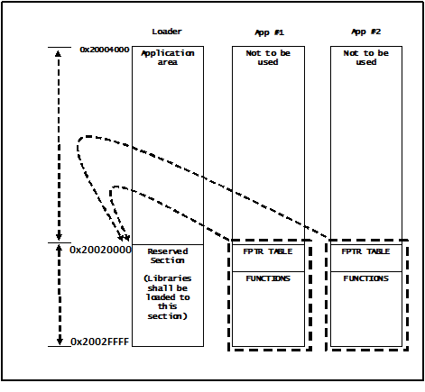
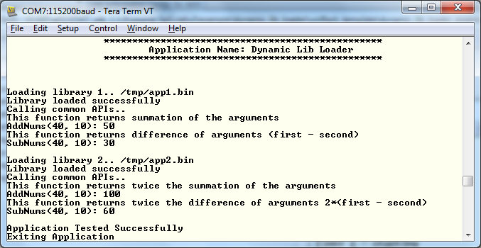

## Overview

This application illustrates how to hook different libraries at run time
with common interface APIs, but differing in their
implementation. On systems with limited RAM, this feature can be important if the application intends to load a library into memory at run-time based on some conditions.

## Application Details

This is a basic application where two different library having the same
interface APIs are being loaded one by one, followed by their
invocation in the same order. The libraries differ in their
implementations, thus giving different output when called with the same
arguments.

### Program Flow

1.  Determine a predefined function-pointer table
    to interface with different libraries. All libraries are expected to
    have the same interface.
2.  Identify a region in the memory for paging. The
    predefined function-pointer table shall be put at the beginning of
    this region.
3.  Before invoking any library function(s), the loader application
    loads the contents of the library from serial flash into the defined
    region in SRAM.
4.  Use the function-pointer table to access the library function(s).

The memory addresses shown in above diagram are for reference only. Developers should define the sections based on their application’s needs. The workspace for this application consists of three projects (for IAR) or three configurations
(for CCS):

- **app1** is the first library with four routines
- **app2** is the second library also with four routines
- **loader** loads the above libraries from non-volatile memory to SRAM at run time and then invokes their routines

## Usage

1. Flash application binaries to the CC3200 serial flash.
	- Start UniFlash for CC3100/CC3200. Open UCF session file at **cc3200_sdk/example/dynamic_link_loader/uniflash_template.ucf**
	- Set SOP jumper to SOP-2 position for flashing.
	- Select **Program**. 
2. Run the reference application.
	- Remove the SOP jumper and reset the LaunchPad to start the application **or**
    - Open the project in CCS/IAR. Build the application and debug to load to the device.

## Limitations/Known Issues
