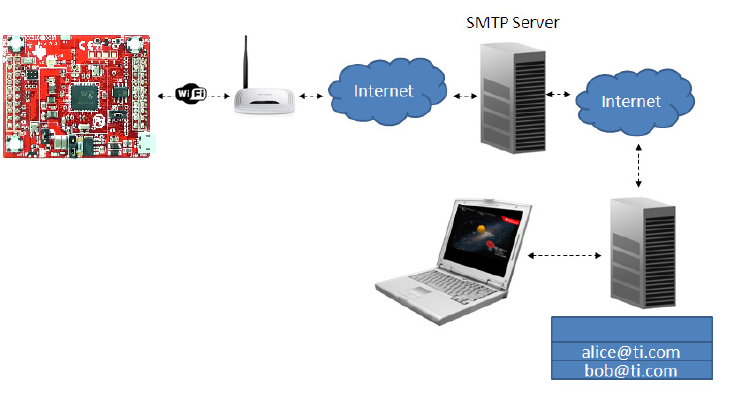
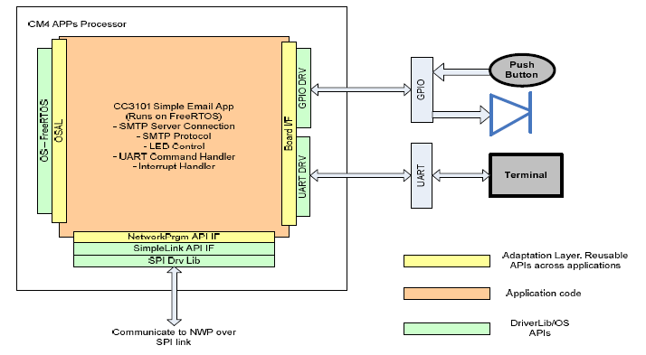
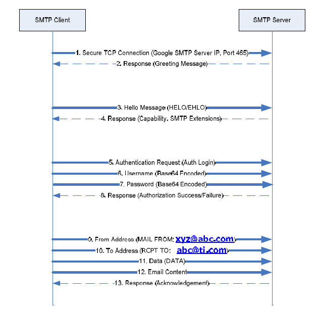
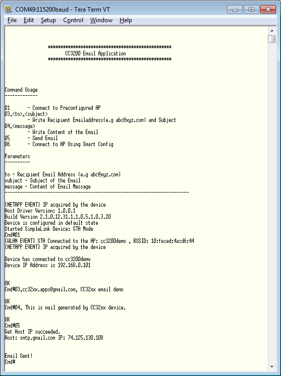

## Overview

This application sends emails using SMTP (Simple Mail
Transfer Protocol). The email application sends a preconfigured email at
the push of a button or a user-configured email through the CLI (Command
Line Interface).

The CC3200 connects to the SMTP server via an Access Point which must be
connected to the internet. The CC3200 sends the email to the SMTP server which then
forwards it to the recipient Email Server. The recipient receives Email from
the Email Server using IMAP/POP3.

The email/SMTP library can be found at cc3200_sdk\netapps\smtp\client.  

 

**Receiving email is not in the scope of this example.**

## Application details


  


### Program Flow

1. Client starts TCP Connection with SMTP Server.
2. SMTP Server responds with Response code and Greeting Message containing FQDN
3. HELO/EHLO – Client sends Hello Message to the Server. ESMTP accepts EHLO
4. The SMTP Server replies with Code 250 and Hello Message. ESMTP Server replies with SMTP extensions it supports such as Email maximum Size, authentication etc.
5. If SMTP Server requires authentication, the client sends “auth login” followed by uUsername and password encoded with proper encryption accepted by SMTP Server.
6. Client Sends Username Encoded with Proper encryption accepted by SMTP Server
7. Client Sends Password Encoded with Proper encryption accepted by SMTP Server
8. SMTP Server replies with authentication success (235) or failure (535).
9. SMTP Client sends From Address
10. SMTP Client sends TO Address
11. SMTP Client sends DATA command
12. SMTP Client sends email data.
13. SMTP Server responds with the acknowledgement.

### Source Files briefly explained

- **main.c** - Simple Application demonstrating Email Client
    Functionalities.
- **button\_if.c** - Interface file to handle button click events.
- **gpio\_if.c** - GPIO interface file which handles all LED events.
- **network\_if.c** - Network interface file which handles all network
    connection events.
- **pinmux.c** - Pinmux file to configure GPIO & UART
- **smartconfig.c** - Smart Configuration to configure AP
- **timer\_if.c** - Interface file to handle all Timer events
- **uart\_if.c** - Interface file which receives command from UART and
    output Logging Information on UART Terminal
- **cc3200_sdk\\netapps\\smtp\\client**- libemail is Platform Indepedent Library
    and can be Integrated to any Email Client Software using below APIs
	- `sl_NetAppEmailSet` - Configure SMTP Server, Login Information,
        Recipient Email Id, Email Subject etc
	- `sl_NetAppEmailConnect` - Connect to SMTP Server
	- `sl_NetAppEmailSend` - Send Email

## Usage

1. Modify the SMTP configurations set as macros in demo_config.h. Use your own email credentials.
2. Edit **common.h** and modify the values of the below macros for the device to connect to the AP:
```c
	#define SSID_NAME           "<ap_name>"    		/* AP SSID */
	#define SECURITY_TYPE       SL_SEC_TYPE_OPEN 	/* Security type (OPEN or WEP or WPA*/
	#define SECURITY_KEY        ""              	/* Password of the secured AP */
```
3.  Setup a serial communication application. Open a serial terminal on a PC with the following settings:
	- **Port: ** Enumerated COM port
	- **Baud rate: ** 115200
	- **Data: ** 8 bit
	- **Parity: ** None
	- **Stop: ** 1 bit
	- **Flow control: ** None
4.  Run the reference application.
      - Open the project in CCS/IAR. Build the application and debug to load to the device, or flash the binary using [UniFlash](http://processors.wiki.ti.com/index.php/CC3100_%26_CC3200_UniFlash_Quick_Start_Guide).
5. The CC3200 will try to connect to the AP as configured. Red LED will start blinking and will turn on once connection is successful. Usually it will take 1-10 seconds for the AP connection.
6. Once the terminal prints the header and IP address, input "3" into the terminal to set the recipient email address and subject
7. Input "4" to set email content
8. Input "5" to send email
9. If the email is sent successfully, the orange LED will blink 5 times and terminal will show "Message Sent".
	- Terminal may show “Server Connection Error”, “Authentication Failed” etc. In case of “Server Connection Error”, try input "5" again.
10. To send a pre-defined email, press push button S3 on the LaunchPad.

 

# Limitations/Known Issues

- Email is sent to only 1 recipient.
- Only plain text email is supported.
	