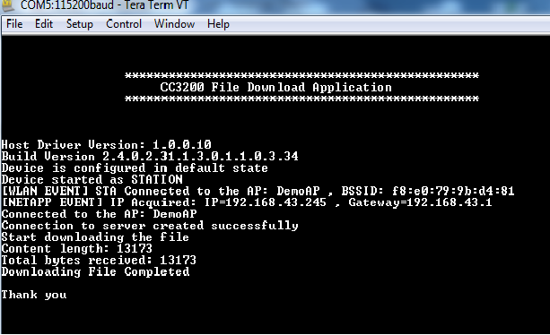

## Overview

This example demonstrates how to connect to a
server, download a file using the HTTP Client library, and save it to the
serial flash. This scheme can be used by developers to update
any file over the network.

## Application Details

This application will:

  - Connect to an Access Point
  - Connect to "www.google.com"
  - Download a 6 KB file.
  - Save it onto serial flash in a temporary file.
  - Verify that the complete file is downloaded.

Users can change the server and the requested file by changing the MACRO
`PREFIX_BUFFER`, `POST_BUFFER`, and `HOST_NAME`.  
Size of the saved file can be changed by changing the MACRO `SIZE_40K`,
but users must delete the existing file `FILE_NAME`.

This application requires an Access Point with internet.

## Usage

1. Open `main.c` and set `SSID_NAME`, `SEC_TYPE` and `PASSKEY`.
2. Setup a serial communication application. Open a serial terminal on a PC with the following settings:
	- **Port: ** Enumerated COM port
	- **Baud rate: ** 115200
	- **Data: ** 8 bit
	- **Parity: ** None
	- **Stop: ** 1 bit
	- **Flow control: ** None
3. Build and run the application.
	- Debug to load the application to the device, or flash the binary using [UniFlash](http://processors.wiki.ti.com/index.php/CC3100_%26_CC3200_UniFlash_Quick_Start_Guide).
4. Upon connection, the application tries to connect to the "www.google.com", requests a file from the server, and saves it to the serial flash as `FILE_NAME`. A successful message will appear on the terminal.

 
  

## Limitations/Known Issues

  - This example only supports downloading data from the server in chunked format.
  - File download depends on memory available in Device's sFlash. If you encounter an error, 
    delete some memory from sFlash using [Uniflash](http://processors.wiki.ti.com/index.php/CC3100_%26_CC3200_UniFlash_Quick_Start_Guide).
