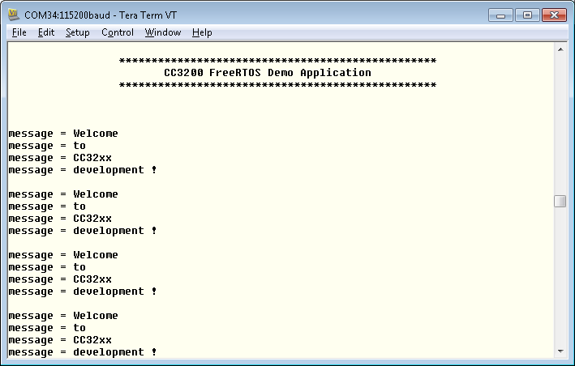

## Overview

FreeRTOS is an open source Real Time Operating System. It implements
a very minimalist set of functions for basic task handling and memory management.
FreeRTOS does not provide network communication,
drivers for external hardware, or access to a filesystem. Among
its features are the following characteristics:  

1.  Preemptive tasks
2.  Small footprint
3.  Written in C and compiled with various C compilers
4.  Unlimited number of tasks can run at the same time
5.  Implements queues, binary and counting semaphores and mutexes.
6.  Inter-task communication accomplished using queues.

## Application details

The objective of this application is to showcase FreeRTOS features
like multiple task creation and inter-task communication using queues. This application creates two
tasks and one message queue. Task one sends a constant message
into the queue, and task two receives the  message from the queue.
After receiving each message, the second task prints the message to a serial terminal over UART.

## Source Files briefly explained  

- **main.c** - Main file that showcases the two tasks communicating with each other using a queue.
- **pinmux.c** - Pinmux configurations as required by the application.
- **uart\_if.c** - To display status information over the UART
- **startup\_\*.c** - Initialize vector table and IDE related functions

## Usage

1.  Setup a serial communication application. Open a serial terminal on a PC with the following settings:
	- **Port: ** Enumerated COM port
	- **Baud rate: ** 115200
	- **Data: ** 8 bit
	- **Parity: ** None
	- **Stop: ** 1 bit
	- **Flow control: ** None
2.  Run the reference application.
      - Open the project in CCS/IAR. Build the application and debug to load to the device, or flash the binary using [UniFlash](http://processors.wiki.ti.com/index.php/CC3100_%26_CC3200_UniFlash_Quick_Start_Guide).
3. Observe the status messages displayed on the terminal by second task.

 

## Limitations/Known Issues
