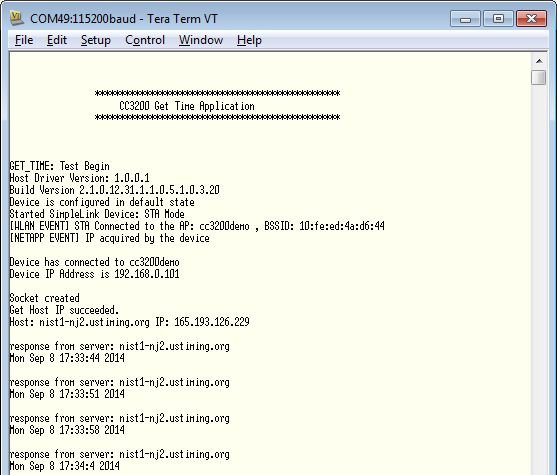

## Overview

The Get Time application connects to a SNTP server, request for time,
process the data and displays the time on Hyperterminal. The
communication between the device and server is based on the Network Time
Protocol (NTP).  

## Application details

The Get Time application connects to an AP with parameters set in common.h. This example requires an Access Point connected to the internet. If the connection to this AP is unsuccessful, the user is prompted on the terminal to enter AP details which must be entered in the format as specified below:

\<ap\_ssid\>:\<security\_type\>:\<password\>:\<wep\_key\_id\>:

  - **ap\_ssid** - ssid of the AP to be connected
  - **security\_type** - values 1(for Open) or 2(for WEP) or 3(for WPA)
  - **password** - network password in case of 2(for WEP) or 3(for WPA)
  - **wep\_key\_id** - key ID in case of 2(for WEP)

The red LED continuously blinks as long as a connection with AP is not
established. Once established, the red LED stays continuously on.

Users can use any of the listed servers to get the time by changing the
variable `g_acSNTPserver`.


	//!    ######################### list of SNTP servers ##################################
	//!    ##
	//!    ##          hostname         |        IP       |       location
	//!    ## -----------------------------------------------------------------------------
	//!    ##   time-a.nist.gov         | 129.6.15.28     |  NIST, Gaithersburg, Maryland
	//!    ##   time-b.nist.gov         | 129.6.15.29     |  NIST, Gaithersburg, Maryland
	//!    ##   time-c.nist.gov         | 129.6.15.30     |  NIST, Gaithersburg, Maryland
	//!    ##   nist1-macon.macon.ga.us | 98.175.203.200  |  Macon, Georgia
	//!    ##   For more SNTP server link visit 'http://tf.nist.gov/tf-cgi/servers.cgi'
	//!    ###################################################################################
	const char g_acSNTPserver[30] = "time-a.nist.gov";


Depending on the region of interest, the GMT offset can be changed by
changing the macro:

	#define GMT_DIFF_TIME_HRS 5
	#define GMT_DIFF_TIME_MINS 30

Get time application gives the current time in the configured time zone.
This application can be used to become familiar with UDP sockets to
communicate with a server.

### Source Files briefly explained

- **network\_if** - Common functions to handle connection to AP and FreeRTOS hook functions.
- **gpio\_if** - Basic GPIO interface APIs. Used to control the red LED
- **main** - Initializes the device, connects to a AP, Open a UDP socket, Request and display time
- **pinmux** - Assigns a personality to the pins at the device boundary
- **uart\_if** - To display status information over the UART
- **timer\_if** - Wrapper function for timer module driver
- **startup\_\*.c** - Initialize vector table and IDE related functions

## Usage

1.  Setup a serial communication application. Open a serial terminal on a PC with the following settings:
	- **Port: ** Enumerated COM port
	- **Baud rate: ** 115200
	- **Data: ** 8 bit
	- **Parity: ** None
	- **Stop: ** 1 bit
	- **Flow control: ** None 
2. Edit **common.h** and modify the values of the below macros for the device to connect to the AP:
```c
	#define SSID_NAME           "<ap_name>"    		/* AP SSID */
	#define SECURITY_TYPE       SL_SEC_TYPE_OPEN 	/* Security type (OPEN or WEP or WPA*/
	#define SECURITY_KEY        ""              	/* Password of the secured AP */
```
3.  Run the reference application.
      - Open the project in CCS/IAR. Build the application and debug to load to the device, or flash the binary using [UniFlash](http://processors.wiki.ti.com/index.php/CC3100_%26_CC3200_UniFlash_Quick_Start_Guide).
4.  If the connection to the default AP is unsuccessful, the user will be prompted on the terminal to enter AP details.
5.  The red LED will continuously blinks while a connection with the AP is
    not established. Once established, the red LED will stay continuously on.
6.  The current time as obtained from the SNTP server and is printed to the terminal.

 

## Limitations/Known Issues

- WEP connectivity is not tested with this example
