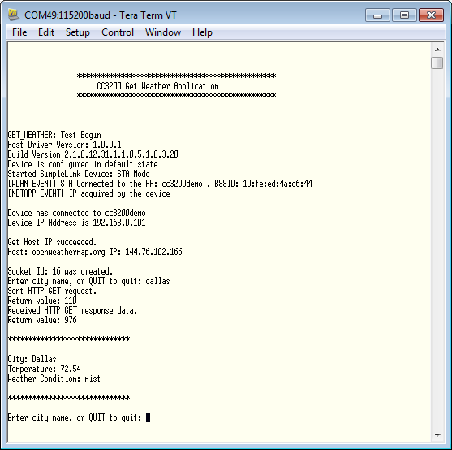

## Overview

The Get Weather application connects to "openweathermap.org" server,
requests for weather details of the specified city, process data and
displays it on the Hyperterminal.  

## Application details

This application connects to the default AP credentials set in common.h. In case the
connection to this default AP is unsuccessful, the user is prompted to
enter the AP details on the hyperterminal.

The AP details have to be entered in the format as specified below:

`<ap_ssid>:<security_type>:<password>:<wep_key_id>`

  - **ap\_ssid** - ssid of the AP to be connected
  - **security\_type** - values 1 (Open), 2 (WEP), or 3(WPA)
  - **password** - network password in case of options 2 (WEP) or 3 (WPA)
  - **wep\_key\_id** - key ID in case of option 2 (WEP)

The red LED continuously blinks until a connection is established with the AP. Once established, the red LED stays continuously on.  
The user is prompted to enter a city name to obtain the
weather information.

The weather information is then requested from "openweathermap.org"
server for the specified city. This is done by opening a TCP socket
with  
server and sending a HTTP Get request. The response is parsed and the
weather information displayed.

## Source Files briefly explained

- **network\_if.c** - Common functions to handle connection to AP and
    FreeRTOS hook functions.
- **gpio\_if.c** - Basic GPIO interface APIs. Used to control the RED
    LED.
- **main.c** - Initializes the device, connects to a AP, performs a DNS
    lookup, open a TCP socket, send a HTTP Get request and displays
    weather information
- **pinmux.c** - Assigns a personality to the pins at the device
    boundary
- **uart\_if.c** - To display status information over the UART
- **udma\_if.c** - Wrapper functions for uDMA module driver
- **timer\_if.c** - Wrapper functions for timer module driver
- **startup\_\*.c** - Initialize vector table and IDE related functions

## Usage

1.  Setup a serial communication application. Open a serial terminal on a PC with the following settings:
	- **Port: ** Enumerated COM port
	- **Baud rate: ** 115200
	- **Data: ** 8 bit
	- **Parity: ** None
	- **Stop: ** 1 bit
	- **Flow control: ** None
2. From openweathermap.org, create an API Key and modify the 'API Key' value in the **POST_BUFFER** macro in **main.c** found below:
`#define POST_BUFFER "&mode=xml&units=imperial&APPID=<API KEY> HTTP/1.1\r\nHost:api.openweathermap.org\r\nAccept: */"`
3. Edit **common.h** and modify the values of the below macros for the device to connect to the AP:
```c
	#define SSID_NAME           "<ap_name>"    		/* AP SSID */
	#define SECURITY_TYPE       SL_SEC_TYPE_OPEN 	/* Security type (OPEN or WEP or WPA*/
	#define SECURITY_KEY        ""              	/* Password of the secured AP */
```
4.  Run the reference application.
      - Open the project in CCS/IAR. Build the application and debug to load to the device, or flash the binary using [UniFlash](http://processors.wiki.ti.com/index.php/CC3100_%26_CC3200_UniFlash_Quick_Start_Guide).
5.  If the connection to the default AP is unsuccessful, the user will be prompted on the terminal to enter AP details.
6.  The red LED will continuously blinks while a connection with the AP is
    not established. Once established, the red LED will stay continuously on.
7.  The user is prompted to enter the city name in the serial terminal.

 

## Limitations/Known Issues

- WEP connectivity is not tested with this application.