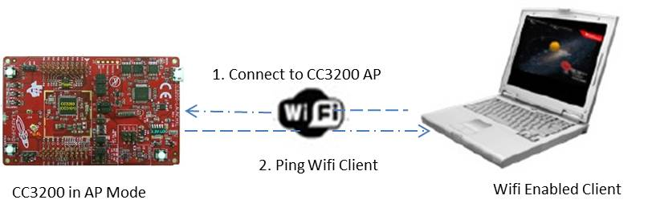
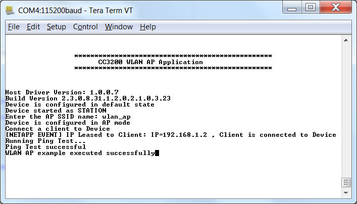

## Overview

The SimpleLink CC3200 device can act as an AP (Access Point). Any Wi-Fi
enabled client in range can connect to the device and then
communicate per standard networking protocols.

   

## Application details

This application aims to exhibit the CC3200 device as an AP (Access Point).
Developers can refer to these functions or re-use them while writing new
applications.

The CC3200 device starts up as an AP, and then waits for a station to connect to it. If the connection is successful, it will ping that station. The expected return value is 0 on success. A different return code would mean that the ping to the station is unsuccessful.

**Note: If the device is not able to ping the connected
station, try disabling its antivirus.**

## Source Files briefly explained

- **main.c** – main file creates the simplelink task which does most
    of the network related operations, a WlanAPMode task makes calls to
    the network related APIs of simplelink library.
- **startup\_\*.c** - Initialize vector table and IDE related functions

## Usage

1.  Setup a serial communication application. Open a serial terminal on a PC with the following settings:
	- **Port: ** Enumerated COM port
	- **Baud rate: ** 115200
	- **Data: ** 8 bit
	- **Parity: ** None
	- **Stop: ** 1 bit
	- **Flow control: ** None
2.  Run the reference application.
      - Open the project in CCS/IAR. Build the application and debug to load to the device, or flash the binary using [UniFlash](http://processors.wiki.ti.com/index.php/CC3100_%26_CC3200_UniFlash_Quick_Start_Guide).
3. Application will switch to AP mode if it's not in AP mode. Connect a client (smartphone/PC) to the CC3220 Access Point. The CC3200 will ping the client and print the result to the terminal.

## Limitations/Known Issues
