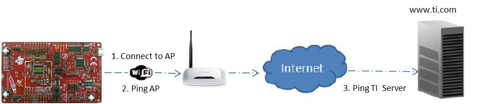
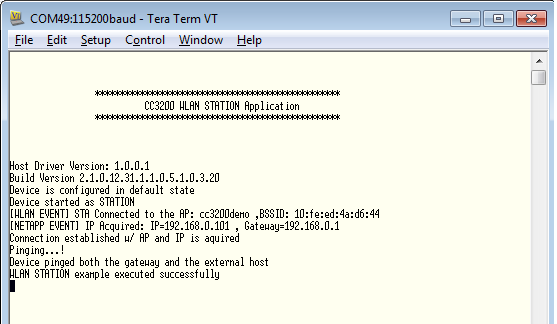

## Overview

A CC3200 device has the capability to behave as a station in a typical
networking system. It can connect to an Access Point
(with or without security) and can use the internet services via the
same AP, if available.



## Application details

This application aims to exhibit the CC3200 device as a station in a
simple network. Developers can refer to the functions or re-use them
while writing new applications.
The CC3220 connects to an AP (Access Point) set by
configurations stored in the form of macros in the application. If the
connection is successful, the CC3200 will try to get the IP address of
“www.ti.com” and then ping the IP address. The expected return value is 0 on success. A different return code would mean that the ping to the station is unsuccessful or the internet connection is not available.

**Macros for connection to Access Point**. These macros can be updated in *cc3200_sdk/example/common/common.h*. 

```
	#define SSID_NAME                "cc3200demo"
	#define SECURITY_TYPE            SL_SEC_TYPE_OPEN
	#define SECURITY_KEY             ""
	#define WEP_KEY_ID               1
```

### Source Files briefly explained

- **main.c** – main file creates the simplelink task which does most
of the network related operations, a WlanStationMode task makes
calls to the network related APIs of simplelink library.
- **startup\_\*.c** - Initialize vector table and IDE related functions
- **gpio\_if.c** - GPIO interface file for LED APIs
- **pinmux.c** - File to mux device pin to different peripheral
signal.

## Usage

1.  Setup a serial communication application. Open a serial terminal on a PC with the following settings:
	- **Port: ** Enumerated COM port
	- **Baud rate: ** 115200
	- **Data: ** 8 bit
	- **Parity: ** None
	- **Stop: ** 1 bit
	- **Flow control: ** None
2. Edit **common.h** and modify the values of the below macros for the device to connect to the AP:
```c
	#define SSID_NAME           "<ap_name>"    		/* AP SSID */
	#define SECURITY_TYPE       SL_SEC_TYPE_OPEN 	/* Security type (OPEN or WEP or WPA*/
	#define SECURITY_KEY        ""              	/* Password of the secured AP */
```
3.  Run the reference application.
	- Open the project in CCS/IAR. Build the application and debug to load to the device, or flash the binary using [UniFlash](http://processors.wiki.ti.com/index.php/CC3100_%26_CC3200_UniFlash_Quick_Start_Guide).
4. The device will switch into Station mode if it is not already and try to connect to the pre-defined Access Point configuration. The red LED will continuously blinks while a connection with the AP is not established. Once established, the red LED will stay continuously on.
5. After a successful AP connection, the device will ping the AP, and turn on the green LED if successful.
6. the device will the check for internet connection by attempting to ping "www.ti.com", and turn on the orange LED if successful.



## Limitations/Known Issues
