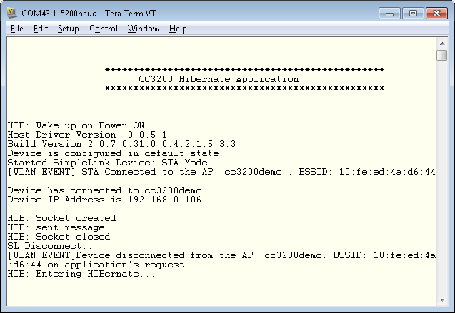

## Overview

This application enters Hibernate mode (HIB) by calling the API PRCMHibernateEnter(). This API disables power to all modules except the hibernate module and the 32 KHz clock operation. The hibernate module supports an RTC timer. On entering HIB, the system can be woken up based on one of the following wakeup sources
selected:
	- Timer
	- GPIO
		- In this mode, most of the system is shutdown (including network processors) and only the HIB module is active. The HIB module has 2 32-bit registers that can be used to save any information across HIB entry-exit cycles. The code execution commences from the reset vector.  
		
For more details on hibernate mode, see the [CC3200 Technical Reference Manual](http://www.ti.com/lit/swru367). 

## Application details

The objective of this application is to showcase hibernate mode as a
power saving tool in a networking context (in this case a UDP client).
In this example, the device wakes up periodically from hibernate,
broadcasts a message, and then enters hibernate again.

The procedure for measuring current can be found [Power Management Optimizations and Measurements documentation](http://processors.wiki.ti.com/index.php/CC3200_Power_Management_Optimizations_and_Measurements).

## Source Files briefly explained

- **network\_if** - Common functions to handle connection to AP and
    FreeRTOS hook functions.
- **main** - Core UDP braodcast implementation. On entry to main a
    check is done to check the wakeup cause (power on or HIB).
- **gpio\_if** - Basic GPIO interface APIs.
- **pinmux** - Assigns a personality to the pins at the device
    boundary.
- **uart\_if** - To display status information over the UART.
- **timer\_if** - To handle timer for LED blinking.
- **startup\_\*.c** - Initialize vector table and IDE related functions

## Usage

**Note**: It is recommended that the application be tested by flashing
the binary file onto the serial flash on LaunchPad only. The IAR and CCS
debuggers will disconnect on entering low power modes and cannot be used
for subsequent debug.

1.  Setup a serial communication application. Open a serial terminal on a PC with the following settings:
	- **Port: ** Enumerated COM port
	- **Baud rate: ** 115200
	- **Data: ** 8 bit
	- **Parity: ** None
	- **Stop: ** 1 bit
	- **Flow control: ** None
2. Edit **common.h** and modify the values of the below macros for the device to connect to the AP:
```c
	#define SSID_NAME           "<ap_name>"    		/* AP SSID */
	#define SECURITY_TYPE       SL_SEC_TYPE_OPEN 	/* Security type (OPEN or WEP or WPA*/
	#define SECURITY_KEY        ""              	/* Password of the secured AP */
```
3.  Run the reference application.
      - Open the project in CCS/IAR. Build the application and debug to load to the device, or flash the binary using [UniFlash](http://processors.wiki.ti.com/index.php/CC3100_%26_CC3200_UniFlash_Quick_Start_Guide).
4.  The device will try to connect to the default AP. If the connection to the default AP is unsuccessful, the user will be prompted on the terminal to enter AP details. 
5. An external application listening on UDP broadcasts will be able to receive the messages broadcast. The broadcast happens on port number 5001.



## Limitations/Known Issues
