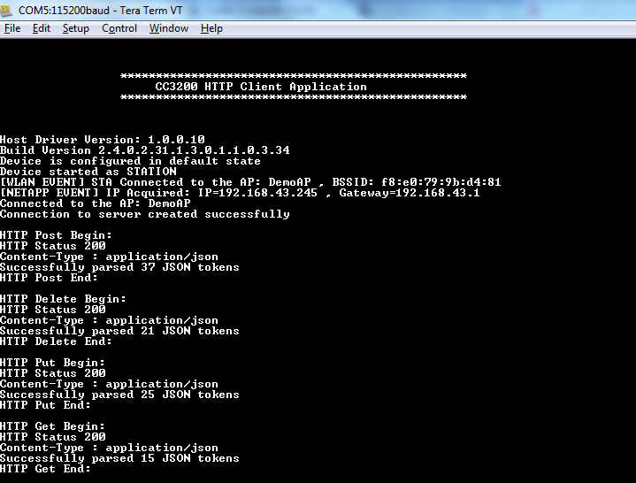

## Overview

The HTTP client library can be used to communicate and exchange data with
a HTTP web server. The HTTP client library support two modes:

1.  **Minimum mode:** HTTP client library in minimum mode supports
    synchronous mode, redirection handling, chunked transfer encoding,
    proxy and TLS. **HTTPCli\_LIBTYPE\_MIN** flag should be used to
    build the library in minimum mode.
2.  **Full Mode:** HTTP Client library in full mode supports all the
    features of the minimal mode along with asynchronous mode and
    content handling and requires RTOS support.
    **HTTPCli\_LIBTYPE\_FULL** flag should be used to build the library
    in full mode.
	
## Application details

This application demonstrates HTTP Client library APIs for
HTTP-based application development in minimum mode. This application
demonstrates how to:

  - Connect to an access point
  - Connect to a HTTP Server with and without proxy
  - Do POST, GET, PUT and DELETE
  - Parse JSON data
  
  
This example requires an Access Point with internet connectivity.

To enable a secure connection, user must add the following code snippets to the HTTP connection section to set the device date and time and configure a certificate.
  
```c
	SlDateTime\_t dt;
	struct HTTPCli_SecureParams sparams;       
	/* Set current date to validate certificate */
	dt.sl_tm_day = DATE;  
	dt.sl_tm_mon = MONTH; 
	dt.sl_tm_year = YEAR;  
	dt.sl_tm_hour = HOUR;  
	dt.sl_tm_min = MINUTE;  
	dt.sl_tm_sec = SECOND;  
	sl_DevSet(SL_DEVICE_GENERAL_CONFIGURATION, 
	SL_DEVICE_GENERAL_CONFIGURATION_DATE_TIME, 
	sizeof(SlDateTime_t), (unsigned char *)(&dt)); 
	
	/* Security parameters */
	sparams.method.secureMethod = SL_SO_SEC_METHOD_TLSV1_2;
	sparams.mask.secureMask  = SL_SEC_MASK_TLS_RSA_WITH_AES_256_CBC_SHA;
	strncpy(sparams.cafile, SL_SSL_CA_CERT, sizeof(SL_SSL_CA_CERT));
	sparams.privkey[0] = 0;
	sparams.cert[0] = 0;
	sparams.dhkey[0] = 0;  
	HTTPCli_setSecureParams(&sparams);
```

``HTTPCli\_connect`` function should also be called with the ``HTTPCli\_TYPE\_TLS`` option.:

```c
	HTTPCli_connect(&cli, (struct sockaddr *)&addr, HTTPCli_TYPE_TLS, NULL);
```

User can change the proxy by editing the macros `PROXY\_IP` and
`PROXY\_PORT` in main.c and defining the symbol `USE\_PROXY`.

HTTP Client library API details are provided in SDK in the docs folder.

## Usage

1.  Setup a serial communication application. Open a serial terminal on a PC with the following settings:
	- **Port: ** Enumerated COM port
	- **Baud rate: ** 115200
	- **Data: ** 8 bit
	- **Parity: ** None
	- **Stop: ** 1 bit
	- **Flow control: ** None
2. Edit **common.h** and modify the values of the below macros for the device to connect to the AP:
```c
	#define SSID_NAME           "<ap_name>"    		/* AP SSID */
	#define SECURITY_TYPE       SL_SEC_TYPE_OPEN 	/* Security type (OPEN or WEP or WPA*/
	#define SECURITY_KEY        ""              	/* Password of the secured AP */
```
3.  Run the reference application.
      - Open the project in CCS/IAR. Build the application and debug to load to the device, or flash the binary using [UniFlash](http://processors.wiki.ti.com/index.php/CC3100_%26_CC3200_UniFlash_Quick_Start_Guide).
4. The device will try to connect to the Access Point and then the HTTP server. Upon successful connection, application will send POST, DELETE, PUT
and GET requests and check and parse the response.



## Limitations/Known Issues

	- HTTP connection timeout is not supported.
	- Only IPV4 is supported
