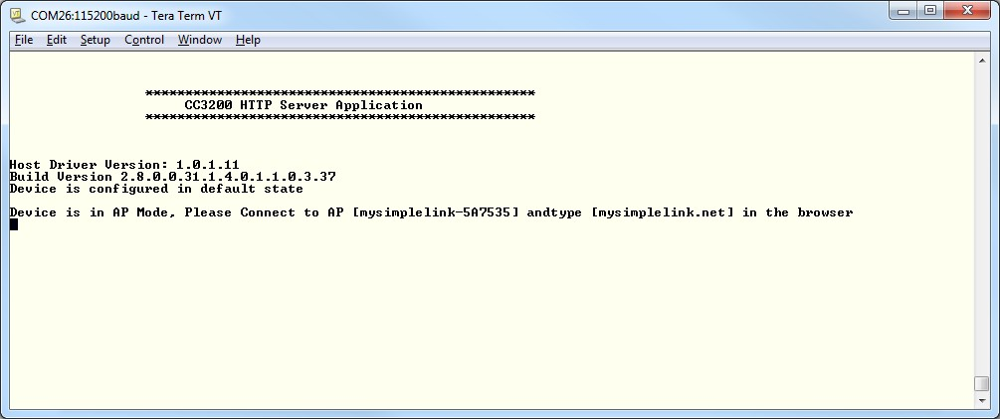

## Overview

The HTTP Server application demonstrates interaction between a HTTP
client and a SimpleLink device. The SimpleLink device hosts an
HTTP Server internal to the network processor, and users can interact with the device using a web browser.

With the "internal" HTTP server, users can:

1.  Get static pages stored on the serial flash
2.  Update device settings by filling forms on static HTML pages
3.  Get dynamic data such as device status using tokens in HTML
    pages
4.  Send commands to the device using tokens in HTML pages

## Source Files briefly explained

  - **main.c** - Handles HTTP Request, Controls LED and Send HTTP Response
    with LED Status
  - **gpio\_if.c** - Handles GPIO related operations
  - **pinmux.c** - Generated by Pinmux utility pin out LED GPIOs.
  - **smartconfig.c** - Implements Smart Configuration Interface For Access
    Point Provisioning
  - **uart\_if.c** - Implements the UART terminal.
- **startup\_\*.c** - Initialize vector table and IDE related functions

## Usage

1. Flash example user files (HTML, images, js) and pre-built application binary to CC3200 serial flash.
	- Start UniFlash for CC3100/CC3200. Open UCSF session file at **cc3200\_sdk\\example\\antenna\_selection\\html\\antenna\_selection.usf**
	- Set SOP jumper to SOP-2 position for flashing.
	- Select **Program**. 
2. Setup a serial communication application. Open a serial terminal on a PC with the following settings:
	- **Port: ** Enumerated COM port
	- **Baud rate: ** 115200
	- **Data: ** 8 bit
	- **Parity: ** None
	- **Stop: ** 1 bit
	- **Flow control: ** None
3.  Add the the Force AP jumper across pin 58 and 3V3 as shown below. 
	 
4. Run the reference application.
	- Remove the SOP jumper and reset the LaunchPad to start the application **or**
    - Open the project in CCS/IAR. Build the application and debug to load to the device.
5. The CC3200 reads the value of GPIO03 on pin 58 to check if the Force AP jumper is in place. If so, it will start in AP mode and print its SSID and HTTP Server domain name to the serial terminal. 
 

6. Connect a Wi-Fi enabled device (smartphone/PC) to the device AP (Default SSID: mysimplelink-<MAC address\>).
7. Open a browser and navigate to **mysimplelink.net/main.html**
8. The browser displays the main page. Select the demo tab to display the demo web page, or navigate directly to **mysimplelink.net/led\_demo.html**. you can also navigate directly to the device's IP address.
9. Click the ON/OFF switch button to control the red LED on the LaunchPad.

## Limitations/Known Issues

See SmartConfig example for provisioning limitations.