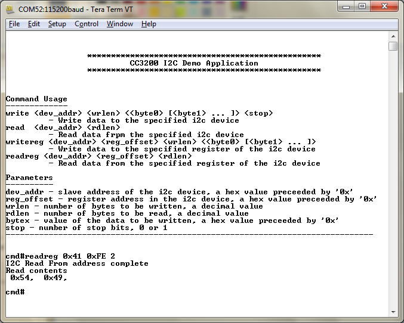

# Overview

The Inter-Integrated Circuit (I2C) bus provides bi-directional data
transfer through a two-wire design (a serial data line SDA and a serial
clock line SCL) and interfaces to external I2C devices. The LaunchPad has two sensors connected over the I2C: accelerometer and
temperature sensors. The I2C lines are also brought out to the headers for
further expansion (such as sensor BoosterPacks).

# Application details

The objective of this application is to act as an I2C diagnostic tool. The
demo application is a generic implementation that allows the user to
communicate with any I2C device. This example uses the APIs:

  - **Write:** Performs write operation to the specifed I2C device
    address. User also needs to specify if the stop bit needs to be set
    or not (To support specifying and reading from a particular
    register).
  - **Read:** Performs I2C read from the specified I2C device
    address.  
  - **Readreg:** Is a combination of I2C write (without stop bit) +
    I2C read. This is useful to get register values from the specified
    register offset from a I2C device. This command assumes the register offset to be 1 byte.
  - **Writereg:** Performs an I2C writes from the specified offset
    register. This command assumes the register offset to be 1 byte.

**Note:** The write and read are core APIs that follow the I2C specification for operation. They are generic and can be used to communicate with any
I2C device.

**Note:** The readreg and writereg are ready-to-use APIs that internally invoke the read and write functionality. These have been provided for ease of use and are not guaranteed to work for all I2C devices.

### I2C commands for this terminal application

- `write <dev_addr> <wrlen> < <byte0> [<byte1> ... ] > <stop>`
- `read <dev_addr> <rdlen>`
- `writereg <dev_addr> <reg_offset> <wrlen> < <byte0> [<byte1> ... ] >`
- `readreg <dev_addr> <reg_offset> <rdlen>`

### Parameters

- dev\_addr - slave address of the i2c device, a hex value preceeded by '0x'  
- reg\_offset - register address in the i2c device, a hex value preceeded by '0x'
- wrlen - number of bytes to be written, a decimal value  
- rdlen - number of bytes to be read, a decimal value
- bytex - value of the data to be written, a hex value preceeded by '0x'
- stop - number of stop bits, 0 or 1

**Note:** The user can determine the device address of a particular component by looking at its respective datasheet.  
	- The temperature sensor used is **tmp006**, and its device address
(dev\_addr) is **0x41**
	- The accelerometer sensor used is **bma222**, and its device address
(dev\_addr) is **0x18**

## Source Files briefly explained

  - **main.c**: - Prompts and services the user options by invoking the
    i2c\_if APIs.
  - **i2c\_if.c**: - I2C access interface APIs. This works in a polled
    mode of operation.
  - **pinmux.c**: - Pinmux configurations as required by the application.
  - **startup\_\***: - Tool specific vector table implementation.
  - **uart\_if.c**: - To display status information over the UART

# Usage

**Note:** For this application to work, one needs to populate jumpers at j2 and j3
on LP 3.x

1. To use the LaunchPad's on-board sensors, add jumpers at J2 and J3.
2.  Setup a serial communication application. Open a serial terminal on a PC with the following settings:
	- **Port: ** Enumerated COM port
	- **Baud rate: ** 115200
	- **Data: ** 8 bit
	- **Parity: ** None
	- **Stop: ** 1 bit
	- **Flow control: ** None
3.  Run the reference application.
      - Open the project in CCS/IAR. Build the application and debug to load to the device, or flash the binary using [UniFlash](http://processors.wiki.ti.com/index.php/CC3100_%26_CC3200_UniFlash_Quick_Start_Guide).
4.  A prompt will appear on the terminal. Enter commands as shown.

To read the manufacturer id register (0xFE) of the temperature sensor (0x41), the command will be: 
`readreg 0x41 0xFE 2`

To read the "who am i" register (0x00) of the accelerometer sensor (0x18), the command will be: 
`readreg 0x18 0x00 1`
 
   

## Limitations/Known Issues

1.  This example exercises only standard speeds (100Kbps and 400Kbps) for the
    I2C clock. High speed (1 Mbps and 3.3 Mbps) I2C clocks are supported
    in driverlib but not exercised in this example.
2.  Populating the jumpers J2 and J3 will turn LEDs D5 and D6 on due to the LaunchPad design. These LEDs will not be available for use.
