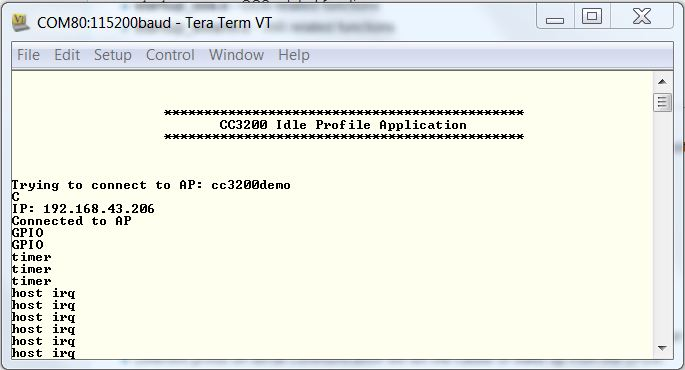

## Overview

The Idle Profile example enables the user to measure current values, power
consumption and other parameters when the CC3200 is
essentially idle (both NWP and application subsystems are in low power deep sleep
conditions). This application also introduces the user to the easily configurable Power  Management
Framework.

## Application details

### Power Management Framework

The CC3200 has multiple power modes which can be set from the application. The Power Management Framework makes it easier to specify this power policy.
The user should configure the lowest power mode for the device based on their application, and the framework will decide when to reach this mode. The framework hides intricacies of the underlying settings and helps the developer experience low power mode capabilities in a simple manner. For more information regarding the Power Management
Framework, please refer to [CC3200 Power Management Framework documentation](http://processors.wiki.ti.com/index.php/CC3200_Power_Management_Framework).

### Current Measurement

This application specifies Low Power Deep Sleep (LPDS) as the lowest
power mode. At times, both the NWP and application subsystem will be in LPDS. Current values can be as low as on the order of hundreds of micro amps. The procedure for measuring current can be found in [Power Management Optimizations and Measurements documentation](http://processors.wiki.ti.com/index.php/CC3200_Power_Management_Optimizations_and_Measurements).

### Program Flow

Most the parameters user will need to modify are specified as MACROs, located in **main.c**

- **SSID\_NAME** - Name of the Access Point used for this application.
- **GPIO\_SRC\_WKUP** - Gpio number used as wake up source.
- **APP\_UDP\_PORT** - Port number on which the device will wait for udp packets.
- **LPDS\_DUR\_SEC** - Time (in seconds) after which the device will come out of LPDS.
- **LPDS\_DUR\_NSEC** - Time (in addition to HIB\_DUR\_SEC) in nanoseconds after which the device will come out of LPDS.

```c
	#define SSID_NAME               "cc3200demo"
	#define GPIO_13                 13
	#define GPIO_SRC_WKUP           GPIO_13
	#define APP_UDP_PORT            5001
	#define LPDS_DUR_SEC            60
	#define LPDS_DUR_NSEC           0
```

Security parameters for the AP can be configure inside the `WlanConnect`
function in main.c.  
Whatever GPIO is used as wake up source must be added to the `gpio_list`
array in user\_app\_config.h and pinmux for the same GPIO must be
added in pinmux.c.

### Task 1: UDPServerTask

1.  Block on a message from the TimerGPIO task (waiting for the NWP to
    start and connect to AP).
2.  Create a UDP server and wait for UDP packet in a while loop. When the NWP subsystem receives any UDP packet, it will bring the
    application MCU out of LPDS, if not already.

### Task 2: TimerGPIOTask

1.  Start NWP, switch to Station mode, set NWP power policy and connect to the AP.
2.  Upon successful connection, unblock UDPServerTask.
3.  Set timer and GPIO as wake sources from low power modes.
4.  Set Power policy for the application MCU.

## Source Files briefly explained

- **main.c** - The main file implementing the idle profile.  
- **lp3p0\_board.c** - Board specific initialization for Power Management framework .  
- **lp3p0\_plat\_ops.c** - Board specific APIs like IO parking and framework loading.  
- **pinmux.c** - Generated by the PinMUX utility.  
- **startup\_\*.c** - Initialize vector table and IDE related functions
- **wdt\_if.c** - Interface file for Watchdog Timer

## Usage

1.  Setup a serial communication application. Open a serial terminal on a PC with the following settings:
	- **Port: ** Enumerated COM port
	- **Baud rate: ** 115200
	- **Data: ** 8 bit
	- **Parity: ** None
	- **Stop: ** 1 bit
	- **Flow control: ** None
2. Edit the macros in main.c as specified above to connect to your AP. Modify any other configurations as desired.
3. Run the reference application. Build the application and flash the binary using [UniFlash](http://processors.wiki.ti.com/index.php/CC3100_%26_CC3200_UniFlash_Quick_Start_Guide).
	- The debugger will disconnect when the device enters LPDS.
4. The red LED will turn off whenever the device enters LPDS. Upon wake, the serial terminal will print the cause.



## Limitations/Known Issues

Refer to [CC3200 Power Management Framework documentation](http://processors.wiki.ti.com/index.php/CC3200_Power_Management_Framework) for limitations and known issues.
