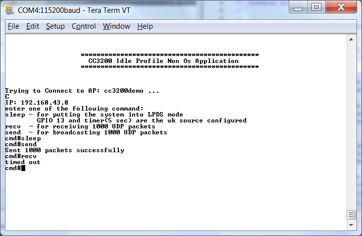

# Overview

The Idle Profile Non-OS example enables the user to measure current values, power
consumption and other parameters when the CC3200 is
essentially idle (both NWP and application subsystems are in low power deep sleep
conditions) and in a Non-OS application. This application also introduces the user to the easily configurable Power  Management
Framework.

## Application details

### Power Management Framework

The CC3200 has multiple power modes which can be set from the application. The Power Management Framework makes it easier to specify this power policy.
The user should configure the lowest power mode for the device based on their application, and the framework will decide when to reach this mode. The framework hides intricacies of the underlying settings and helps the developer experience low power mode capabilities in a simple manner. For more information regarding the Power Management
Framework, please refer to [CC3200 Power Management Framework documentation](http://processors.wiki.ti.com/index.php/CC3200_Power_Management_Framework).

### Current Measurement

This application specifies Low Power Deep Sleep (LPDS) as the lowest
power mode. At times, both the NWP and application subsystem will be in LPDS. Current values can be as low as on the order of hundreds of micro amps. The procedure for measuring current can be found in [Power Management Optimizations and Measurements documentation](http://processors.wiki.ti.com/index.php/CC3200_Power_Management_Optimizations_and_Measurements).

### Program Flow

Most the parameters user will need to modify are specified as MACROs, located in **main.c**

- **GPIO\_SRC\_WKUP** - Gpio to be used as wake up source.
- **APP\_UDP\_PORT** - Port number on which the device will wait for UDP packets.
- **LPDS\_DUR\_SEC** - Time (in seconds) after which the device will come out of LPDS.
- **IP\_ADDR** - IP address of the device to which the UDP packets will be sent
- **PORT\_NUM** - Port Number used for the UDP Communication
- **BUFF\_SIZE** - Size of each UDP packet.
- **UDP\_PACKET\_COUNT** - number of UDP packet to be receieved or sent out.

```c
	#define GPIO_SRC_WKUP           PRCM_LPDS_GPIO13  
	#define LPDS_DUR_SEC            5

	#define BUFF_SIZE               1472

	/* udp transmission related parameters */
	#define IP_ADDR                 0xFFFFFFFF /* broadcast */
	#define PORT_NUM                5001
	#define BUF_SIZE                1400
	#define UDP_PACKET_COUNT        1000
```

This application execution depends on user input from the serial terminal using the following commands:

- **sleep** - put the Device into LPDS only to be woken up by either configured GPIO source or the configured wake-up Timer
- **send** - send out UDP\_PACKET\_COUNT number of UDP packets to the IP\_ADDR
- **recv** - receive UDP\_PACKET\_COUNT number of UDP packets

While waiting for input, the device will be in an active state. Once the
command is input, the device will try to enter LPDS whenever it is idle. UDP receive will time out in 5 seconds.

## Source Files briefly explained

- **main.c** - The main file implementing the idle profile.  
- **lp3p0\_board.c** - Board specific initialization for Power Management framework .  
- **lp3p0\_plat\_ops.c** - Board specific APIs like IO parking and framework loading.  
- **pinmux.c** - Generated by the PinMUX utility.  
- **startup\_\*.c** - Initialize vector table and IDE related functions
- **uart\_if.c** - contains UART Interface APIs
- **udma\_if.c** - contains UDMA related APIs
- **utils\_if.c** - contains utility routines

# Usage

1.  Setup a serial communication application. Open a serial terminal on a PC with the following settings:
	- **Port: ** Enumerated COM port
	- **Baud rate: ** 115200
	- **Data: ** 8 bit
	- **Parity: ** None
	- **Stop: ** 1 bit
	- **Flow control: ** None
2. Edit the macros in common.h to connect to your AP. Modify any other configurations in main.c as desired.
3.  Run the reference application. Build the application and flash the binary using [UniFlash](http://processors.wiki.ti.com/index.php/CC3100_%26_CC3200_UniFlash_Quick_Start_Guide).
	- The debugger will disconnect when the device enters LPDS.
4. Input commands on the serial terminal as shown above.



## Limitations/Known Issues

Refer to [CC3200 Power Management Framework documentation](http://processors.wiki.ti.com/index.php/CC3200_Power_Management_Framework)
for limitations and known issues.