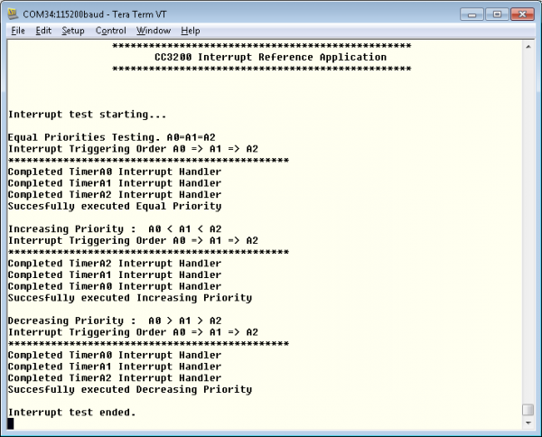

## Overview

This application showcases interrupt preemption
and tail-chaining capabilities. Nested interrupts are synthesized when
the interrupts have the same priority, increasing priorities, and
decreasing priorities. With increasing priorities, preemption will
occur; in the other two cases tail-chaining will occur.

##  Source Files briefly explained  

- **pinmux** - Pinmux configurations as required by the application.
- **main** - Main file that showcases Interrupt Preemption
capabilities
- **uart\_if** - To display status information over the UART
- **systick\_if** - Setup the systick values and registers SysTick handler

## Usage

1.  Setup a serial communication application. Open a serial terminal on a PC with the following settings:
	- **Port: ** Enumerated COM port
	- **Baud rate: ** 115200
	- **Data: ** 8 bit
	- **Parity: ** None
	- **Stop: ** 1 bit
	- **Flow control: ** None
2.  Run the reference application.
      - Open the project in CCS/IAR. Build the application and debug to load to the device, or flash the binary using [UniFlash](http://processors.wiki.ti.com/index.php/CC3100_%26_CC3200_UniFlash_Quick_Start_Guide).

# Limitations/Known Issues
