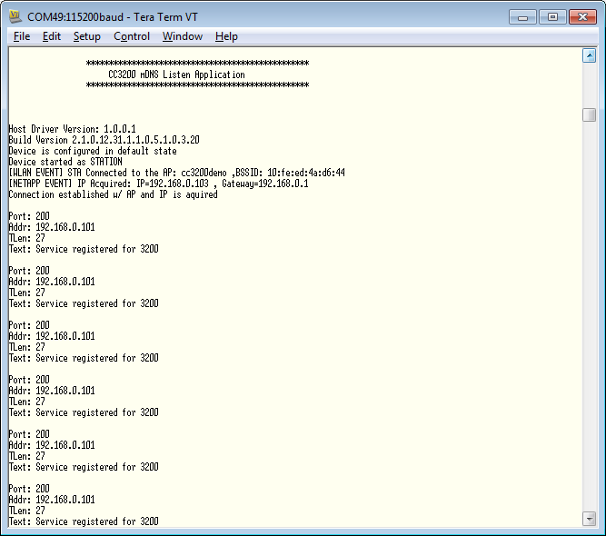

# Overview

mDNS (Multicast Domain Name System) is a host name resolution service. mDNS hosts can multicast messages containing information about its services, IP address, and text on mDNS ports. An mDNS client on the same subnet can listen to those messages. The CC3200 device can make use of these services.  

# Application Details

This application can either be used as a Advertise (mDNS host) application or as a listen (mDNS client) application. Users can switch between the two using a predefined symbol `MDNS\_ADVERTISE`.

The advertise application registers and multicasts one service `CC3200._uart._tcp.local` at mDNS port. The listen application attempts to get the IP, port, and text of a service multicasted by another device acting as a DNS host.

This mDNS sample application registers services as "unique services". This means if a service with the same name is already registered on the network, the new service registration will fail.

## Source Files briefly explained

- **main.c** - Initializes the device, connects to an AP, registers
service for broadcast and tries to get IP, port and text of the
service by name.
- **pinmux.c** - Generated by the PinMUX utility.  
- **startup\_\*.c** - Initialize vector table and IDE related functions
- **uart\_if.c** - Interface file for uart communication  

# Usage

1.  Setup a serial communication application. Open a serial terminal on a PC with the following settings:
	- **Port: ** Enumerated COM port
	- **Baud rate: ** 115200
	- **Data: ** 8 bit
	- **Parity: ** None
	- **Stop: ** 1 bit
	- **Flow control: ** None
2. Edit **common.h** and modify the values of the below macros for the device to connect to the AP:
```c
	#define SSID_NAME           "<ap_name>"    		/* AP SSID */
	#define SECURITY_TYPE       SL_SEC_TYPE_OPEN 	/* Security type (OPEN or WEP or WPA)*/
	#define SECURITY_KEY        ""              	/* Password of the secured AP */
```
3.  Run the reference application.
	- Open the project in CCS/IAR. Build the application and debug to load to the device, or flash the binary using [UniFlash](http://processors.wiki.ti.com/index.php/CC3100_%26_CC3200_UniFlash_Quick_Start_Guide).
4. If ran as a advertise application, the serial terminal will appear as below:
	
5. If ran as a listen application, a mDNS host must be run on the same subnet. This can be a PC, smartphone, or another CC3200 device running as advertise. Upon receiving the multicast message, the serial terminal will appear as below:
	

## Limitations/Known Issues

	- Services cannot be broadcasted by the same LaunchPad.
