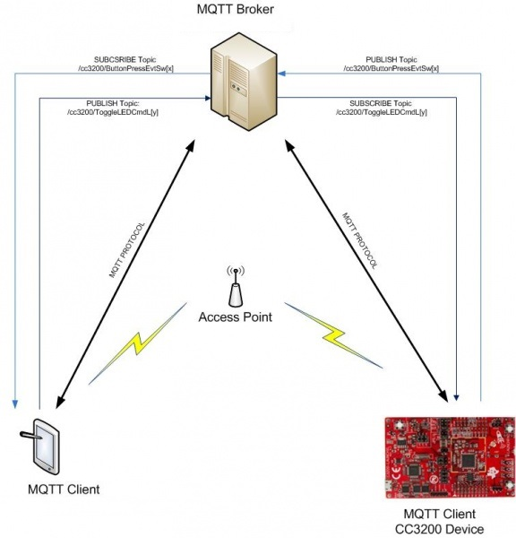
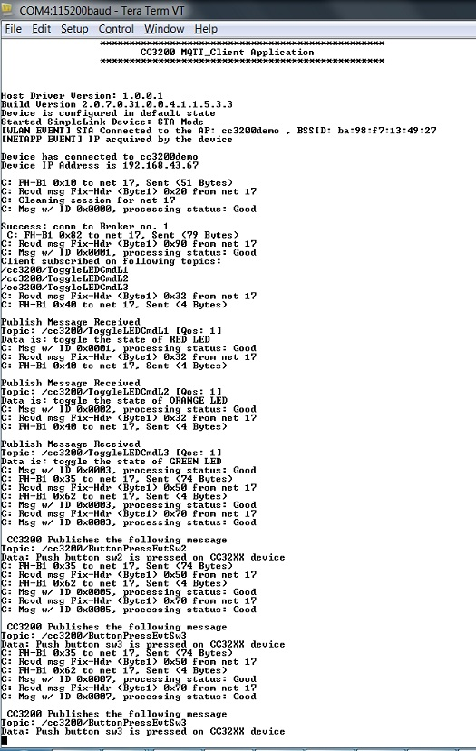

# Overview

MQTT (Message Queue Telemetry Transport) protocol is an extremely
light weight machine to machine connectivity protocol. It is based on
publish/subscribe messaging model and is designed to be used on the top
of TCP/IP protocol. Key point of this protocol includes small code
footprint and low network bandwidth requirement. Other features include
faster response time, low power requirement, ease of scalability. All
these advantages makes it an ideal candidate for communication protocol
in embedded devices intended to implement IOT(internet of things)
applications. More information regarding MQTT protocol can be obtained
from the latest MQTT Protocol specification.

### MQTT Network

A simple MQTT network contains a server / broker (like a central hub)
that can handle connections from multiple clients. Each of the connected
client can publish data for any topic (token). Whereas, the server /
broker is responsible for forwarding the data published for a topic by a
client to all the other clients who have subscribed for that particular
topic. This is a very simplistic description of a MQTT network to set
the tone for the sample application provided in SDK.

### MQTT Library

MQTT library abstracts out the underlying intricacies of MQTT network
and provide you with an intuitive and easy to use APIs to implement the
MQTT protocol on CC3200 device.

# Application details

This application make use of the APIs from MQTT client library to
communicate with a MQTT client through a broker. Three LEDs on
the CC3200 device can be controlled from a web client by publishing msg
on appropriate topics. Similarly, messages can be published on
pre-configured topics defined in the code by pressing the switch buttons on the CC3200 device.



## Configurations

Most the parameters user will need to modify are specified as MACROs which will eventually get populated in following structures containing connection configurations and library configurations respectively.

```c
    /*Operate Lib in MQTT 3.1 mode.*/
    #define MQTT_3_1_1              false /*MQTT 3.1.1 */
    #define MQTT_3_1                true /*MQTT 3.1*/
    
	/*Defining Broker IP address and port Number*/
	#define SERVER_ADDRESS           "m2m.eclipse.org"
	#define SERVER_IP_ADDRESS        "192.168.178.67"
	#define PORT_NUMBER              1883
	#define SECURED_PORT_NUMBER      8883
	#define LOOPBACK_PORT            1882
    
    #define MAX_BROKER_CONN         1
    
    #define SERVER_MODE             MQTT_3_1
    /*Specifying Receive time out for the Receive task*/
    #define RCV_TIMEOUT             30
    
    /*Background receive task priority*/
    #define TASK_PRIORITY           3
    
    /* Keep Alive Timer value*/
    #define KEEP_ALIVE_TIMER        25
    
    /*Clean session flag*/
    #define CLEAN_SESSION           true
    
    /*Retain Flag. Used in publish message. */
    #define RETAIN                  1
    
    /*Defining Publish Topic*/
    #define PUB_TOPIC_FOR_SW3       "/cc3200/ButtonPressEvtSw3"
    #define PUB_TOPIC_FOR_SW2       "/cc3200/ButtonPressEvtSw2"
    
    /*Defining Number of topics*/
    #define TOPIC_COUNT             3
    
    /*Defining Subscription Topic Values*/
    #define TOPIC1                  "/cc3200/ToggleLEDCmdL1"
    #define TOPIC2                  "/cc3200/ToggleLEDCmdL2"
    #define TOPIC3                  "/cc3200/ToggleLEDCmdL3"
```

**Note:** CC3200 MQTT library has the capability of connecting to up to four brokers
simultaneously. The configuration for the new
connection can be added as new element(on next index) in
connect\_config.

```c
    /* connection configuration */
    connect_config usr_connect_config[] =
    {
        {
            {
                {
                    SL_MQTT_NETCONN_URL,
                    SERVER_ADDRESS,
                    PORT_NUMBER,
                    0,
                    0,
                    0,
                    NULL
                },
                SERVER_MODE,
                true,
            },
            NULL,
            "user1",
            NULL,
            NULL,
            true,
            KEEP_ALIVE_TIMER,
            {Mqtt_Recv, sl_MqttEvt, sl_MqttDisconnect},
            TOPIC_COUNT,
            {TOPIC1, TOPIC2, TOPIC3},
            {QOS2, QOS2, QOS2},
            {WILL_TOPIC,WILL_MSG,WILL_QOS,WILL_RETAIN},
            false
        }
    };
    
    /* library configuration */
    SlMqttClientLibCfg_t Mqtt_Client={
        1882,
        TASK_PRIORITY,
        30,
        true,
        UART_PRINT
    };
```

## Source Files briefly explained

- **main.c** - The main file implementing the mqtt client.  
- **pinmux.c** - Generated by the PinMUX utility.  
- **button\_if.c** - Interface file to handle button click events
- **gpio\_if.c** - Basic GPIO interface APIs. Used to control the LEDs.
- **network\_if.c** - Common functions to handle connection to AP and FreeRTOS hook functions.
- **startup\_\*.c** - Initialize vector table and IDE related functions
- **timer\_if.c** - Wrapper functions for timer module driver
- **uart\_if.c** - To display status information over the UART

# Usage

This example can use TI-RTOS or FreeRTOS.

1.  On a host PC, open a serial terminal with the following parameters:
	- **Port: ** Enumerated COM port
	- **Baud rate: ** 115200
	- **Data: ** 8 bit
	- **Parity: ** None
	- **Stop: ** 1 bit
	- **Flow control: ** None
2.  Run the reference application.
      - Open the project in CCS/IAR. Build the application and debug to load to the device, or flash the binary using [UniFlash](http://processors.wiki.ti.com/index.php/CC3100_%26_CC3200_UniFlash_Quick_Start_Guide).
3.  This example requires the AP to have internet connectivity. In case the connection to the default AP fails, the user will see a prompt on the serial terminal.
	- The green LED denotes that the network processor has turned on
    successfully, and the red LED continuously blinks as long as a connection
    with AP is not established.
	- Once established, the red LED stays continuously ON for one second and then all the LEDs will be turned off.
4.  From a host PC or mobile device, open any MQTT client application. Connect to the **m2m.eclipse.org** broker we are using for this example.
5. Subscribe to topics `/cc3200/ButtonPressEvtSw3` and `/cc3200/ButtonPressEvtSw2`.
6.  Publish on `/cc3200/ToggleLEDCmdL1`, `/cc3200/ToggleLEDCmdL2`, or `/cc3200/ToggleLEDCmdL3` to control LED9, LED10 and LED11 respectively.
7. Press the SW2 or SW3 switch on CC3200 LaunchPad to publish message on `/cc3200/ButtonPressEvtSw2` or `/cc3200/ButtonPressEvtSw3` respectively.



**Note:** The client ID should be unique for every client. We recommended changing the
client ID for the CC3200 device to avoid interference with other users. In this example, this is defined in struct `usr_connect_config` as `"user1"`.

### Debug

**Note:** To print packet-level details on the serial terminal for debugging, add `DEBUG_NET_DEV` as a predefined symbol in the MQTT client library.

## Limitations/Known Issues

- Client can connect to up to 4 brokers simultaneously