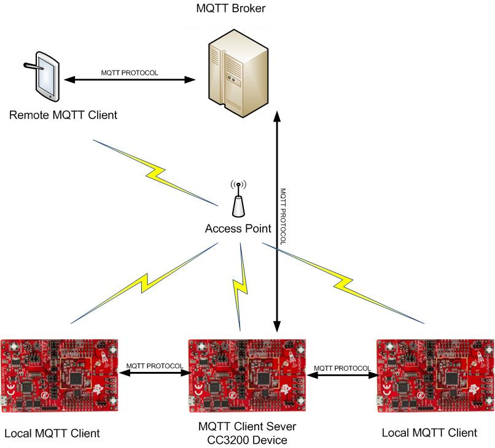
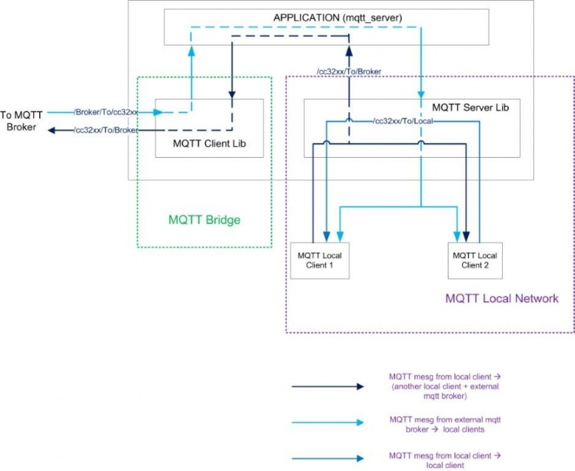
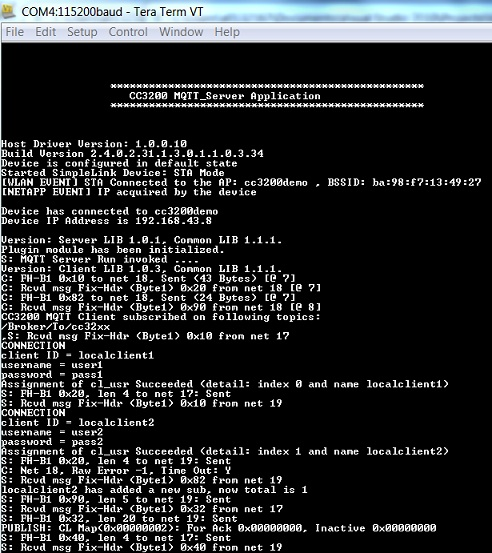
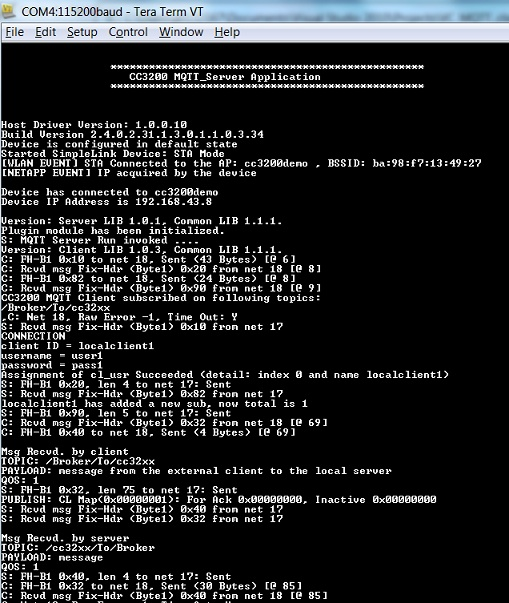

# Overview

MQTT (Message Queue Telemetry Transport) protocol is an extremely
light weight machine to machine connectivity protocol. It is based on
publish/subscribe messaging model and is designed to be used on the top
of TCP/IP protocol. A small footprint implementation, low bandwidth
requirement and ease of scalability makes it a popular choice for data
transport for embedded systems in the realm of Internet-of-Things (IoT).

MQTT uses a client-server topology for data transactions. Multiple
clients can communicate with a single server. More information about
MQTT protocol can be obtained from the latest MQTT Protocol
specification. Subsequent sections outline the support for the tiny MQTT
server implementation that has been made available as part of this SDK.

### MQTT Network

A simple MQTT network contains a server / broker (like a central hub)
that can handle connections from multiple clients. Each of the connected
client can publish data for any topic (token). Whereas, the server /
broker is responsible for forwarding the data published for a topic by a
client to all the other clients who have subscribed for that particular
topic. This is a very simplistic description of a MQTT network to set
the tone for the sample application provided in SDK.

### MQTT Library

MQTT library abstracts out the underlying intricacies of MQTT network
and provide you with an intuitive and easy to use APIs to implement the
MQTT protocol on CC3200 device. The server library makes provisions to
manage multiple clients and topics.

# Application details

This application implements a MQTT bridge that utilizes the services of
a MQTT server and MQTT client running in parallel (on the same
CC3200 device). The MQTT server manages the local MQTT network whereas the
MQTT client connects to a cloud server/broker. The bridge application
enables data exchange between the local server and the cloud server. To
receive data from the cloud server, the MQTT bridge subscribes to certain topics through the MQTT client. It also forwards the data or topics
received from the local MQTT server to the cloud server. The local MQTT
server handles the connections from multiple MQTT clients in the local network (shown as Launchpads in the following figure, but can be running on another platform).



## Use Case

The motivation behind this application is to showcase a working setup
where two local MQTT clients can communicate with each other as well as
talk to a remote client via an external broker. For the sake of
simplicity, the following abbreviations are used:

1.  LC1 - First local MQTT client
2.  LC2 - Second local MQTT client
3.  RC - Remote MQTT client
4.  AS (Application Server) - MQTT server running on CC32xx device
5.  AC (Application Client) - MQTT clint running on CC32xx device
6.  BR - External broker/cloud server
7.  AP - Access Point

This use case consists of two local MQTT clients LC1 and LC2, which could
be running on a PC, smartphone, or SimpleLink clients (as shown
in the above figure), communicating with each other using the MQTT
server (AS). These Llocal clients can also communicate with a remote MQTT
client (RC) through an external broker (BR). Please refer to the following diagrams.

### Local Communication

1.  LC1 connects to AS
2.  LC2 connects to AS
3.  LC1 subscribes on a particular topic.
4.  LC2 publish message on the same topic.
5.  LC1 should get the message published by LC2. This will conclude the
    Local MQTT Network.

### Remote Communication

1.  RC and AC should be connected to the same external broker (BR)
2.  AC has already subscribed to the topic `SUB\_TOPIC`
3.  RC will publish a message on `SUB\_TOPIC`
4.  Whatever message is received by AC will be passed to the AS.
5.  If any of the local clients have subscribed to the `SUB\_TOPIC`, they will
    receive the message published by RC.
6.  AC has also enrolled for the topic `ENROLLED\_TOPIC`, which means if
    AS receives any message on `ENROLLED\_TOPIC` from any local client, it
    will be passed to the AC and then will be published to the BR.
7.  If RC has subscribed on `ENROLLED\_TOPIC`, it will receive the message
    published by the local client.

### MQTT Application block diagram



## Configurations

Following highlights most of the parameters that the user will want to
configure

```c
	/*Operate Lib in MQTT 3.1 mode.*/
	#define MQTT_3_1_1          false /*MQTT 3.1.1 */
	#define MQTT_3_1            true /*MQTT 3.1*/
	
	#define WILL_TOPIC          "Client"
	#define WILL_MSG            "Client Stopped"
	#define WILL_QOS            QOS2
	#define WILL_RETAIN             false
	
	/*Defining Broker IP address and port Number*/
	#define SERVER_ADDRESS           "m2m.eclipse.org"
	#define SERVER_IP_ADDRESS        "192.168.178.67"
	#define PORT_NUMBER              1883
	#define SECURED_PORT_NUMBER      8883
	#define LOOPBACK_PORT            1882
	
	/*Specifying Receive time out for the Receive task*/
	#define RCV_TIMEOUT             30
	
	/*Background receive task priority*/
	#define TASK_PRIORITY           3
	
	/* Keep Alive Timer value*/
	#define KEEP_ALIVE_TIMER        25
	
	/*Clean session flag*/
	#define CLEAN_SESSION           true
	
	/*Retain Flag. Used in publish message. */
	#define RETAIN                  1
	
	/*Defining Publish Topic*/
	#define PUB_TOPIC               "/cc32xx/ButtonPressEvtSw2"
	
	/*Defining Number of topics*/
	#define SUB_TOPIC_COUNT         1
	
	/*Defining Subscription Topic Values*/
	#define SUB_TOPIC           "/Broker/To/cc32xx"
	
	/*Defining Enrolled Topic Values*/
	#define ENROLLED_TOPIC              "/cc32xx/To/Broker"
```

Apart from the MACROs shown above, the following structure can be
configured as per requirement and use case.

```c
	/*Initialization structure to be used with sl_ExtMqtt_Init API*/
	SlMqttClientCtxCfg_t Mqtt_ClientCtx ={
	{
	    SL_MQTT_NETCONN_URL,
	    SERVER_ADDRESS,
	    PORT_NUMBER,
	    0,
	    0,
	    0,
	    NULL
	    },
	    MQTT_3_1_1,
	    true
	};
	
	SlMqttClientLibCfg_t Mqtt_ClientCfg ={
	    0,
	    TASK_PRIORITY,
	    RCV_TIMEOUT,
	    true,
	    UART_PRINT
	};
	
	SlMqttServerCfg_t Mqtt_Server={
	    {
	        0,
	        NULL,
	        PORT_NUMBER,
	        0,
	        0,
	        0,
	        NULL
	    },
	    LOOPBACK_PORT,
	    TASK_PRIORITY,
	    KEEP_ALIVE_TIMER,
	    true,
	    UART_PRINT
	};
	
	SlMqttWill_t will_param={
	    WILL_TOPIC,
	    WILL_MSG,
	    WILL_QOS,
	    WILL_RETAIN
	};
```

## Source Files briefly explained

- **main.c** - The main file implementing the mqtt client server bridge. 
- **pinmux.c** - Generated by the PinMUX utility.  
- **button\_if.c** - Interface file to handle button click events
- **gpio\_if.c** - Basic GPIO interface APIs. Used to control the LEDs.
- **network\_if.c** - Common functions to handle connection to AP and FreeRTOS hook functions.
- **startup\_\*.c** - Initialize vector table and IDE related functions
- **timer\_if.c** - Wrapper functions for timer module driver
- **uart\_if.c** - To display status information over the UART

# Usage

1.  On a host PC, open a serial terminal with the following parameters:
	- **Port: ** Enumerated COM port
	- **Baud rate: ** 115200
	- **Data: ** 8 bit
	- **Parity: ** None
	- **Stop: ** 1 bit
	- **Flow control: ** None
2.  Run the reference application.
	- Open the project in CCS/IAR. Build the application and debug to load to the device, or flash the binary using [UniFlash](http://processors.wiki.ti.com/index.php/CC3100_%26_CC3200_UniFlash_Quick_Start_Guide).
3.  This example requires the AP to have internet connectivity. In case the connection to the default AP fails, the user will see a prompt on the serial terminal.
	- The green LED denotes that the network processor has turned on
    successfully, and the red LED continuously blinks as long as a connection
    with AP is not established.
	- Once established, the red LED stays continuously ON for one second and then all the LEDs will be turned off.
4.  From a host PC or mobile device, open any MQTT client application. Connect to the **m2m.eclipse.org** broker we are using for this example. You can connect one or multiple local MQTT clients to the MQTT server, and it can be a PC or another CC3200 device. A local functional MQTT network can be used to communicate between multiple local clients.
5.  If a local client publishes on a topic enrolled by the on-board client, it will be published to the external broker and made available for remote clients.
6. Any message from the broker to the on-board client will be sent to the MQTT server, which will distribute the message to the local clients subscribed to the same topic.

### Local Communication



### Remote Communication



**Note:** The client ID should be unique for every client. We recommended changing the
client ID for the CC3200 device to avoid interference with other users. In this example, this is defined in struct `usr_connect_config` as `"user1"`.

### Debug

**Note:** To print packet-level details on the serial terminal for debugging, add `DEBUG_NET_DEV` as a predefined symbol in the MQTT client library.

## Limitations/Known Issues
