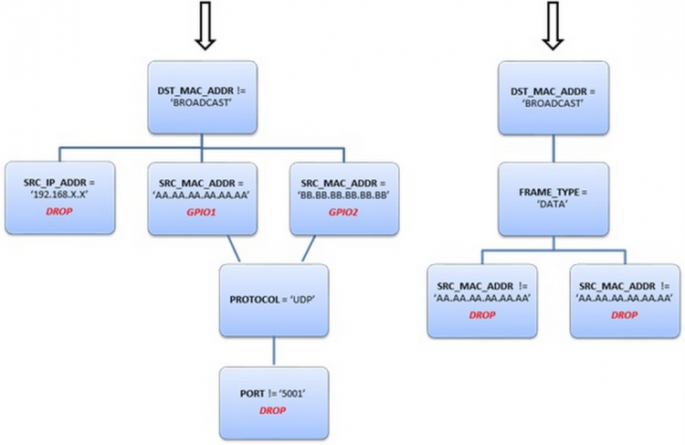
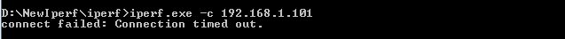
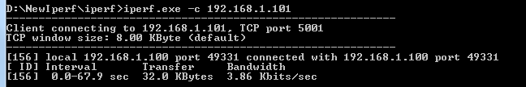

# Overview

The Rx-Filters feature enables the user to simply define and manage
Rx-filtering. It reduces the amount of traffic transferred to
the host and for efficient power management.

Every Rx frame traverses through a series of decision trees that
determines how the frame should be handled. The decision trees are composed of filter nodes. Each node has its “filter rule”, “trigger” and “action”. The frame filtering process
starts with the tree root nodes: for every node, if its “filter rule” and “trigger” are true, the node’s action will be performed, and the frame will continue to the node’s child nodes.

- Filter rules:
	- Protocol header rule: header type + compare function + arguments
- Triggers:
	- When role is… (STA/AP/Promiscuous)
	- When connection state is… (connected/disconnected)
	- When device IP... (acquired/not acquired)
	- When counter reaches a certain threshold
- Actions:
	- Drop the packet (do not pass it to the host)
	- Increment a counter (counter can be used in a child's filter to
	perform a certain action, such as dropping a frame when counter
	reaches some threshold)
	- Decrement a counter (counter can be used in a child's filter to
	perform a certain action, such as dropping a frame when counter
	reaches some threshold)
	- Reset a counter

The actions are executed only if the filter is matched to a received
packet. Up to two actions can be defined per filter.

There is an option to define a combined-filter-node, which its rule
is a logical function on one or two other filters-nodes. For
example: node\_1 OR node\_2. Tree traversal is stopped when the frame reaches a DROP action in
one of the trees. Traversing is done layer by layer among all the trees.

**Example:**

1. Receive data broadcast frames only from two specific MAC addresses
2. Receive all unicast frames, except for frames with a certain SRC\_IP
	address range
3. If a unicast frame is received from MAC address `AA.AA.AA`, turn on
	GPIO1
4. If a unicast frame is received from MAC address `BB.BB.BB`, turn on
	GPIO2
5. If a unicast UDP frame is received from MAC address `AA.AA.AA` or `BB.BB.BB`, pass only packets from port 5001  



### Creating Trees

Trees are created by the user. The user adds the filter nodes and
defines the filter's tree hierarchy. Trees can be saved and loaded from
the serial flash. The maximum number of filter nodes is limited to 64.

### Host Interface

The host supplies a set of APIs to enable filter creation and editing. The following operations are supported:
	1.  Add nodes - The user may request to add new node to the database,
	    the node is created and a node unique ID is returned back to the
	    user. The user should disable all filters before adding a node.  
	2.  Remove nodes - The user may request to remove a node from the
	    filters' database, the node is removed. The user should disable all
	    filters before removing a node.  
	3.  Enable nodes - The user can request to enable one or more filters,
	    filters which are enabled, take part in the matching process.
	4.  Disable nodes - The user can request to disable one or more filters,
	    filters which are disabled, don’t take part in the matching process.
	5.  Get filter node
	6.  Update filter node

The user’s application is responsible for adding filter nodes and defining the filters' tree hierarchy. If the user is interested in storing a filter node in the flash memory, the user should set the persistence flag of the node. A filter can be defined as persistent only if its parent is persistent. Persistent filter nodes will be loaded automatically upon system startup. The user can choose one or more filters to disable or enable; filters which are disabled don’t take part in the matching process.

# Application details

This application creates and enables two filters according to:  
- Remote MAC address  
- Remote IP address

## Program Flow

1. Connect to an AP and listen on `PORT_NUM`. The TCP connection will be refused if remote MAC/IP is of the filtered. It is also possible to enable the filters after TCP connection, resulting in not receiving TCP packets.
2. Change the source address and IP address for the remote TCP server.
3. Delete all stored filters. For deleting a specific filter, filter ID should be set as input parameter
4. Build a filter to drop incoming packets according to source MAC address
5. Build filter to drop incoming packets according to source IP address
6. Enable all filters. For enabling a specific filter, filter ID should be set as input parameter

## Source Files briefly explained

- **main.c** - The main file that creates Rx Filters and manage the traffic
- **startup\_\*.c** - Initialize vector table and IDE related functions

# Usage  
1.  Setup a serial communication application. Open a serial terminal on a PC with the following settings:
	- **Port: ** Enumerated COM port
	- **Baud rate: ** 115200
	- **Data: ** 8 bit
	- **Parity: ** None
	- **Stop: ** 1 bit
	- **Flow control: ** None
2. Edit **common.h** and modify the values of the below macros for the device to connect to the AP:
```c
	#define SSID_NAME           "<ap_name>"    		/* AP SSID */
	#define SECURITY_TYPE       SL_SEC_TYPE_OPEN 	/* Security type (OPEN or WEP or WPA) */
	#define SECURITY_KEY        ""              	/* Password of the secured AP */
```
3.  Run the reference application.
      - Open the project in CCS/IAR. Build the application and debug to load to the device, or flash the binary using [UniFlash](http://processors.wiki.ti.com/index.php/CC3100_%26_CC3200_UniFlash_Quick_Start_Guide).
4.  Connect a PC to the AP and start Iperf. Change the PC's IP address and MAC address to the default set in main.c as `g_ucMacAddress` and `g_ucIpAddress`.
5.  The application creates and enables filters based on IP Address and MAC Address. Once device connects to the network, it acquires IP and prints to the serial terminal. Send a packet to the CC3200 using the filtered IP address. You should see a connection error if you are using a filtered IP address.
	
6. If you send packets from an IP address that is not in the filter list, you should see a successful connection.
	 
  
## Limitations/Known Issues
