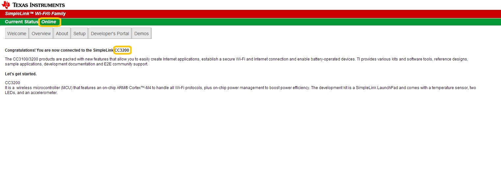
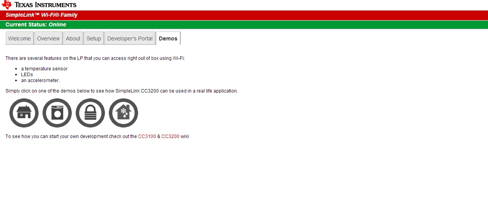
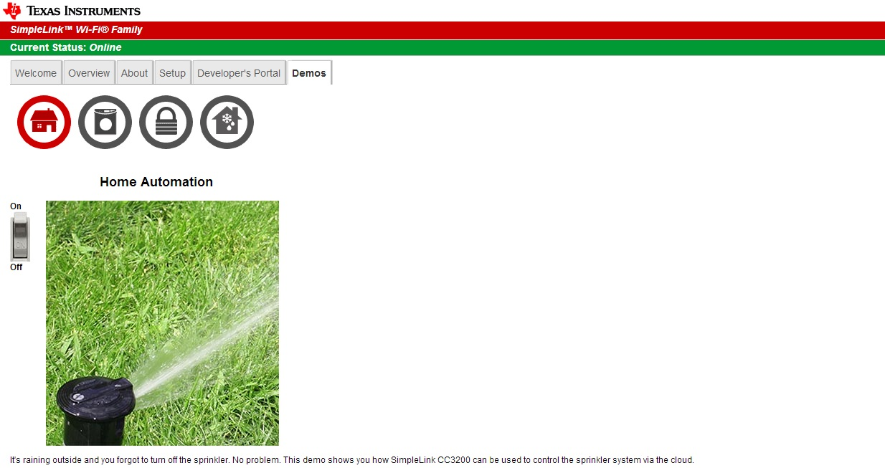
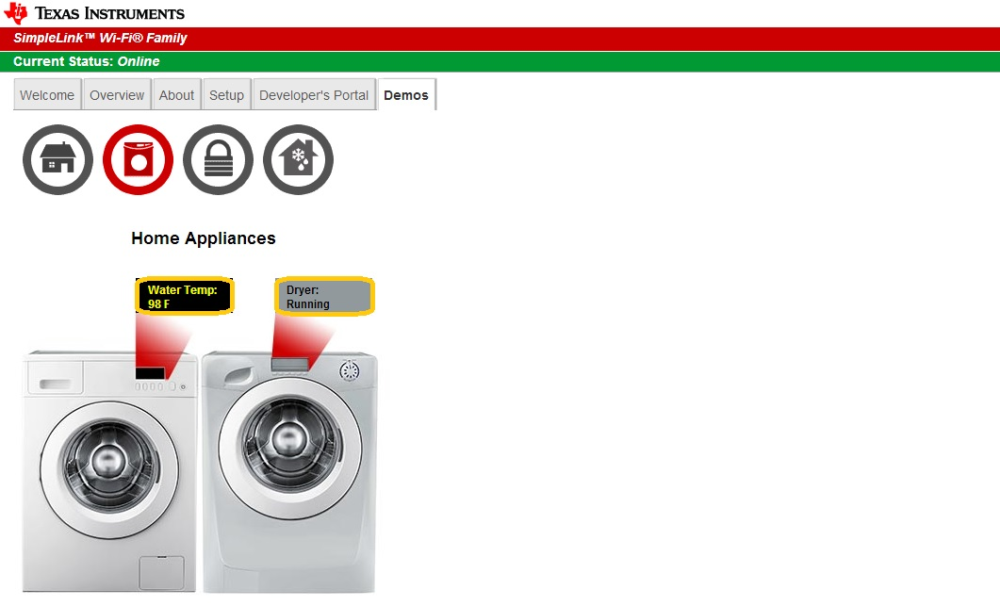
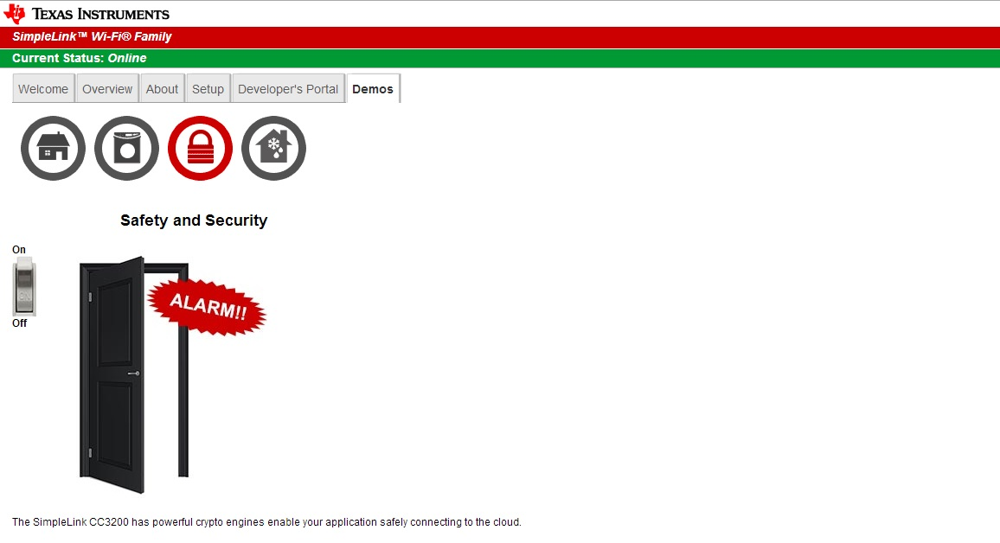
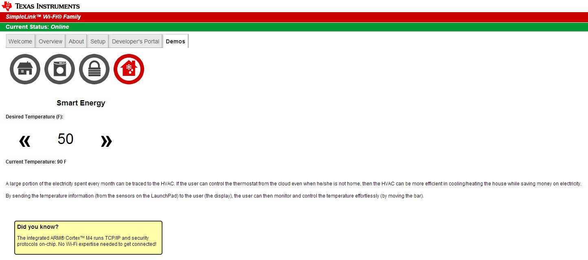

# Overview

This application demonstrates Out of Box Experience with CC3200 Launch
Pad. It highlights the following features

1.  Easy Connection to CC3200 Launchpad
	- Direct Connection to Launchpad by using CC3200 device in Access Point Mode(Default)
	- Connect with [TI SmartConfig](http://www.ti.com/tool/wifistarterpro) Technology
2.  Easy access to CC3200 Using Internal HTTP server and on-board webcontent
3.  Attractive Demos
	- Home Automation
	- Appliance Control
	- Security System
	- Thermostat

For more information please refer [CC32xx Quick Start Guide](http://processors.wiki.ti.com/index.php/CC3200_Quick_Start_Guide)

# Usage

The CC3200 LaunchPad comes with all the required content flashed to run this application.

If user has flashed other SDK applications and needs to flash the Out of Box content again, follow below steps:

1. Open **<cc3200\_sdk>\examples\out\_of\_box\html\out\_of\_box.usf** session file in Uniflash.
2. Flash the files to the device. Detailed instructions at [Uniflash User Guide](http://processors.wiki.ti.com/index.php/UniFlash_v4_Quick_Guide).
3. Remove the SOP jumpers and reset the LaunchPad to run the reference application

If device is starting in Access Point mode (jumper is set on VCC and pin 58), check terminal prints to learn the device's AP name.

## Demos

Go to Demo Tab. Click/Press on the icons to see the demo  
  
  
Turn the Switch ON/OFF and Check the Red LED(D7) on Launchpad  
 
  
Check temperature from Inbuilt temperature Sensor on Launchpad. Move the
Launchpad and check Dryer status  
 
  
Turn on the Switch. Move the Launchpad and check Alarm  
 
  
Change the temperature slider and check the RED LED (D7)  

  

## Limitations/Known Issues
