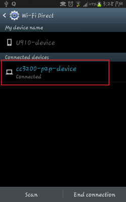
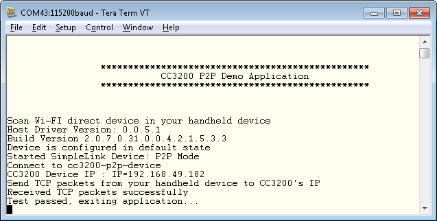

## Overview

This example demonstrates how to connect the CC3200 to a P2P device. The
application starts a TCP server on port 5001 and waits for a P2P device to
connect to send data.
  
Supported P2P roles:

  - `SL_P2P_ROLE_GROUP_OWNER`: CC3200 will be configured in
    'Group-Owner' mode
  - `SL_P2P_ROLE_CLIENT`: CC3200 will be configured in 'Client' mode
  - `SL_P2P_ROLE_NEGOTIATE`: CC3200 will negotiate with remote device
    for client/GO role.

The CC3200 can be configured in the following modes to initiate negotiation:

  - `SL_P2P_NEG_INITIATOR_ACTIVE`: CC3200 will perform discovery -
    Once the remote device is found, it sends the negotiation request
    immediately
  - `SL_P2P_NEG_INITIATOR_PASSIVE`: CC3200 will perform discovery -
    Once the remote device is found, CC3200 waits for it to start
    negotiation
  - `SL_P2P_NEG_INITIATOR_RAND_BACKOFF`: CC3200 will perform
    discovery - Once the remote device is found, it triggers a random
    timer (1-7 seconds) and waits for the remote device to negotiate. On
    timer expiry, CC3200 starts negotiation itself

Supported security types for P2P negotiation:

  - `SL_SEC_TYPE_P2P_PBC`
  - `SL_SEC_TYPE_P2P_PIN_DISPLAY`
  - `SL_SEC_TYPE_P2P_PIN_KEYPAD`

The CC3200 can be configured in `any_p2p` mode as well. When configured,
the CC3200 will perform discovery and connect to the first found device
using security type `SL_SEC_TYPE_P2P_PBC`.

## Application details

This example configures the device with following settings:

  - P2P role negotiate (`SL_P2P_ROLE_NEGOTIATE`)
  - P2P negotiation initiation active (`SL_P2P_NEG_INITIATOR_ACTIVE`)
  - P2P device listens on channel 11 and P2P device's operation channel
    is set to 6
  - P2P connect security type `PBC`

## Usage

1.  Setup a serial communication application. Open a serial terminal on a PC with the following settings:
	- **Port: ** Enumerated COM port
	- **Baud rate: ** 115200
	- **Data: ** 8 bit
	- **Parity: ** None
	- **Stop: ** 1 bit
	- **Flow control: ** None
2.  Run the reference application.
      - Open the project in CCS/IAR. Build the application and debug to load to the device, or flash the binary using [UniFlash](http://processors.wiki.ti.com/index.php/CC3100_%26_CC3200_UniFlash_Quick_Start_Guide).
3. Start a remote P2P device. The CC3200 will be visible cc3200-p2p-device by default, set by `P2P\_DEVICE\_NAME`. 
	
4. Connect to the CC3200. On successful connection, the acquired IP address will be printed to the serial terminal. 
	
5. Additionally, you can open an Iperf client on the remote P2P device and connect on `PORT_NUM`

	`Iperf.exe -c `<DEST_IP_ADDR>` -p `<PORT_NUM>` -i 1`

## Limitations/Known Issues
