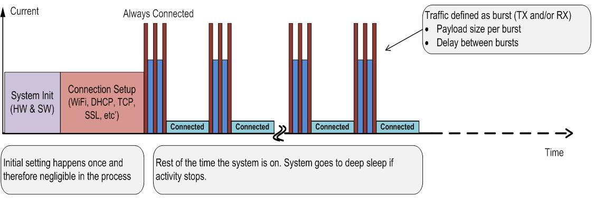

## Introduction

The CC3200 SimpleLink™ Power Management Measurement application provides
users the ability to configure the device in various low power uses
cases, for the purposes of current consumption measurements. The user
can choose to work in the Interactive (simple) mode or to use the
advanced mode where they can change the define values in the source code
in order to control the behavior of the application. The application has
recommended guidelines on how to optimize the power consumption in the
different power profiles use cases.  
The various system's basic power modes are first explained. These are
the building blocks of all power management profiles:

- Hibernate
- Low power deep sleep (LPDS)
- Active modes (Rx or Tx)

The various power profiles are the focus of this document:

- Always connected (aka. Idle connected)
- Intermittently connected
- Transceiver mode

that the focus is on periodic/repetitive events, because one time
events, no matter how high they peak, do not need to be taken into
account, since their influence is negligible for longer periods of
activities.

### Getting started

All Instructions in this document are under the assumptions that the
user already has a working environment of CC3200 LaunchPad, and
installed all the relevant software packages. Otherwise, please refer to
[CC3200 getting started user guide](http://www.ti.com/lit/pdf/swru376),
before proceeding.

## Pre-requisites

### Hardware

- CC3200 LaunchPad Rev4.1 or above
- Oscilloscope with differential probe or current probe
- Digital multimeter (capable of measuring down to 1 uA)

### Software
The power management application is released as a example within the CC3200 SDK. Import it into your environment (CCS/IAR), as any other project described in the [CC3200 Getting Started Guide](http://www.ti.com/lit/pdf/swru376).

## Basic System Power Modes

The following section describes the CC3200 active and low power static
modes. The CC3200 device contains only the Networking sub-system and is
self-contained in terms of power optimization. The following system
modes are defined, and could be measured using TI's EVM boards. The main
three building blocks of most power related application profiles are:

  - Hibernate
  - Low Power Deep Sleep (LPDS)
  - Active: RX & Tx

More details can be found at: [SimpleLink™ CC3100/CC3200 Wi-Fi
Internet-on-a-chip™ Networking Sub-System Power
Management](http://www.ti.com/lit/pdf/swra462)

### Hibernate State

The hibernate mode represents the lowest power state of the device. This
mode is entered when the MCU subsystem requests the power management
unit to shut off the voltage source itself. In hibernate, all the
voltage sources, like DCDC or LDOs, within the power management unit are
shut off. Very few logic, which works directly on battery power, is ON
and they work on 32 KHz clock. Wakeup sources to exit this sleep mode
can be a toggle event on the device’s general purpose IO (GPIO) or based
on timer expiry. In order to measure the static hibernate current
consumption, the user needs to set the global use case variable to
HIBERNATE\_MEASURE.

The application enables the user to enter a constant Hibernate state for
an easy measurement of the power consumption of this state. 


 
To do so, configure `g\_ActiveUseCase` to `HIBERNATE_MEASURE` in the
PM management benchmark code.

**Measurement Tool**
 
Follow the steps mentioned in the *Static Current Measurements*
section, in order to record the hibernate current.

**Expected Results** The expected power consumption numbers are
described in the
[datasheet](http://www.ti.com/lit/ds/symlink/cc3200.pdf).

### LPDS state

To enter into this mode each subsystem processor requests the clock
management unit for shutting off their subsystem. When both the
subsystems request for this mode, Clock management unit will turn off
the PLL, 40Mhz xtal, and the power management unit will shut off the
power to each subsystem and scale down the voltage of always on domain
to 0.9V. Active logic in this mode will work at 32 KHz xtal. There is an
option of retaining the memory content for each subsystem or not. Wakeup
sources to exit this sleep mode can be a toggle event on the device’s
general purpose IO (GPIO) or based on timer expiry. In this mode, power
saving happens because of turning off of power domain, turning off of
PLL, turning off of 40 MHz xtal, memory not retained if opted, and
voltage scale down. In order to measure the static Low Power Deep sleep
(LPDS) current consumption, the user needs to set the global use case
variable to SLEEP\_MEASURE.

The application enables the user to enter a constant Sleep mode (no
traffic) to enable an easy way to measure the power consumption of this
state. 


To do so, configure **g\_ActiveUseCase to "SLEEP\_MEASURE"** in the PM
management benchmark code

**Measurement Tool**  
Follow the steps mentioned in the *Static Current Measurements*
section, in order to record the LPDS current.

**Expected Results**  
The expected power consumption numbers are described in the
[datasheet](http://www.ti.com/lit/ds/symlink/cc3200.pdf).

### Active (Rx & Tx) States

The device is fully active, voltage levels are at their operational
value, and all clocks are ticking. At least one block (MCU / NWP /
Wi-Fi) is running. The two main active modes are transmitting (TX) and
receiving (RX). The Tx and Rx active currents vary based on the channel,
packets type, etc...

**Configuration Parameter**  
In order to individually measure the Tx and Rx current consumptions,
please refer to the Appendix section of '*Using radiotool for active modes*'.

Follow the steps mentioned in the *Profiles and Active current
measurements* section, in order to measure the average current consumption, for each
of the active mode, and power profile use cases.

**Expected Results**  
The expected power consumption numbers for each Rx and Tx states are
described in the
[datasheet](http://www.ti.com/lit/ds/symlink/cc3200.pdf).

## Power Profiles Use Cases

The Power Profiles use cases combine various power states to emulate the
behavior of a real application in an end product. This section describes
how to emulate, optimize, and measure such profiles. We will focus on
these three main profiles:

  - Idle Connected
  - Intermittently Connected
  - Transceiver Mode

End product's applications have various power requirements, which drives
the duration of the active states and inactive periods. The system's
latency, or the response time, is another common requirement, which
focuses on how fast a device can wake up from inactive mode, and be
fully functional. Thus, it is important to architect multiple low power
inactive modes depending upon all the possible use cases of the end
product. In other words, the low power mode used in the system is
determined by the end product's application properties.

The majority of the use cases for battery powered devices in the IoT
context would necessitate the device to be in its lowest possible power
state for most of its lifetime, only having to intermittently wake up
and take some action. The choice of the suitable low power mode is
primarily a trade-off between the response time and the power
consumption. Two popular deployment use cases are considered here and
the power consumption determined.

<big>**Idle Connected Profile**</big> – Use cases with responsiveness
being of paramount importance would place the system in the LPDS. In
this mode the device is always connected to the access point. The entire
system is in LPDS with only the WLAN subsystem periodically waking up to
service beacons. This system is remotely triggered to wakeup and takes
action, usually by issuing commands over cloud based services.

<big>**Sensor profile**</big> - Non-time-critical use cases that have
infrequent activity and need to take action either periodically or based
on an external trigger (GPIO) would place the system in HIBernate. Most
of the sub-systems are in its powered down state always and occasionally
wakes up to perform all the necessary actions.

Follow the steps mentioned in the *Profiles and Active current
measurements* section, in order to measure the average current consumption, for each
of these profiles.

## Use Case 1: Always Connected



The always connected use case deals with situations where the device must stay connected to
AP in any time. Staying connected may cause a high power consumption due
to periodic beacon functionality. In order to reduce the power penalty,
the next improvement was implemented in the application:

  - **LSI (Long Sleep Intervals)** – A configuration that enable to wake
    the device up only on every n-th beacon thus providing longer Sleep
    periods.

A good representation of a code for such case is:

```c
sl_start(0,0,0);
sl_WlanPolicySet(...); // configure the time interval between wakeups
sl_socket();
sl_SetSocketOpt();     // configure UDP/TCP Secured or not
sl_bind();
while (1) {
    sl_Send();         // can be UDP/TCP and/or secure connection 
    sl_Recv();         // can be UDP/TCP and/or secure connection
    Delay();
}  
```

### Configuring Options


There is one define value that configures the behavior of the device in
this case:

- **LSI\_SLEEP\_DURATION\_IN\_MSEC** – define the sleep period between
    each wake-up for beacon reception.
	- Example: "\#define LSI\_SLEEP\_DURATION\_IN\_MSEC 500"
        will set it to 500 milliseconds.

A detailed configuration example for always connected use case is shown
in the *Always connected configuration example* figure; the relevant
settings are emphasized. 

### Expected Results

<table>
<thead>
<tr class="header">
<th><p>Parameter</p></th>
<th><p>Description</p></th>
</tr>
</thead>
<tbody>
<tr class="odd">
<td><p><strong>Setup &amp; scenario info</strong></p></td>
<td><p>The AP connection security is open. Device is in Idle profile (beacons receive only). Beacon interval is 102ms</p></td>
</tr>
<tr class="even">
<td><p><strong>Average current consumption (steady-state)</strong></p></td>
<td><p>0.85 mA</p></td>
</tr>
<tr class="odd">
<td><p><strong>Electric charge consumption of one active cycle</strong></p></td>
<td><p>0.05 mC (one Beacon reception)</p></td>
</tr>
<tr class="even">
<td><p><strong>Remarks</strong></p></td>
<td><p>By default, the device is listening on a UDP socket for incoming packets. The user can configure TCP with or without SSL socket as well.<br />
 The option with SSL sockets requires a peer server.</p></td>
</tr>
</tbody>
</table>

The following figure describes the use case profile:


## Use Case 2: Intermittently Connected


This mode is
for devices that need to operate between long time intervals. In this
mode, the device is in Hibernate state between working cycles, the
lowest power consumption possible state. Almost all the device
components are shut-down, hence when waking up a new connection needs to
be established. The next tweaks were taken in order to reduce the power
consumption cost of this periodic establish connection action.

1.  Working with static IP (when possible) in order avoid DHCP.
2.  Set the connection policy to work with fast connect, which mean the
    device will try first to connect to the previous connection.
3.  Disable Scan, as in this case we probably stay in the same channel &
    network (AP).
4.  Disable mDNS.

A good representation of a code for such case is:

``` c
sl_start(0,0,0); 
sl_NetCfgSet(…) ;      // set static IP address to the device
sl_WlanPolicySet(...); // disable scan
sl_WlanPolicySet(…);  set fast connect
sl_NetAppStop(..);     // disable mDNS
while (1) {
    sl_stop(10);       // Enter hibernate mode
    Delay();           // Long hibernate Time period
    sl_Start();        // device wake up and connect to network with previous setting  
    sl_socket();       // usually UDP 
    sl_SetSocketOpt(); // configure UDP/TCP Secured or not
    sl_bind();   
    sl_RecvFrom();  
    sl_SendTo();
    sl_Close();
}  
```

### Configuration Option


The define value that configures the behavior of the device in this
case:

- **NOT\_ACTIVE\_DURATION\_IN\_MSEC** – defines the hibernate time period between 2 active states.
	- Example: "\#define NOT\_ACTIVE\_DURATION\_IN\_MSEC 800" will set 800 milliseconds hibernate time periods.

A detailed configuration example for intermittently connected use case
is shown in *Intermittently Connected configurations example* figure;
the relevant settings are emphasized.

### Expected Results

#### UDP Packet

| Parameter                                           | Description                                                                                                              |
| --------------------------------------------------- | ------------------------------------------------------------------------------------------------------------------------ |
| **Setup & scenario info**                           | Device wakes up from hibernate every 5 seconds, and transmit 1 packet on UDP socket. The AP connection security is open. |
| **Average current consumption (steady-state)**      | 1.3 mA                                                                                                                   |
| **Electric charge consumption of one active cycle** | 6.5 mC                                                                                                                   |

The following figure describes the use case profile:


#### TCP Packet

| Parameter                                           | Description                                                                                                                                                                                                                               |
| --------------------------------------------------- | ----------------------------------------------------------------------------------------------------------------------------------------------------------------------------------------------------------------------------------------- |
| **Setup & scenario info**                           | The AP connection security is open. Device wakes up from hibernate every 5 seconds. Establishes a TCP and SSL connection, and then transmit 1 TCP secured packet. The SSL version is SSLv3, and the cipher is "RSA\_WITH\_RC4\_128\_SHA". |
| **Average current consumption (steady-state)**      | 2.25 mA                                                                                                                                                                                                                                   |
| **Electric charge consumption of one active cycle** | 10.8 mC                                                                                                                                                                                                                                   |
| **Remarks**                                         | This examples requires a peer server. See below section on how to setup a server with Python scripts.                                                  |

The following figure describes the use case profile:


## Use Case 3: Transceiver Mode


For Transceiver mode a connection to standard Wi-Fi network is not required. The device is in
hibernate state between operation times, and the socket in use is RAW
hence not requires use of networking services . In this mode we can
configure some MAC/PHY attributes like:

- Ignore CCA (Clear channel Assessment).
- Set CCA threshold.
- Set Tx timeout.
- Do channel tune.
- Set TX power.
- Set TX rate.

The tweaks made in this mode for power optimization are:

- Setting the PM policy to "SL\_LOW\_POWER\_POLICY".
- Setting the connection policy to all zeroes, as connection is not
required.
- The device is in hibernate state between operation.

A good representation of a code for such case is:

``` c
sl_start(0,0,0); 
sl_WlanPolicySet(...); // set "SL_LOW_POWER_POLICY"
sl_WlanPolicySet(…);   // set all connection option to zero
while (1) {
    sl_stop(10);       // Enter hibernate mode
    Delay();           // Long hibernate Time period
    sl_Start();  
    sl_socket();       // Raw socket 
    sl_SetSockOpt(…);  // Optional setting CCA threshold & TX timeout
    sl_Send();         // TX param are passed also
}
```

### Configuration Options

The define values that configure the behavior of the device in this
case:

1.  **TAG\_TUNED\_CHANNEL** – defines the channel number the device will
    work and do channel tune.
      - Example: " \#define TAG\_TUNED\_CHANNEL 1" will set
            the working channel to be channel 1.
2.  **NOT\_ACTIVE\_DURATION\_IN\_MSEC** – defines the hibernate time
    period between 2 active states.
      - Example: "\#define NOT\_ACTIVE\_DURATION\_IN\_MSEC
            800" will set 800 milliseconds hibernate time periods.
3.  **TAG\_FRAME\_LENGTH** - Tag frame data length.
      - Example: "\#define TAG\_FRAME\_LENGTH 50" will set
            the data length to 50.
4.  **TAG\_FRAME\_TRANSMIT\_RATE** – the PHY rate to be used.
      - Example: "\#define TAG\_FRAME\_TRANSMIT\_RATE 6" will
            set mcs 6 or equivalent legacy rate.
5.  **TAG\_FRAME\_TRANSMIT\_POWER** - TX Power to be used.
      - Example: "\#define TAG\_FRAME\_TRANSMIT\_POWER 7"
            will set the TX power.


A detailed configuration example for transceiver mode use case is shown
in *Transceiver mode configurations* figure; the relevant settings are
emphasized. A detailed configuration of MAC/PHY and L2 packet attributes
is shown in *PHY/MAC/L2 packet attributes configuration example* figure.

### Expected Results

<table>
<thead>
<tr class="header">
<th><p>Parameter</p></th>
<th><p>Description</p></th>
</tr>
</thead>
<tbody>
<tr class="odd">
<td><p><strong>Setup &amp; scenario info</strong></p></td>
<td><p>Device wakes up from hibernate every 5 seconds, and transmit 3 packets of 100 bytes each, on raw socket. The packet is OFDM at rate 6 Mbps &amp; TX power is 7 (out 15).</p></td>
</tr>
<tr class="even">
<td><p><strong>Average current consumption (steady-state)</strong></p></td>
<td><p>0.940 mA</p></td>
</tr>
<tr class="odd">
<td><p><strong>Electric charge consumption of one active cycle</strong></p></td>
<td><p>5 mC</p></td>
</tr>
<tr class="even">
<td><b>Note:</b></td>
<td><p>Channel tune is being carried out on every wake up (R1 limitation)</p></td>
</tr>
</tbody>
</table>

The following figure describes the use case profile:


## Power Management Application BenchMark

The power management application is released as a stand alone CC3200
application, which is inserted within the CC3200 SDK folder. Import it
into your environment (code composer /IAR), as any other project
described in the getting started user guide.

The application requires some preliminary action to be taken/defined
within the code. The next values need to be defined; the pre-define
lines are already in the code, just fill the relevant values:

1.  **IP\_ADDR** – Destination IP address.
2.  **MY\_IP\_ADDRESS** – The device IP address.
3.  **GW\_IP\_ADDRESS** – The gateway IP address.
4.  **NO\_OF\_PACKETS** – The number of packets to be transmitted
5.  **NUM\_OF\_CYC** – defines how many times to repeat current use
    case.
6.  **BUF\_SIZE** - defines the packet data size.
7.  **INTERACTIVE** – defines if we use the simple mode where small
    amount configuration/settings can be set interactively through sets
    of menus displayed on the terminal screen. The value 1 for this
    define (this is the default) will set the application to
    simple/interactive mode while 0 to the advanced one.

Moreover, there is also a need for a destination peer. A python script
that implements TCP/UDP client or server is a simple solution for such
peer. There are also good examples of DHCP server PC application that
can be found in the internet, that the user can use.

### How to use

The power measurement application enables to switch between the various
use cases and to configure the device settings through several global
variables declared at the top of the main file. The table below
describes how to use them. For the user's conveniences, some defines
were already created for all possible values. Note that if the user
works in interactive mode the use case & socket type are set
interactively, while the other (advanced setting) still needs to be
defined in source code.

<table>
<thead>
<tr class="header">
<th><p>Variable Name</p></th>
<th><p>Value</p></th>
<th><p>Remarks</p></th>
</tr>
</thead>
<tbody>
<tr class="odd">
<td><p><b>g_ActiveUseCase</b></p></td>
<td><p>HIBERNATE_MEASURE</p></td>
<td><p>Hibernate Current measurement mode</p></td>
</tr>
<tr class="even">
<td></td>
<td><p>SLEEP_MEASURE</p></td>
<td><p>Sleep current measurement mode</p></td>
</tr>
<tr class="odd">
<td></td>
<td><p>TRANSCEIVER MODE</p></td>
<td></td>
</tr>
<tr class="even">
<td></td>
<td><p>ALWAYS CONNECTED USE CASE</p></td>
<td></td>
</tr>
<tr class="odd">
<td></td>
<td><p>INTERMEDIATELY CONNECTED</p></td>
<td></td>
</tr>
<tr class="even">
<td><p><b>g_SocketType</b></p></td>
<td><p>UDP SOCKET</p></td>
<td></td>
</tr>
<tr class="odd">
<td></td>
<td><p>TCP SOCKET</p></td>
<td></td>
</tr>
<tr class="even">
<td></td>
<td><p>SEC_TCP_SOCKET</p></td>
<td><p><b>Note:</b> For secure socket there are default values for cipher &amp; method variables.</p></td>
</tr>
<tr class="odd">
<td><p><strong>g_IpV4Option</strong></p></td>
<td><p>STATIC_IP</p></td>
<td><p>The Address value is defined in the &quot;MY_IP_ADDRESS&quot; define statement.</p></td>
</tr>
<tr class="even">
<td></td>
<td><p>DHCP</p></td>
<td><p>Obtain IP address through DHCP process.</p></td>
</tr>
<tr class="odd">
<td><p><strong>g_CcaBypass</strong></p></td>
<td><p>0</p></td>
<td><p>This variable is relevant only on Transceiver mode, the default value is 1,<br />
aka bypass the CCA</p></td>
</tr>
<tr class="even">
<td></td>
<td><p>1</p></td>
<td><p>Example</p></td>
</tr>
</tbody>
</table>

### Example Usage

This example will show how to run the application in "Intermittently
connected" use case with static IP address and communicating via UDP
socket.

1.  Connect the CC3200 Launchpad to a windows PC with a Micro-USB cable.
2.  Connect the current measurement tool.
    1.  Check to make sure that all pull-ups, pull-downs, and resistors
        are in place (according the board measurement setup ECO).
    2.  Remove the jumper from J6 and connect your current measurement
        tool.
3.  Open CCS (Code Composer Studio) and Choose File-\>import from the
    menu, choose the CCS project
4.  Check the project "power\_management" and press Finish.
5.  Open the sl\_common.h file under "\[sdk-path\\example\\common\\\]" ,
    and configure your network parameters. Set values for the:
    "SSID\_NAME","SECURITY\_TYPE" and "SECURITY\_KEY" defines.

    

6.  Open the main file from the project explorer in the CCS and
    configure the general & use case settings.
 
	

7.  Right click on the simplelink project and under the build
    configuration **→** set active select the "NON\_OS\_PM" option and
    recompile the simplelink project.

    

8.  Build the power management project. A bin file will be created under
    the "power\_managment/Release/" directory.
9.  Flash the device with the created bin file using UniFlash tool. For
    newbie with UniFlash please refer to the [UniFlash user
    guide](http://processors.wiki.ti.com/index.php/CC31xx_%26_CC32xx_UniFlash#Service_Pack_Programming).
    Important note: while flashing make sure that j15 jumper is
    shortened and no TeraTerm windows is open, otherwise the flashing
    process will fail.
10. Launch Tera Term on the relevant com port, the serial number of the
    com port may differ. The baud rate should be set to 115200.
    
	

11. Open the J15 jumper (CC3200 Launchpad rev3p2) and press the reset
    button the application should start running.
    
	

## Current Consumption Measurements Setup

### Current Measurement for Profiles and Active States

Application energy consumption profile describes the consumption of the
system for different system modes over time. The profile also includes
the energy consumed for the transition between system modes. The total
energy consumed is an integral of the current consumed, measured in
units of Amperes, over time from the supply:

    Energy: E [Jouls]= ∫Vsupply*Idt

Alternatively the charge consumption could be calculated:

    Charge: C [coulomb ]= ∫ Idt

Commonly, a simpler, piece-wise linear approximation description of
energy consumption is used:

    Energy: E [Jouls]= ∑_(x=1)^n(Vsupply*Ix*Tx )

Alternatively the charge consumption could be calculated:

    Charge: C [coulomb]= ∑_(x=1)^n(I_x*T_x )

The application power consumption could be measured in various methods. Please refer to the appropriate section for each method:

- Oscilloscope with Current Probe
- Mobile Communications DC source (Example presented using Agilent 66319D)

These methods are recommended for dynamic and active current consumption measurements.

#### Oscilloscope with Current Probe

- **Tools Required**
    1.  Oscilloscope(Tektronix TDS7404/TDS5104B)
    2.  Current probe with Amplifier(Tektronix TCP312 and TCPA300)
    3.  External 3.3V supply source(Agilent E3631A)
    4.  Short cables to connect 3.3V external supply to device

	
	
	

- **FW Needed**
    1.  Use TI PM benchmark code or your application FW
    2.  
- **Pre-requisites / Things to Consider**
    1.  This setup is suited for active current measurements only or
        current numbers, which are higher than min measurable currents
        using particular current probe (with current probe and
        oscilloscope which we have in our lab, we could measure current
        numbers accurately which are higher than 10mAmp).
    2.  Make sure **FULL** bandwidth is selected for the channel where
        current probe is connected this is to make sure you do not miss
        out any glitch/spike while measuring currents.
    3.  Calibrate current probe before connecting across supply line and
        align current direction mark (arrow) on current probe with
        current direction in supply line (if not you will see negative
        currents on the oscilloscope).
    4.  Always feed external 3.3V supply at VBAT\_CC pin and connect
        current probe across this supply line and measure current.
		- For the CC3200Launchpad: Connecting wire across jumper(J12) is not a good method, since this will alter the DCDCs inductor values.
    5.  Check the current limit that you have set for the external
        supply, lower current limit may RESET the device.
    6.  Calibrate for voltage drop across the wire connecting supply to
        the device (use short and multi strand wire).

- **Procedure**
    1.  Modifications for each board
		- For CC3100Boosterpack: Remove jumper J6, connect at Jumper J10, Pin\_3.2 for GND.
		- For CC3200LaunchPad: Remove resistor R62 across jumper J12 and also jumper J12
    2.  Connect external supply to the pin, which connects to device(on
        other pin we can measure 3.3V which is coming from board
        supply).
    3.  Connect current probe to the positive supply wire and make sure
        current direction in the wire and arrow on the current probe are
        in same direction.
    4.  Start executing the code and measure the active currents on the
        oscilloscope.
        1.  To measure the charge of a profile, place the cursors to
            limit the profile and use **“math”** function to perform
            integral over time. The result will be the total profile
            charge in \[Coulombs\] in between the cursors.
        2.  To measure the peak current of transmit (TX) and receive
            (RX) modes use the **“Y”** axis cursors.

#### Mobile Communications DC source

- **Tools Needed**
    1.  Agilent 66319D
    2.  Install NI Measurement and Automation explorer and Agilent
        66319D GUI
    3.  NI GPIB-USB connector
    4.  Wires to connect instrument to device
	
	

- **FW Needed**
    1.  Use TI benchmark code or your application FW

- **Pre-Requisites /Things to Consider**
    1.  This particular setup can be used to measure transient currents.
    2.  Set proper supply Voltage, Current and series resistor value
        before turning ON the supply Output
    3.  Make sure you select proper range in the *“Range”* tab before
        you start the measurements.
          - There are three ranges: Low, Mid and HiGH. Select based
                on the requirement.
                Select the proper time and current divisions, these will
                be at top left and top right corner of plot window
    4.  Plot in the GUI might not match the current numbers due to
        software issue. But the Minimum, Average and Maximum values
        displayed at the bottom are accurate.
    5.  In order to measure max current of particular spike/peak use
        marker, place markers on either side of the spikes and look for
        max currents.
    6.  There is no necessity to tweak settings for the measurements
        accuracy. Hence Set it to default, software automatically sets
        the best possible accuracy with the current configuration.
    7.  If you select the 4wire connection mode then software will take
        care of drop across the wire, there is no need to compensate for
        the drop across the wire.
- **Procedure**
    1.  Modifications for each board
		- For CC3100Boosterpack: Remove jumper J6, connect at Jumper J10, Pin\_3.2 for GND
		- For CC3200LaunchPad:</u> **Remove resistor R62 across jumper J12 and also jumper J12
    2.  Install necessary software for the instrument 66319D
    3.  Open 66319D GUI and go to *“Source”* tab and select *“I/O
        Configuration…”* .
          - On the pop window press *“Auto-Detect”*
                This will show instrument details, which are connected
                to your PC and prompt if you want to use 66319D as power
                supply, click *“Yes”*
    4.  Connect positive terminal of power supply to VBAT\_CC pin and
        GND to board GND.
    5.  Configure supply voltage, current and series resistor value and
        then turn on the power supply.
    6.  Start executing code and press *“DLOG”* tab if you want to log
        the data or press *“Measure”* if you want to measure
        instantaneous current numbers.
    7.  To measure average current over certain period of time or over
        one complete cycle of active + low power mode, stop measurement
        after desired time period or one cycle and place markers on
        either ends and measure currents.

### Static Current Measurements

The static low power modes current consumption could be measured using
digital multi-meter. Here is a description of the setup:

#### Digital Multimeter

- **Tools Needed**
	1.  Digital multimeter(Agilent 34401A)
	2.  Short cables to connect multimeter in series with the device
	3.  Optional: [Keysights
    Software](http://www.keysight.com/main/software.jspx?ckey=2417463&lc=eng&cc=US&nid=-536902435.536880933&id=2417463)

	

- **FW Needed**
    1.  Use TI benchmark code to generate the system modes
		- For Hibernate
		- For LPDS

- **Pre-Requisites / Things to Consider**
    1.  This particular setup should be used to measure constant
        currents(both low and high currents can be measured provide
        these currents are constant over time or long interval).
    2.  Start all current measurements with higher current range setting
        on ammeter and then depending on low power mode configured,
        reduce the current measurement range.
    3.  Take care of the current direction through the ammeter, wrong
        current direction may lead to negative current numbers.
    4.  Use short cables for connecting ammeter to device.

- **Procedure**
    1.  Modifications for each board
		- For CC3100Boosterpack: Remove jumper J6
		- For CC3200LaunchPad: Remove resistor R62 and connect ammeter across jumper J12
    2.  Configure multimeter to measure DC current and set higher
        current range.
    3.  Check for the current direction, wrong current direction will
        lead to negative currents.
    4.  Release RESET and execute the code.
    5.  Once device enters into the configured low power mode, reduce
        current range and note down the current numbers.
    6.  Before you exit from low power mode/RESET the device increase
        the current range on multimeter to higher value.

## Appendix

### How To Select Simplelink Wi-Fi Low Power Profiles

1. Do you need connecting to AP?
	1. Yes – Continue
	2. No – Use Transceiver Profile
2. Do you connect to server?
	1. Yes – Continue
	2. No – Think
3. Do you connect periodically to server or one shot:
	1. Periodically – Q4
	2. One Shot – Q4
4. How often you connect to the server (in seconds):
	1. Every <9sec Use Always Connected Profile
	2. Every >9sec Use Intermittently Connected Profile
5. What is your latency requirement (How fast you need to check the server content or response to server request)?
	1. <100msec (Always Connected Profile– No Sleep)
	2. <500msec (Always Connected Profile– LSI 100ms)
	3. \>500msec (Always Connected Profile– LSI 500ms)
	4. \>10sec (Go to #6)
6. What is your throughput:
	1. <1Kbps (Intermittently Connected Profile)
	2. <5Mbps (Always Connected Profile)
	3. \>5Mbps (Always Connected Profile)
7. Do you need reliable connection with the server?
	1. Yes – Use TCP option, within the Always Connected Profile
	2. No – Use UDP option, within the Always Connected Profile
8. Do you need secured connection?
	1. No – (Do Nothing) connect to server w/o security
	2. Yes – recommend on default values?
9. What is the distance between the AP and the Simplelink device?
	1. <10m – use medium TX output power
	2. \>10m – Use TX max output power
10. Do you need mDNS?
	1. Yes
	2. No
	3. Don’t Know

### Active Current Consumption Setup

**Measurement Tools**

It recommended to use the tools mentioned in Current Measurement for Profile and Active states, in order to record the Tx current consumption.

Alternatively, one can modify the boosterpack or Launchpad board, and measure the voltage difference across a (0.1Ohm) series resistor.
Using an oscilloscope and resistor NoteNote: These actions must be taken proactively.

The Boosterpack has an option to solder a series resistor on the current path to enable measurements.

- This resistor R42 is not populated by default on the boosterpacks Rev 3.3 and above.
- For transmit current measurements solder a 0.1 Ohm resistor on R42.
	- It is highly recommended to use a 1% tolerance or better to reduce errors.
- The voltage across the resistor needs to be measured using an oscilloscope as it has high noise and in transmit mode the voltage constantly changes.
	- The current can then be measured by dividing the voltage measured by the series resistance.
	- The oscilloscope can also be set to display a current value directly by using the probe setup options. (Not all oscilloscopes support this.)


**TX packet current measurement steps**

Since the current is non static while perform the Tx packet transmission, an oscilloscope or data acquisition system is needed to capture the time domain waveform.

1. Ensure that your device is running at the latest SDK.
	- This can be done by clicking HERE and installing the latest CC31xx SDK.
2. Reset the board by pressing SW2.
3. Attach the CC3100 Boosterpack to a CC3100EMU and connect the CC3100EMU to the computer.
4. Connect the oscilloscope to the CC3100 by attaching the prongs of the oscilloscope to J6 of the CC3100 Boosterpack.
5. Run the RadioTool application the PC & connect to the Boosterpack using the COM port enumerated on the PC using the device manager, located under "ports", select the 3rd COM port.
	- The user can also click the autofind button located next to the COM Port field to automatically find the device.
	- **Warning:** With SPI connection, only one CC3100 can be connected to a PC at the same time because the Radio Tool doesn't know which CC3100 device to connect to if multiple CC3100 devices are present.
	- Please see CC31xx & CC32xx Radio Tool for information on how to run the Radio Tool.
6. On successful connection, the CHIP ID and the device versions are displayed, confirm that these are correct.
7. Select the "TX" tab and choose the desired modulation channel and number of bytes. An example is shown below.
8. Click on "Start TX Testing" and measure the current using the oscilloscope. If the oscilloscope only measures voltage then take the desired measured voltage and divide it by the series resistance.


**RX packet current measurement steps**

The measurement tools are the same as for the TX active state.

1. Ensure that your device is running the latest SDK.
	- This can be done by clicking HERE and installing the latest CC31xx SDK.
2. Reset the board by pressing SW2.
3. Attach the CC3100 Boosterpack to a CC3100EMU and connect the CC3100EMU to the computer.
4. Connect the oscilloscope to the CC3100 by attaching the prongs of the oscilloscope to J6 of the CC3100 Boosterpack.
5. Run the RadioTool application the PC & connect to the Boosterpack using the COM port enumerated on the PC using the device manager, located under "ports", select the 3rd COM port.
	- The user can also click the autofind button located next to the COM Port field to automatically find the device.
	- **Warning:** With SPI connection, only one CC3100 can be connected to a PC at the same time because the Radio Tool doesn't know which CC3100 device to connect to if multiple CC3100 devices are present.
	- Please see CC31xx & CC32xx Radio Tool for additional information on how to run the Radio Tool.
6. On successful connection, the CHIP ID and the device versions are displayed, confirm that these are correct.
7. Select the "RX" tab and choose the desired modulation channel and number of bytes. An example is shown below.
8. Click on "Start RX Testing" and measure the current using the oscilloscope. If the oscilloscope only measures voltage then take the desired measured voltage and divide it by the series resistance.
	- For measuring the current, use the "Mean" function as it would estimate the average current.


### Server Setup With Python Scripts

Using python scripts is an easy solution for peer server. The python package is open sourced and can be easily installed on any PC. This document will describe how to set the python environment on a PC and how to use the provided scripts.

**Software requirements**

- Python 2.7.x - Please note that there is also python 3 installers on the web site, please stick to the python 2 versions, as the provided server scripts support of python 3 is not guaranteed. Install the package on your PC according to the instructions the installer prompts.
- OpenSSL - In order to implement a secure server, OpenSSL must be installed. Please refer to CC31xx & CC32xx Generate Certificate for OpenSSL download and certificate generation. Place all certificate files under the same directory when you are done.

**Peer server provided scripts**

There are 2 python scripts provided in the packages:

1. tcp\_server.py – this script implements a TCP server.
2. ssl\_tcp\_server.py – this script implements a TCP server with TLS/SLL.

**Setting the connection parameters**

Each one of the scripts requires the user to set the connection parameters the figures below show an example.

**tcp\_server.py setting example**

```c
	import socket,os
	TCP_IP = '192.168.39.200' #<-- define the server IP address
	TCP_PORT = 5001           #<-- define the server listening port
	BUFFER_SIZE = 1400        #<-- define the buffer size
	idx = 1
	# open TCP socket
	s = socket.socket(socket.AF_INET, socket.SOCK_STREAM)
	s.bind((TCP_IP, int(TCP_PORT)))
	print "waiting for RX"
	while 1:
	    s.listen(1)
	    conn, addr = s.accept()
	    print 'Connection has been established with address: ', addr
	    while 1:
	        data = conn.recv(BUFFER_SIZE)
	        # data will be null when the client closes the socket
	        if not data: break 
	        if data : print "received data:", idx
	        #conn.sendall(data)  # echo if needed, uncomment this line if you want to reply
	        idx = idx + 1
	    conn.close()
```

**ssl\_tcp\_server.py setting example**

```c
	import socket, ssl
	 
	idx = 1
	print "-- Server is starting --"
	bindsocket = socket.socket()
	bindsocket.bind(('', 443))
	print "-- Server is set and listening on port 443 --"
	 
	while True:
	    print " Waiting for client requests ... "
	    bindsocket.listen(1)
	    newsocket, fromaddr = bindsocket.accept()
	    connstream = ssl.wrap_socket(newsocket,
	                                 server_side=True,
	                                 certfile="cert.pem",
	                                 keyfile="cert_privkey.pem")
	    while True:
	        data =  connstream.read()
	        if not data : break
	        if data : print "packet number: ",idx
	        idx += 1
	    conststream.close()
```

**Running the script**

Open a command line terminal and run the command, just like in the figure 3 below. Make sure that the running computer is connected to same AP as your SimpleLink device.

