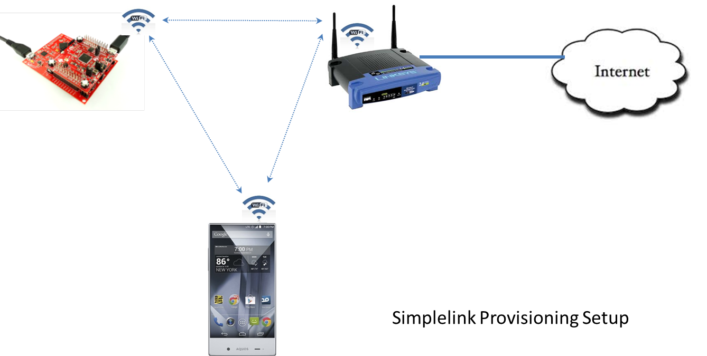
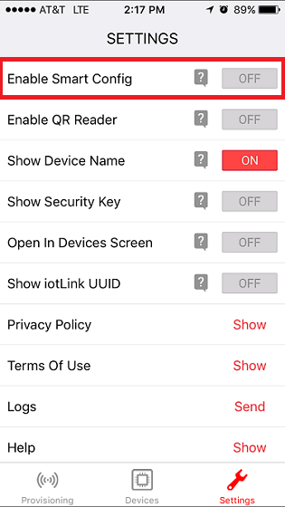
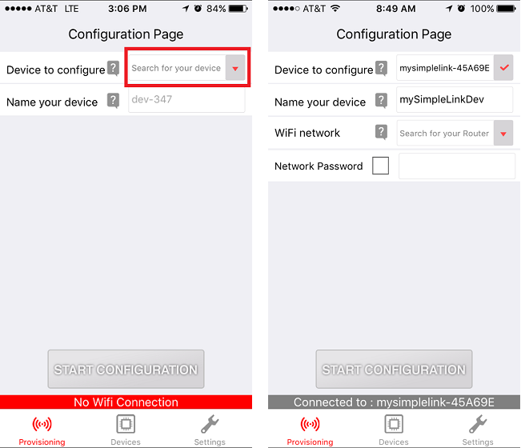
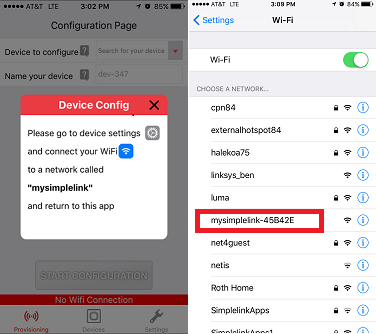
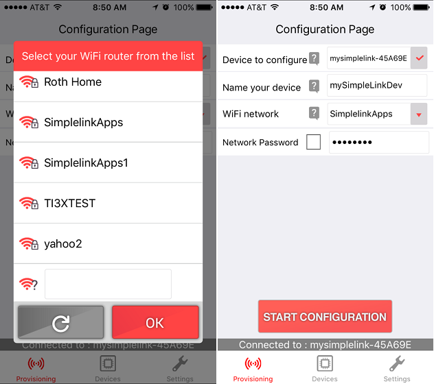
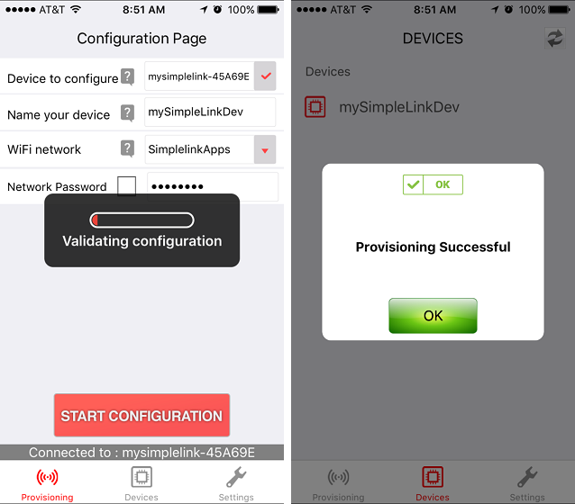
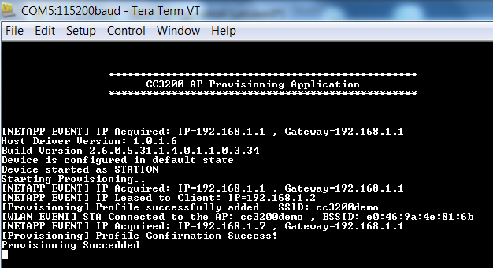

# Overview

This user guide describes all the steps needed to use this example, in
which the CC3200 device is used in conjunction with a Wi-Fi enabled
smartphone running a mobile application (in this case Simplelink Wi-Fi
Starter Pro) and connecting to the Wi-Fi network.

# Application details

Provisioning set up is illustrated in the picture below. It consists of
the SimpleLink Wi-Fi device being provisioned, a smart phone (Android or
iPhone) with TI SimpleLink Starter Pro Application installed and an
access point/router (for connection to the Internet).

## Prerequisites
- Simplelink Wi-Fi Starter Pro mobile application for Android and iOS: <http://www.ti.com/tool/wifistarterpro>

# Usage

1. Download the SimpleLink Wi-Fi Starter Pro mobile application to a smartphone: <http://www.ti.com/tool/wifistarterpro>
2.  Setup a serial communication application. Open a serial terminal on a PC with the following settings:
	- **Port: ** Enumerated COM port
	- **Baud rate: ** 115200
	- **Data: ** 8 bit
	- **Parity: ** None
	- **Stop: ** 1 bit
	- **Flow control: ** None
3.  Run the reference application.
      - Open the project in CCS/IAR. Build the application and debug to load to the device, or flash the binary using [UniFlash](http://processors.wiki.ti.com/index.php/CC3100_%26_CC3200_UniFlash_Quick_Start_Guide).
4. Once the application starts, it start the NWP in AP mode and wait to be provisioned. Turn on the Wi-Fi setting on your smartphone and open the SimpleLink Wi-Fi Starter Pro app.
5. Go to the Settings page and check that **Enable Smart Config** is turned **off**.
	
6. On the Provisioning page, open the Device to Configure drop-down menu to choose your device. You will be able to identify your device based on the default SSID, which is mysimplelink-xxxxxx (where xxxxxx is the last 6 characters of the device MAC address). 
	
	- If you are using an iOS device, you may have to connect to your AP using your Settings App. Choose your device from the network list, then reopen the Wi-Fi Starter Pro app to continue. 
		
7. Open the WiFi Network drop-down menu to select the network you would like the CC3200 to connect to. Enter the network credentials. You can also choose to name your device to use when it joins the network. 
	
8. Press **Start Configuration**. You can verify that the provisioning process has succeeded by checking the terminal output or the mobile app. 
	
	
If the provisioning process fails, try the following:

- Ensure that the password and SSID entered for the access point are correct.
- The SimpleLink device is in Provisioning mode.
- The phone (with the running provisioning app) and the device are within the AP range.
- Check the console for error messages.

## Limitations/Known Issues
