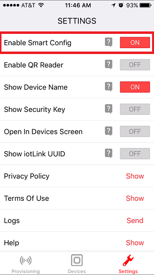

## Overview

### What is SmartConfig Provisioning?

A first step in utilizing CC3200 in a Wi-Fi enabled application is to
configure the CC3200 to a user's Wi-Fi network. This requires information on
the AP, or SSID name, and the security passcode if using WEP/WPA/WPA2. Considering that embedded Wi-Fi applications will generally lack user interfaces such as keypads or touchscreens, this process can be complex without the use of advanced I/O.

To create a great user experience, TI has created SmartConfig technology: a one-step and one-time process to connect a CC3200 device to
a home wireless network. This greatly stands apart from other Wi-Fi
suppliers who require multiple steps to configure a device onto the
network.

SmartConfig leverages the standard mechanisms present in Wi-Fi to
configure a CC3200's association information on the fly, regardless of
whether the user-interface is available. In this process a Wi-Fi enabled
device such as a smartphone, tablet or a laptop is used to send the
association information to the CC3200.

Addtionally, it can be used to associate multiple devices to the same AP
simultaneously. The Configuration process is secured with AES-128
encryption, and the SSID and key length are supported up to 32 bytes.

Furthermore, the device used for configuration (smartphone, tablet, or
PC) stays connected to the user's home network during the configuration
process unlike other methods that require disconnection.

## Application details

### Program Flow

1. Initialize the device networking layer
2. Delete all the profiles to ensure the CC3200 device does not connect to any other AP
3. Set the Connection Policy to Auto. This ensures that the device connects to this AP automatically once SmartConfig is complete
4. Wait for configuration from TI SimpleLink Wi-Fi Starter Pro application
5. Wait for the connection to the AP
  
### Prerequisites

- Simplelink Wi-Fi Starter Pro mobile application for Android and iOS: <http://www.ti.com/tool/wifistarterpro>

## Source Files briefly explained

- **main.c** - Device Initialization, Profile deletion, Connection Policy change, Trigger Smart Configuration, Wait for Device Events
- **gpio\_if.c** - GPIO interface file to handle LED blinking TASK

## Usage

1. Download the SimpleLink Wi-Fi Starter Pro mobile application to a smartphone: <http://www.ti.com/tool/wifistarterpro>
2.  Setup a serial communication application. Open a serial terminal on a PC with the following settings:
	- **Port: ** Enumerated COM port
	- **Baud rate: ** 115200
	- **Data: ** 8 bit
	- **Parity: ** None
	- **Stop: ** 1 bit
	- **Flow control: ** None
3.  Run the reference application.
      - Open the project in CCS/IAR. Build the application and debug to load to the device, or flash the binary using [UniFlash](http://processors.wiki.ti.com/index.php/CC3100_%26_CC3200_UniFlash_Quick_Start_Guide).
4. Once the application starts, it will start the NWP in Station mode and wait to be provisioned. Turn on the Wi-Fi setting on your smartphone and connect to the network you would like to use to provison the CC3200.
5. Open the SimpleLink Wi-Fi Starter Pro app. Go to the Settings page and check that **Enable Smart Config** is turned **on**. 
	
6. On the Provisioning page, enter the AP credentials using the Network Name and Network Password fields. You can also choose to name your device to use when it joins the network. Press **Start Configuration**. 
	
7. You can verify that the provisioning process has succeeded by checking the terminal output or the mobile app.

## Limitations/Known Issues

SmartConfig cannot provision embedded systems in all circumstances. Therefore, products should not go to production implementing only SmartConfig. Access Point mode should be implemented and be used as a backup in case SmartConfig fails to provision the system.