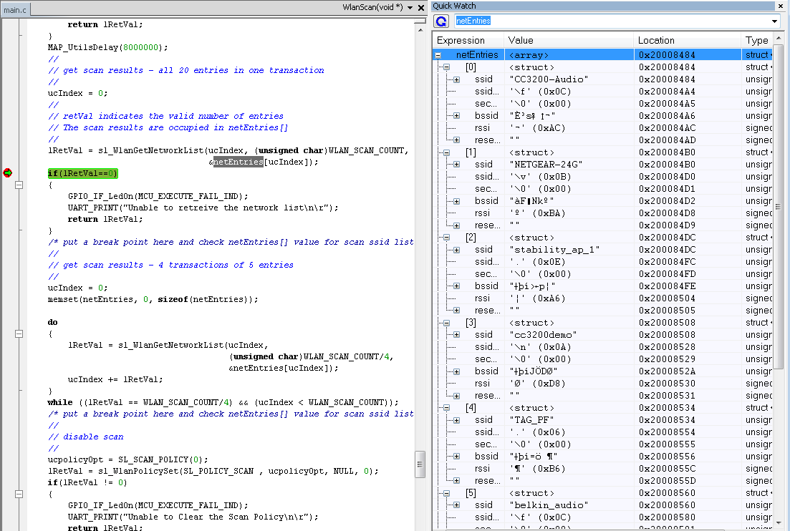

# Overview

The CC3200 allows users to set a scan policy and enable scanning. `sl\_WlanPolicySet` API can be used to set the scan policy to
`SL_POLICY_CONNECTION`, `SL_POLICY_SCAN` or `SL_POLICY_PM`. Once the scan cycle is enabled and set, `sl_WlanGetNetworkList` API can retrieve the results of the scan. It provides the RSSI (Received Signal Strength Indication), security information, BSSID, and SSID.  

# Application details

This example demonstrates how scan policy is set in the device.
The procedure includes the following steps:

- Check the connection policy is not set (so no scan is run in the
background)  
- Enable scan, set scan cycle to 10 seconds and set scan policy. This
starts the scan.
- Get scan results, all 20 entries in one transaction  
- Get scan results, 4 transactions of 5 entries  
- Disable scan

## Source Files briefly explained

- **main.c** - The main file that explains steps to set scan policy,
    enables scan and gets the scan result  
- **pinmux.c** - Generated by the PinMUX utility
- **startup\_\*.c** - Initialize vector table and IDE related functions
- **gpio\_if.c** - GPIO Interface APIs  

# Usage

1. Run the reference application.
	- Open the project in CCS/IAR. Build the application and debug to load to the device, or flash the binary using [UniFlash](http://processors.wiki.ti.com/index.php/CC3100_%26_CC3200_UniFlash_Quick_Start_Guide).
2. The application scans and retrieves the network list. `lRetVal` indicates the number of networks found (or error) and `netEntries` contains the network list. 
	
3. The orange LED on the LaunchPad will turn on in case of an error. The green LED will turn on upon successful execution.  

## Limitations/Known Issues
