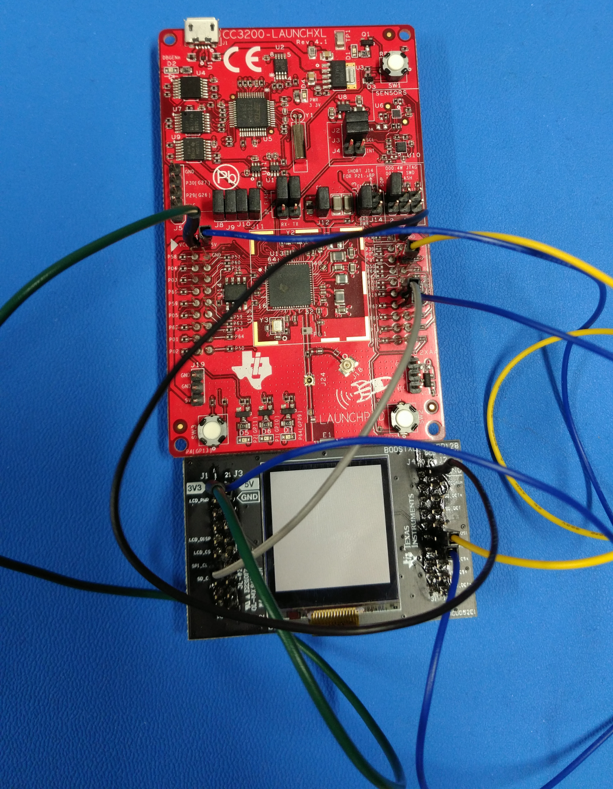

## Overview  

The Secure Digital Host (SD Host) controller on CC3200 provides an
interface to standard SD memory cards in 1-bit transfer mode and handles
the SD protocol and data packing at the transmission level with minimum CPU
intervention.

## Application details  

This application showcases the basic use case of initializing the
controller to communicate with the attached card, reading and writing an SD
card block using the internal controller buffer via DriverLib API(s).
The demo includes extracting the card capacity, capacity class and SD
version information and displaying it on the UART terminal. The demo
also reads the first block from the attached card and displays it on
the terminal.  

Shown is the BOOSTXL-SHARP128 display and micro SD card reader connected to the CC3200 Launchpad.
  
  
  
Writing to SD card block is disabled by default using a macro defined in
the main.c file, this is to avoid accidental corruption of card
Filesystem.  

## Source Files briefly explained  

- **main.c** - Includes the main and DriverLib wrapper functions to
initialize, read and write the attached card.
- **pinmux.c** - Generated by Pinmux utility to mux out the SD Host
controller signal to chip boundary.
- **uart\_if.c** - Implements the UART terminal.
- **startup\_\*.c** - Initialize vector table and IDE related functions

## Connect the boards

The BOOSTXL-SHARP128 is recommended for use with the CC3200 in this demo.
THe BOOSTXL-SHARP128 is a boosterpack with a micro SD card interface in
addition to the Sharp LCD. More information on the BOOSTXL-SHARP128 can be
found here:
<http://www.ti.com/tool/boostxl-sharp128>  
However, the BOOSTXL-SHARP128 cannot be mounted directly onto the CC3200
through the Launchpad connectors. Instead, the needed signals from the 
SD card need to be wired directly to the appropriate pins on the CC3200.

### Required wiring

| CC3200 Pin | BOOSTXL-SHARP128 Pin |
|------------|----------------------|
| 3V3        | 3V3                  |
| GND        | GND                  |
| 5V         | 5V                   |
| P07        | SPI_CLK              |
| P08        | SPI_MOSI             |
| P06        | SPI_MISO             |

Ensure that wire lengths are kept to a minimum, especially for the SPI_CLK
signal.

## Usage  

1.  Setup a serial communication application. Open a serial terminal on a PC with the following settings:
	- **Port: ** Enumerated COM port
	- **Baud rate: ** 115200
	- **Data: ** 8 bit
	- **Parity: ** None
	- **Stop: ** 1 bit
	- **Flow control: ** None
2.  Run the reference application.
	- Open the project in CCS/IAR. Build the application and debug to load to the device, or flash the binary using [UniFlash](http://processors.wiki.ti.com/index.php/CC3100_%26_CC3200_UniFlash_Quick_Start_Guide).

# Limitations/Known Issues  

- For many SD cards, pull up resistors are required on the bidirectional
signal lines: DAT0 and CMD.
