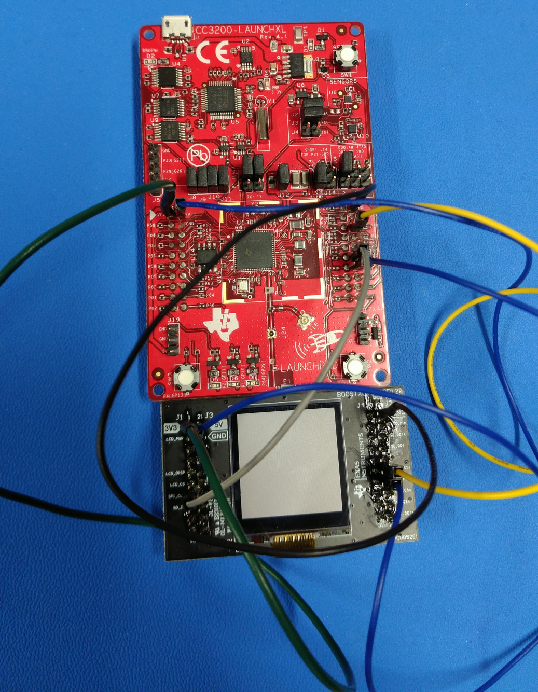
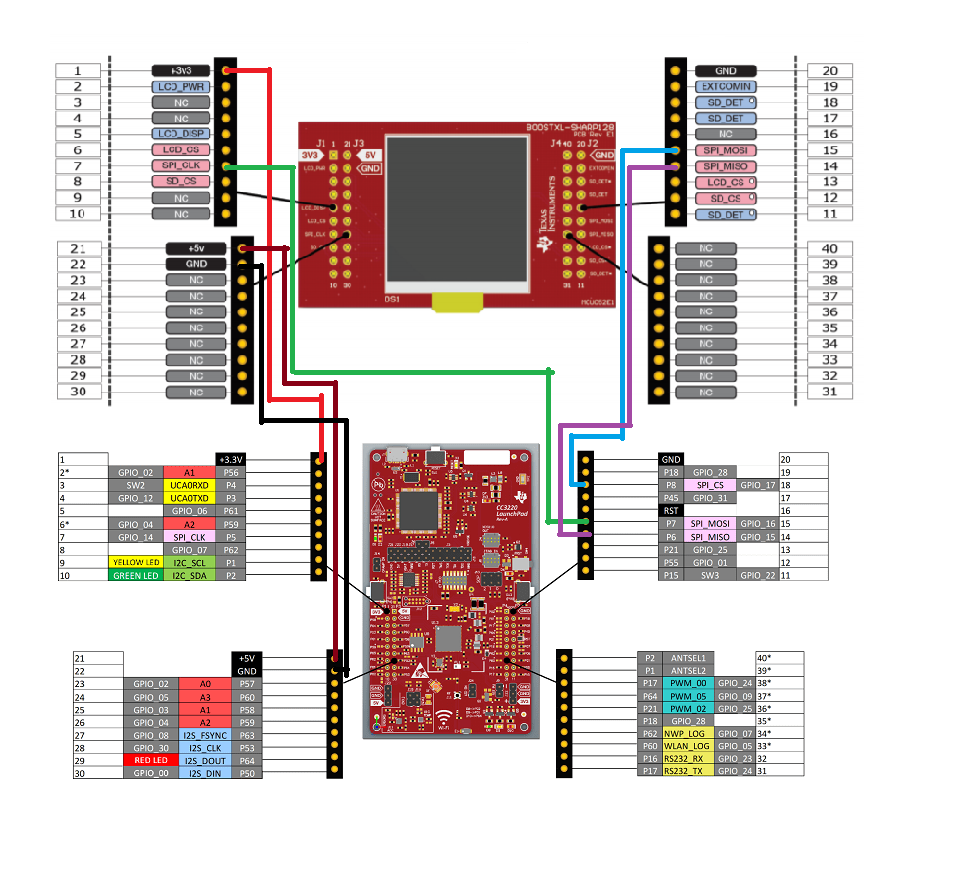
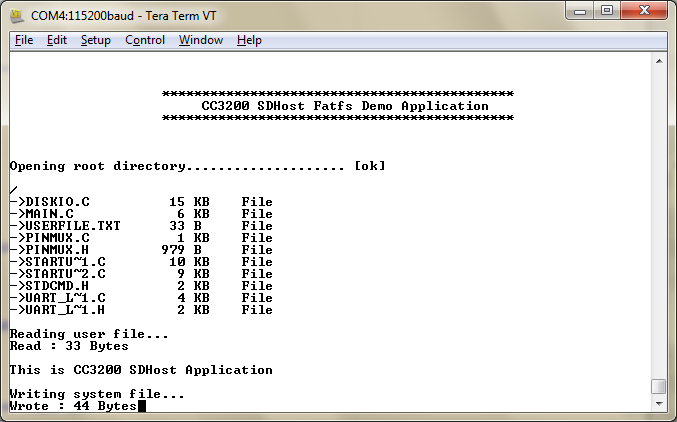

## Overview  

The Secure Digital Host (SD Host)controller on CC3200 provides an
interface to standard SD memory cards in 1-bit transfer mode and handles
the SD protocol and data packing at transmission level with minimum CPU
intervention.

## Application details  

This application uses the FatFS to provide the block level
read/write access to SD card, using the SD Host controller on CC3200.
The application initializes the FatFs and lists the files and/or
directories that are present on the SD card at the root followed by
contents of a predefined file on the terminal. The application also
writes a predefined pattern to a predefine file. The user can change the
predefine(s) by changing following
macros
```c
	#define USERFILE        "userfile.txt" // Application reads out this file
	#define SYSFILE         "sysfile.txt"  // Application write to this file
	#define SYSTEXT         "The quick brown fox jumps over the lazy dog" // Pattern to be written to SYSFILE
```

Shown is the BOOSTXL-SHARP128 display and micro SD card reader connected to the CC3200 Launchpad.
  
 

## Source Files briefly explained  

- **main.c** - Implements the main function.
- **diskio.c** - Implements low-level function for FatFS using
    DriverLib API(s)
- **pinmux.c** - Generated by Pinmux utility to mux out the SD Host
    controller signal to chip boundary.
- **uart\_if.c** - Implements the UART terminal.
- **startup\_\*.c** - Initialize vector table and IDE related functions

## Connect the boards

The BOOSTXL-SHARP128 is recommended for use with the CC3200 in this demo.
THe BOOSTXL-SHARP128 is a boosterpack with a micro SD card interface in
addition to the Sharp LCD. More information on the BOOSTXL-SHARP128 can be
found here:
<http://www.ti.com/tool/boostxl-sharp128>  
However, the BOOSTXL-SHARP128 cannot be mounted directly onto the CC3200
through the Launchpad connectors. Instead, the needed signals from the 
SD card need to be wired directly to the appropriate pins on the CC3200.

### Required wiring

| CC3220 Pin | BOOSTXL-SHARP128 Pin |
|------------|----------------------|
| 3V3        | 3V3                  |
| GND        | GND                  |
| 5V         | 5V                   |
| P07        | SPI_CLK              |
| P08        | SPI_MOSI             |
| P06        | SPI_MISO             |



Ensure that wire lengths are kept to a minimum, especially for the SPI_CLK
signal.

# Usage  

1.  Setup a serial communication application. Open a serial terminal on a PC with the following settings:
	- **Port: ** Enumerated COM port
	- **Baud rate: ** 115200
	- **Data: ** 8 bit
	- **Parity: ** None
	- **Stop: ** 1 bit
	- **Flow control: ** None
2.  Run the reference application.
      - Open the project in CCS/IAR. Build the application and debug to load to the device, or flash the binary using [UniFlash](http://processors.wiki.ti.com/index.php/CC3100_%26_CC3200_UniFlash_Quick_Start_Guide).



# Limitations/Known Issues  

- For many SD cards pull up resistors are required on the bidirectional
signal lines, DAT0 and CMD.
