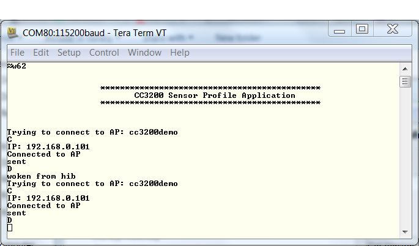

## Overview

The Sensor Profile example showcases the usage of lowest power mode (Hibernate) for CC3200. Hibernate mode can significantly lower power consumption of the system, especially if the use case demands the device to be active for only small amount of time over long periods like periodically sending data over the network.

## Application details

### Power Management Framework

The CC3200 has multiple power modes which can be set from the application. The Power Management Framework makes it easier to specify this power policy.
The user should configure the lowest power mode for the device based on their application, and the framework will decide when to reach this mode. The framework hides intricacies of the underlying settings and helps the developer experience low power mode capabilities in a simple manner. For more information regarding the Power Management
Framework, please refer to [CC3200 Power Management Framework documentation](http://processors.wiki.ti.com/index.php/CC3200_Power_Management_Framework).

### Current Measurement

This application specifies Hibernate as the lowest power mode. When
the CC3200 is in hibernate mode, the current values can be as low as in the
order of microseconds. he procedure for measuring current can be found in [Power Management Optimizations and Measurements documentation](http://processors.wiki.ti.com/index.php/CC3200_Power_Management_Optimizations_and_Measurements).

### Example Configuration

Most the parameters user will need to modify are specified as MACROs

  - SSID\_NAME - Name of the Access Point used for this application.
  - GPIO\_SRC\_WKUP - Gpio number used as wake up source.
  - APP\_UDP\_PORT - Port number on which the device will send the udp
    packets.
  - HIB\_DUR\_SEC - Time (in seconds) after which the device will come
    out of Hibernate.
  - HIB\_DUR\_NSEC - Time (in addition to HIB\_DUR\_SEC) in nanoseconds
    after which the device will come out of Hibernate.
  - TRAFFIC\_DUR\_SEC - Time (in seconds) for which the device will send
    the udp packets.
  - TRAFFIC\_DUR\_NSEC - Time (in addition to TRAFFIC\_DUR\_SEC ) in
    nanoseconds for which the device will send the udp packets.
  - SERVER\_IP\_ADDRESS - Address of the udp server(other machine on
    same network) to receive udp packets sent by device.

```c
    #define SSID_NAME              "cc3200demo"
    #define GPIO_13                 13
    #define GPIO_17                 17
    #define GPIO_SRC_WKUP       GPIO_13
    #define APP_UDP_PORT            5001
    #define HIB_DUR_SEC         60
    #define HIB_DUR_NSEC            0
    #define TRAFFIC_DUR_SEC         5
    #define TRAFFIC_DUR_NSEC        0
    #define SERVER_IP_ADDRESS       0xC0A80066
```

Security parameters for the AP can be configure inside the `WlanConnect`
function in main.c.  
Whatever GPIO is used as wake up source must be added to the `gpio\_list`
array in user\_app\_config.h and pinmux for the same GPIO must be
added in pinmux.c.

### Task: TimerGPIOTask

1.  Start network processor (NWP), switch to station mode, set NWP power policy and connect to the AP.
2.  Send UDP packets to server address for configurable duration.
3.  Disconnect, stop NWP, set timer and GPIO as wake sources from Hibernate.
4.  Set Power policy for the application MCU.

## Source Files briefly explained

- **main.c** - The main file implementing the sensor profile.  
- **lp3p0\_board.c** - Board specific initialization for Power
	Management framework .  
- **lp3p0\_plat\_ops.c** - Board specific APIs like IO parking and
	framework loading.  
- **pinmux.c** - Generated by the PinMUX utility.  
- **startup\_\*.c** - Initialize vector table and IDE related functions
- **wdt\_if.c** - Interface file for Watchdog Timer  

## Usage

1.  Setup a serial communication application. Open a serial terminal on a PC with the following settings:
	- **Port: ** Enumerated COM port
	- **Baud rate: ** 115200
	- **Data: ** 8 bit
	- **Parity: ** None
	- **Stop: ** 1 bit
	- **Flow control: ** None
2. Edit the macros in main.c as specified above to connect to your AP. Modify any other configurations as desired.
3.  Run the reference application. Build the application and flash the binary using [UniFlash](http://processors.wiki.ti.com/index.php/CC3100_%26_CC3200_UniFlash_Quick_Start_Guide).
	- The debugger will disconnect when the device enters hibernate mode.



## Limitations/Known Issues

Refer to [CC3200\_Power\_Management\_Framework documentation](http://processors.wiki.ti.com/index.php/CC3200_Power_Management_Framework) for limitations and known issues.
