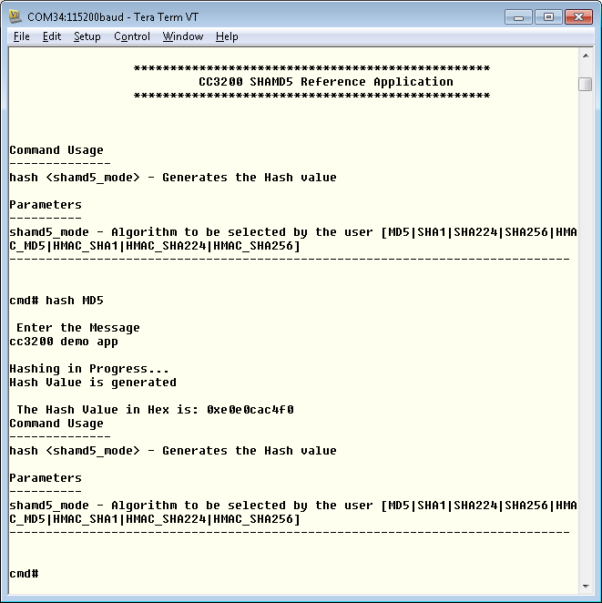

## Overview  

The SHA/MD5 module provides hardware-accelerated hash functions with support for:

  - MD5 message digest algorithm developed by Ron Rivest in 1991
  - SHA-1 algorithm compliant with the FIPS 180-3 standard
  - The algorithms produce a condensed representation of a message or a
    data file, called digest or signature, which can then be used to
    verify the message integrity.
  - Hashing of 0 to 233 – 2 bytes of data (of which 232 – 1 bytes are in
    one pass) using the MD5, SHA-1, SHA-224, or SHA-256 hash algorithm
    (byte granularity only, no support for bit granularity)
  - Automatic HMAC key preprocessing for HMAC keys up to 64 bytes
  - Host-assisted HMAC key preprocessing for HMAC keys larger than 64
    bytes
  - HMAC from precomputes (inner/outer digest) for improved performance
    on small blocks
  - Support of μDMA operation for data and context in/result out
    transfers
  - Support of interrupt to read the digest (signature)

## Application details  

The application is a reference for SHAMD5 DriverLib functions on the
CC3200. Developers can refer to this simple application and re-use
the functions in their applications.

- **hash**: This command allows the user to excercise the hashing
    (SHAMD5) funcitonality on CC3200. The command needs one parameter:
	- **shamd5\_mode**: hashing algorithm. The value can be MD5, SHA1, SHA224, SHA256, HMAC\_MD5, HMAC\_SHA1, HMAC\_SHA224, or HMAC\_SHA256. 

User will be prompted for inputs for key and plain text input. User can also undefine `USER_INPUT` in main.c to use the default test vectors for debugging `g_psHMACShaMD5TestVectors` in shamd5_vector.h.

## Source Files briefly explained

- **main.c** - The main file that contians the core-logic for
    encryption and decryption. The functions in the file uses DriverLib
    calls to perform encryption and decryption.
- **shamd5\_userinput.c** - This file is used in the USER-INPUT mode.
    The function in the file reads the input from the user, parses the
    input string and feed the core-logic functions in the shamd5\_main.c
- **pinmux.c** - Generated by the PinMUX utility. UART0 pins are
    brought out in this file.
- **startup\_\*.c** - Initialize vector table and IDE related functions
- **uart\_if.c** - Functions to display information on UART 

## Usage  

1.  Setup a serial communication application. Open a serial terminal on a PC with the following settings:
	- **Port: ** Enumerated COM port
	- **Baud rate: ** 115200
	- **Data: ** 8 bit
	- **Parity: ** None
	- **Stop: ** 1 bit
	- **Flow control: ** None
2.  Run the reference application.
      - Open the project in CCS/IAR. Build the application and debug to load to the device, or flash the binary using [UniFlash](http://processors.wiki.ti.com/index.php/CC3100_%26_CC3200_UniFlash_Quick_Start_Guide).
3.  A prompt will appear on the terminal. Enter the command with your chosen input as shown above.

# Limitations/Known Issues
