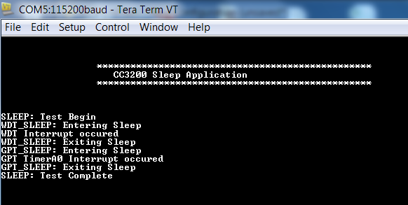

## Overview

Sleep is one of the low power modes supported by the CC3200 device.
There are various options available to select active modules during this low power mode and designating these modules to wake the device upon detecting activity. The clock to all other modules are disabled.

The various modules that can be clock gated (enabled/disabled):

1.  Camera
2.  McASP
3.  MMCHS
4.  McSPI
5.  uDMA
6.  GPIOs
7.  WatchDOG
8.  UART
9.  GPT
10. Crypto
11. I2C

The NWP can also be set to act as a wake-up source when there is activity on the Wi-Fi network.

## Application details

The objective of this application is to showcase the sleep power mode
supported by the CC3200 device using two modules:

	1.  WatchDog Timer based Sleep
	2.  General Purpose Timer (GPT) based Sleep

## Source Files briefly explained

- **gpt\_if.c** - APIs to configure the GPT as a one shot timer with specified timeout.
- **pinmux.c** - Pinmux configurations as required by the application.
- **main.c** - Main file that showcases the sleep functionality using the WDT and GPT modules by invoking the corresponding APIs.
- **uart\_if.c** - To display status information over the UART
- **wdt\_if.c** - Setup the watchdog timer with the timeout value.

## Usage

1.  Setup a serial communication application. Open a serial terminal on a PC with the following settings:
	- **Port: ** Enumerated COM port
	- **Baud rate: ** 115200
	- **Data: ** 8 bit
	- **Parity: ** None
	- **Stop: ** 1 bit
	- **Flow control: ** None
2. Edit the macros in main.c as specified above to connect to your AP. Modify any other configurations as desired.
3.  Run the reference application. Build the application and flash the binary using [UniFlash](http://processors.wiki.ti.com/index.php/CC3100_%26_CC3200_UniFlash_Quick_Start_Guide).

**Note:** The debugger will disconnect when the device enters sleep.

## Limitations/Known Issues
