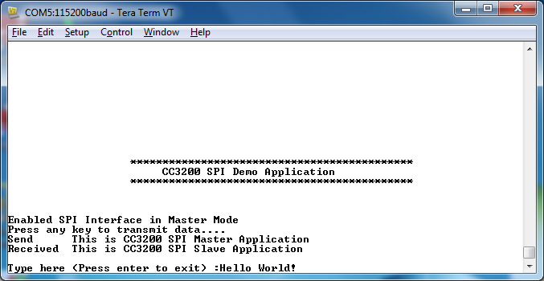
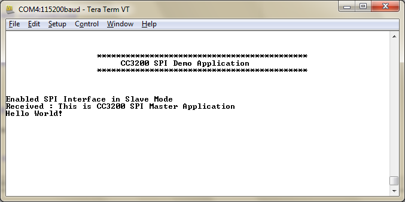

# Overview  

The Serial Peripheral Interface (SPI) is a synchronous serial
interface that allows full duplex communication with an external SPI-compliant master or slave device. SPI devices operate in master-slave
mode where the master initiates the communication and can operate in 4-wire or 3-wire mode. SPI specifies following signals:

  - **SCLK** : Serial clock from Master to Slave
  - **MOSI** : Serial data from master to slave
  - **MISO** : Serial Data from slave to master
  - **CS** : Chip select(Only in 4 wire mode)

# Application details  

The demo application focuses on showing the required
initialization sequence to enable the CC3200 SPI module in full duplex
4-wire master and slave mode(s).

## Source Files briefly explained  

- **main.c** - Initializes the SPI module in either master or slave 4
    wire mode based on macro
- **pinmux.c** - Generated by Pinmux utility to mux out the SPI module
    signal to chip boundary.
- **uart\_if.c** - Implements the UART terminal.
- **startup\_\*.c** - Initialize vector table and IDE related functions

# Usage

1.  Setup a serial communication application. Open a serial terminal on a PC with the following settings:
	- **Port: ** Enumerated COM port
	- **Baud rate: ** 115200
	- **Data: ** 8 bit
	- **Parity: ** None
	- **Stop: ** 1 bit
	- **Flow control: ** None
2.  Run the reference application.
      - Open the project in CCS/IAR. Build the application and debug to load to the device, or flash the binary using [UniFlash](http://processors.wiki.ti.com/index.php/CC3100_%26_CC3200_UniFlash_Quick_Start_Guide).
3. Select master or slave mode using the serial terminal.

# Limitations/Known Issues  

  - User should always execute master application followed by slave application to avoid slave SPI receiving garbage.
  