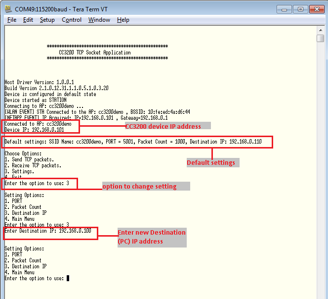

## Overview

A CC3200 device can communicate over the network using standard
communication protocols such as TCP and UDP. This example will demonstrate the TCP protocol.

## Application details

This application demonstrates how the CC3200 can be used as a
client or server for TCP communication.

This application can act as a TCP client and send packets:

1.  Open the socket
2.  Connect to the TCP server 
3.  Send the packets
4.  Close the socket

This application can also act as a TCP server and receive packets:

1.  Open the socket
2.  Create a TCP server
3.  Listen for connection
4.  Accept a connection
5.  Receive packets
6.  Close the socket

Default settings are defined in following MACROs in main.c. This configuration can be set statically in source code or changed during run time.

```c
	#define IP_ADDR         	0xc0a80167  
	#define PORT_NUM        	5001
	#define TCP_PACKET_COUNT    1000
```

## Source Files briefly explained

- **main.c** – main file calls simplelink APIs to connect to the
    network, create socket and use it to communicate over TCP by acting
    as a TCP client or server.
- **pinmux.c** - pinmux file to mux the device to configure UART
    peripheral
- **startup\_\*.c** - Initialize vector table and IDE related functions

## Usage

1.  Setup a serial communication application. Open a serial terminal on a PC with the following settings:
	- **Port: ** Enumerated COM port
	- **Baud rate: ** 115200
	- **Data: ** 8 bit
	- **Parity: ** None
	- **Stop: ** 1 bit
	- **Flow control: ** None
2. Edit **common.h** and modify the values of the below macros for the device to connect to the AP:
```c
	#define SSID_NAME           "<ap_name>"    		/* AP SSID */
	#define SECURITY_TYPE       SL_SEC_TYPE_OPEN 	/* Security type (OPEN or WEP or WPA*/
	#define SECURITY_KEY        ""              	/* Password of the secured AP */
```	  
3.  Run the reference application.
      - Open the project in CCS/IAR. Build the application and debug to load to the device, or flash the binary using [UniFlash](http://processors.wiki.ti.com/index.php/CC3100_%26_CC3200_UniFlash_Quick_Start_Guide).
4. Connect a PC to the same AP that the CC3200 will be connected to. Find the IP address of the PC. Select option 3 in the serial terminal to edit Settings, then select option 3 to edit the Destination IP. Enter the IP address of the PC.
	- The default IP address can also be modified as `IP_ADDR` in main.c.
5. Select option 1 to send TCP packets (according to the default settings), option 2 to receive TCP packets, or option 3 to edit settings.
	- You can use Iperf for another CC3200 device to send and receive packets.



## Limitations/Known Issues
