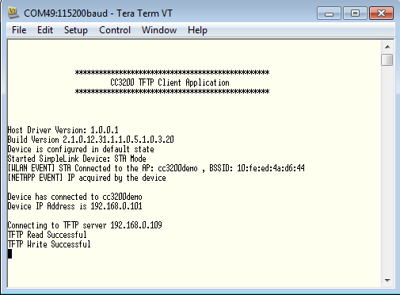

## Overview

Trivial File Transfer Protocol (TFTP) is a simple, lock-step, file
transfer protocol which allows a client to get or put a file onto a
remote host.

## Application details

This application demonstrates how to read/write a
file from/to a TFTP server running on the network. This
application reads an existing file from the server and writes it to
serial flash. Then the application will write the same file to the server with a different file name. Settings can be defined in source code or at runtime.

## Source Files briefly explained

- **main.c** - main file calls simplelink APIs to connect to the network
    and read/write file from/to the server by calling TFTP library APIs
- **network\_if.cf** - Common network interface APIs
- **pinmux.c** - pinmux file to mux the device to configure UART
    peripheral
- **uart\_if.c** - Common UART interface APIs
- **udma\_if.c** - common uDMA interface APIs
- **startup\_\*.c** - Initialize vector table and IDE related functions

TFPT client library can be found in the cc3200_sdk\netapps\tftp\client folder.

## Usage

1. Create a file "readFromServer.txt" in the TFTP server root path and enable write access.
2.  Setup a serial communication application. Open a serial terminal on a PC with the following settings:
	- **Port: ** Enumerated COM port
	- **Baud rate: ** 115200
	- **Data: ** 8 bit
	- **Parity: ** None
	- **Stop: ** 1 bit
	- **Flow control: ** None
3. Connect a PC to the AP and find the IP address of the TFTP server. Modify the following macros in main.c.
	```c
		#define SSID           	""
		#define SSID_KEY		""
		#define TFTP_IP        	0xc0a80164  /* TFTP server IP */
		#define FILE_SIZE_MAX  	(20*1024)   /* Max File Size set to 20KB */
	```
4.  Run the reference application.
	- Open the project in CCS/IAR. Build the application and debug to load to the device, or flash the binary using [UniFlash](http://processors.wiki.ti.com/index.php/CC3100_%26_CC3200_UniFlash_Quick_Start_Guide).



## Limitations/Known Issues
	
- If you encounter an error, try disabling anti-virus on the PC while running the TFTP server.  
