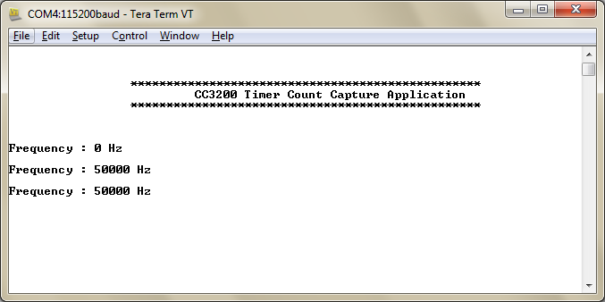

# Overview  

Every GPTM (General purpose timer module) block can be used as two
16-bit timers/counters (referred to as Timer A and Timer B) that can be
configured to operate independently as timers or event counters, or
concatenated to operate as one 32-bit timer. Timers can also be used to
trigger µDMA transfers.

Following operating modes are supported:

1.  16 or 32-bit programmable one-shot timer
2.  16 or 32-bit programmable periodic timer
3.  16-bit general-purpose timer with an 8-bit prescaler

# Application details  

This application showcases the timer count capture feature to measure frequency of an external signal.

##   
Source Files briefly explained  

- **main.c** - Display banner and measured frequency
- **pinmux.c** - Generated by Pinmux utility to mux out the CCP signal
	to chip boundary.
- **uart\_if.c** - Generic APIs to initialize and configure UART.
- **startup\_\*.c** - Initialize vector table and IDE related functions

# Usage  

1.  Setup a serial communication application. Open a serial terminal on a PC with the following settings:
	- **Port: ** Enumerated COM port
	- **Baud rate: ** 115200
	- **Data: ** 8 bit
	- **Parity: ** None
	- **Stop: ** 1 bit
	- **Flow control: ** None
2.  Run the reference application.
      - Open the project in CCS/IAR. Build the application and debug to load to the device, or flash the binary using [UniFlash](http://processors.wiki.ti.com/index.php/CC3100_%26_CC3200_UniFlash_Quick_Start_Guide).
3. Feed an external signal on LaunchPad header P1.3 (pin 4). Observe the frequency printed to the terminal.
	

# Limitations/Known Issues  

The example uses the timer in 16 bit mode. With the clock at 80 MHz and
a 16 bit timer, the minimum theoretical frequency that can be captured
is 1200 Hz, however, as coded in SDK v1.3, the minimum possible
frequency that can be captured is 1400 Hz.  
  
The example can be modified to support the full frequency capture range
by replacing
  
`g_ulFreq = (TIMER_FREQ/(g_ulSamples[0] - g_ulSamples[1]));`  
  
on line 104 in main.c with:

`g_ulFreq = ( (g_ulSamples[0] > g_ulSamples[1]) ?
(TIMER_FREQ/(g_ulSamples[0] - g_ulSamples[1])) : (TIMER_FREQ/(65535 -
(g_ulSamples[1] - g_ulSamples[0]))) );`  
  
With this fix, the minimum frequency that can be captured is now 1230
Hz. Moreover, 0 Hz is no longer erroneously displayed when the first
sampled value is larger than the second sampled value.  
  
To increase the overall frequency capture range, the example may be
modified to operate the timer in 32 bit mode instead of 16 bit mode.
