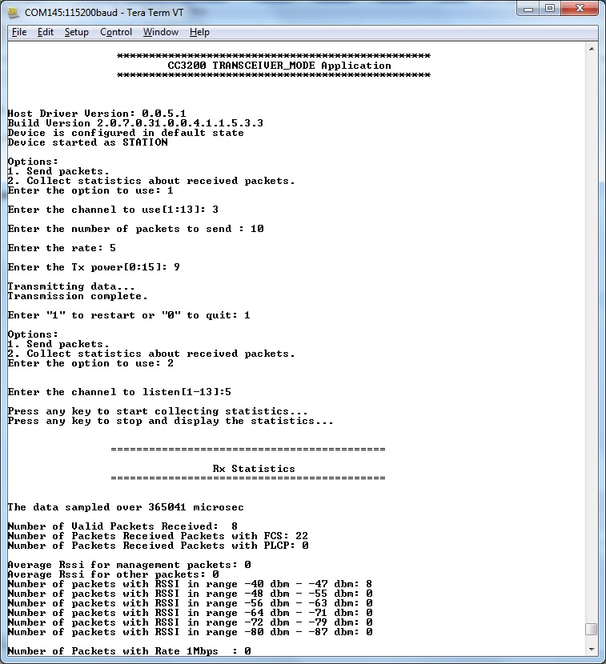

## Overview

TX continuous functionality is part of Transceiver mode on the CC3200.
In this mode, the SimpleLink device is able to communicate directly over
the Wi-Fi PHY layer, i.e. bypass the Network Stack, the Wi-Fi driver, and
the MAC layer. In this mode, the user is given full flexibility
in building the transmitted packet.

The RX Statistics feature is used to determine important parameters
about the medium and the CC3200 RX mechanism. The RX Statistics provides
data about:  

-  RSSI – receive power in dbm units
-  RSSI histogram, between -40 - -87 dbm in resolution of 8 dbm
-  Average RSSI divided to DATA + CTRL / MANAGEMENT
-  Received frames – divided into valid frames, FCS error and PLCP
error frames
-  Rate histogram – creates an histogram of all BGN rates 1mbps-MCS7  

## Application details

This example demonstrates building a proprietary protocol on top of
Wi-Fi PHY layer and the user is given full flexibility to build his own
packet.
  
It is important to notice that the first two bytes of the raw data are
Wi-Fi PHY layer specific:

- 1st byte: Wi-Fi rate. Definition for rate options can be found in *wlan.h*, *RateIndex\_e* structure.
- 2nd byte: 4 bits of power level and 4 bits of preamble type.

Defining a ping packet as a raw data structure:

```c
    char RawData_Ping[] = {
                       /*---- wlan header start -----*/
                       0x88,                                /* version , type sub type */
                       0x02,                                /* Frame control flag */
                       0x2C, 0x00,
                       0x00, 0x23, 0x75, 0x55,0x55, 0x55,   /* destination */
                       0x00, 0x22, 0x75, 0x55,0x55, 0x55,   /* bssid */
                       0x08, 0x00, 0x28, 0x19,0x02, 0x85,   /* source */
                       0x80, 0x42, 0x00, 0x00,
                       0xAA, 0xAA, 0x03, 0x00, 0x00, 0x00, 0x08, 0x00, /* LLC */
                       /*---- ip header start -----*/
                       0x45, 0x00, 0x00, 0x54, 0x96, 0xA1, 0x00, 0x00, 0x40, 0x01,
                       0x57, 0xFA,                          /* checksum */
                       0xc0, 0xa8, 0x01, 0x64,              /* src ip */
                       0xc0, 0xa8, 0x01, 0x02,              /* dest ip  */
                       /* payload - ping/icmp */
                       0x08, 0x00, 0xA5, 0x51,
                       0x5E, 0x18, 0x00, 0x00, 0x41, 0x08, 0xBB, 0x8D, 0x00, 0x00, 0x00, 0x00,
                       0x00, 0x00, 0x00, 0x00, 0x00, 0x00, 0x00, 0x00, 0x00, 0x00, 0x00, 0x00,
                       0x00, 0x00, 0x00, 0x00, 0x00, 0x00, 0x00, 0x00, 0x00, 0x00, 0x00, 0x00,
                       0x00, 0x00, 0x00, 0x00, 0x00, 0x00, 0x00, 0x00, 0x00, 0x00, 0x00, 0x00,
                       0x00, 0x00, 0x00, 0x00, 0x00, 0x00, 0x00, 0x00, 0x00, 0x00, 0x00, 0x00,
                       0x00, 0x00, 0x00, 0x00, 0x00, 0x00, 0x00, 0x00, 0x00, 0x00, 0x00, 0x00,
                       0x00, 0x00, 0x00, 0x00, 0x00, 0x00, 0x00, 0x00, 0x00, 0x00, 0x00, 0x00,
                       ..... };
```

  
The RX Statistics feature is used to inspect the medium in terms of
congestion, distance, and validate the RF hardware.

Additional details on Transceiver mode are available in the [CC3100/CC3200 Network Processor User's Guide](http://www.ti.com/lit/swru368).

## Source Files briefly explained

-  **main.c** - Demonstrates sending a Raw Ping packet in Tx continues
and usage of different API for getting the Rx Statistics.
-  **uart\_if.c** - To display status information over the UART

## Usage

1.  Setup a serial communication application. Open a serial terminal on a PC with the following settings:
	- **Port: ** Enumerated COM port
	- **Baud rate: ** 115200
	- **Data: ** 8 bit
	- **Parity: ** None
	- **Stop: ** 1 bit
	- **Flow control: ** None
2.  Run the reference application.
      - Open the project in CCS/IAR. Build the application and debug to load to the device, or flash the binary using [UniFlash](http://processors.wiki.ti.com/index.php/CC3100_%26_CC3200_UniFlash_Quick_Start_Guide).



## Limitations/Known Issues

- TX continuous and RX statistics only works in Wi-Fi disconnected mode.
- The user should be sure the connection policy is not set to auto/fast mode.
- Since RX statistics is currently limited to disconnected mode, it is
	used only in transceiver mode, i.e. with raw socket.  
