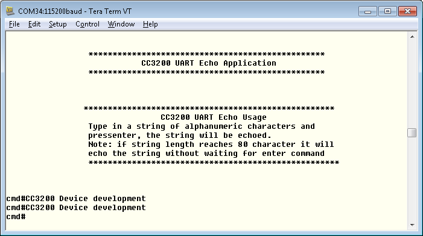

## Overview

The CC3200 has hardware support for UART functionality. Standard features include programmable baud rate, separate Transmit and Receive FIFO, and fully programmable serial interface characteristics.

## Application details

This application showcases the UART on the CC3200. This application receives user input from a terminal, and then echo the string back to the terminal.

## Source Files briefly explained

- **pinmux.c** - Pinmux configurations as required by the application.
- **main.c**- display banner, receieve input and echoes back the input.
- **startup\_\*.c** - Initialize vector table and IDE related functions
- **uart\_if.c** - APIs to display information over the UART.

## Usage

1.  Setup a serial communication application. Open a serial terminal on a PC with the following settings:
	- **Port: ** Enumerated COM port
	- **Baud rate: ** 115200
	- **Data: ** 8 bit
	- **Parity: ** None
	- **Stop: ** 1 bit
	- **Flow control: ** None
2.  Run the reference application.
      - Open the project in CCS/IAR. Build the application and debug to load to the device, or flash the binary using [UniFlash](http://processors.wiki.ti.com/index.php/CC3100_%26_CC3200_UniFlash_Quick_Start_Guide).
3. Enter characters in the serial terminal to see the echo printed back to the terminal.

## Limitations/Known Issues
