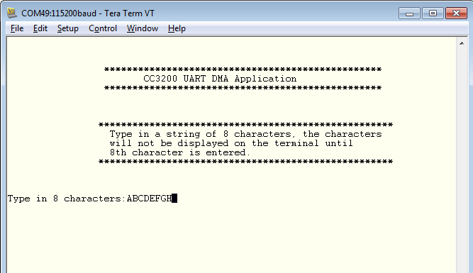

# Overview  

The CC3200 has hardware support for UART functionality. Standard features include programmable baud rate, separate
Transmit and Receive FIFO, and fully programmable serial interface
characteristics.

# Application details  

This application showcases the use of UART with uDMA and interrupts. This application will receive user input from
a terminal and echo the information back to the terminal. This example takes 8
characters as input which are transferred to a local buffer using the uDMA Rx
channel. After receiving 8 characters in the local buffer, the
characters are sent back to the terminal via UART using the uDMA Tx
channel.

## Source Files briefly explained  

- **main.c** - Display banner, receieve input and echoes back the
	input.
- **pinmux.c** - Generated by Pinmux utility to mux out the SD Host
	controller signal to chip boundary.
- **uart\_if.c** - Generic APIs to initialize and configure UART.
- **udma\_if.c** - IGeneric API to Initialize and configure uDMA.
- **startup\_\*.c** - Initialize vector table and IDE related functions

# Usage  

1.  Setup a serial communication application. Open a serial terminal on a PC with the following settings:
	- **Port: ** Enumerated COM port
	- **Baud rate: ** 115200
	- **Data: ** 8 bit
	- **Parity: ** None
	- **Stop: ** 1 bit
	- **Flow control: ** None
2.  Run the reference application.
      - Open the project in CCS/IAR. Build the application and debug to load to the device, or flash the binary using [UniFlash](http://processors.wiki.ti.com/index.php/CC3100_%26_CC3200_UniFlash_Quick_Start_Guide).
3. Enter 8 characters into the serial terminal to see them printed back to the terminal.

 
  
# Limitations/Known Issues  
