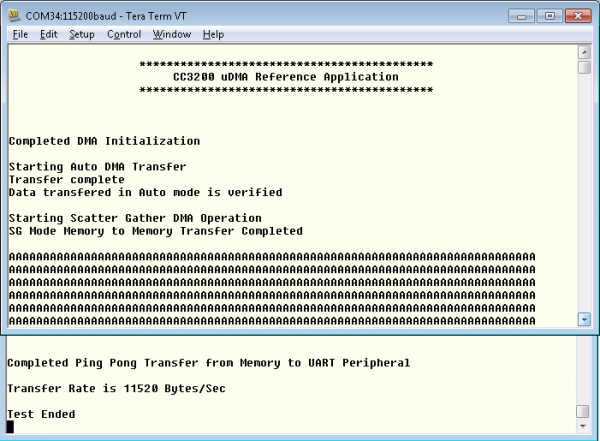

## Overview

The µDMA controller is a flexible and highly configurable DMA controller
designed to work efficiently with the microcontroller's Cortex-M4
processor core. It supports multiple data sizes and address increment
schemes, multiple levels of priority among DMA channels, and several
transfer modes to allow for sophisticated programmed data transfers.

Different transfer modes supported are:

1.  **Basic mode**: In Basic mode, the µDMA controller performs
    transfers as long as there are more items to transfer,and a transfer
    request is present. This mode is used with peripherals that assert a
    µDMA request signal whenever the peripheral is ready for a data
    transfer.
2.  **Auto Mode**: Auto mode is similar to Basic mode, except that once
    a transfer request is received, the transfer runs to completion,
    even if the µDMA request is removed. This mode is suitable for
    software-triggered transfers. Generally, Auto mode is not used with
    a peripheral.
3.  **Ping-pong Mode**: Ping-Pong mode is used to support a continuous
    data flow to or from a peripheral. To use Ping-Pong mode, both the
    primary and alternate data structures must be implemented. Both
    structures are set up by the processor for data transfer between
    memory and a peripheral. The transfer is started using the primary
    control structure. When the transfer using the primary control
    structure is complete,the µDMA controller reads the alternate
    control structure for that channel to continue the transfer.Each
    time this happens, an interrupt is generated, and the processor can
    reload the control structure for the just-completed transfer.
4.  **Scatter-gather Mode**: Memory Scatter-Gather mode is a complex
    mode used when data must be transferred to or from varied locations
    in memory instead of a set of contiguous locations in a memory
    buffer.

## Application details

This application demonstrates the use of the uDMA controller to transfer data
between memory buffers using Auto Mode and Scatter Gather Mode, and to
transfer data to and from UART using Ping Pong Mode. In Auto and Scatter
Gather mode, the data transfer is verified once the transfer
is complete. In Ping Pong mode, the transfer rate is calculated and
displayed.

### Source Files briefly explained

- **pinmux.c** - Pinmux configurations as required by the application.
- **main.c** - Main file that showcases different DMA modes of Transfer
- **uart\_if.c** - To display status information over the UART
- **udma\_if.c** - Initialize and Setup the uDMA controller

## Usage

1.  Setup a serial communication application. Open a serial terminal on a PC with the following settings:
	- **Port: ** Enumerated COM port
	- **Baud rate: ** 115200
	- **Data: ** 8 bit
	- **Parity: ** None
	- **Stop: ** 1 bit
	- **Flow control: ** None
2.  Run the reference application.
      - Open the project in CCS/IAR. Build the application and debug to load to the device, or flash the binary using [UniFlash](http://processors.wiki.ti.com/index.php/CC3100_%26_CC3200_UniFlash_Quick_Start_Guide).

## Limitations/Known Issues

