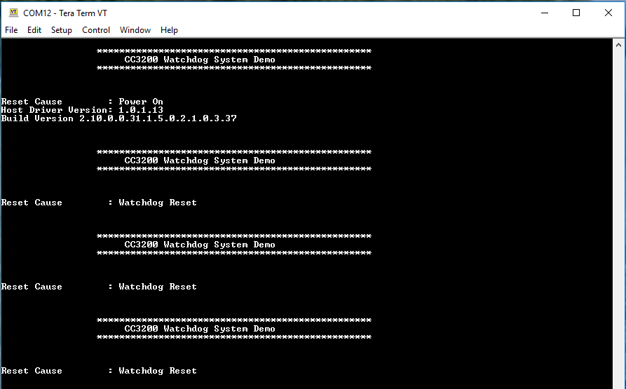

## Overview

A watchdog timer generates an interrupt or a reset when a time-out value
is reached. The watchdog timer is used to regain control when a system
has failed due to a software error or due to the failure of an external
device to respond in the expected way.

## Application details

This application showcases the usage of the Watchdog Timer (WDT) in a
complete system with the application MCU and networking subsystem. The objective of this
application is to showcase the watchdog timer functionality to recover
the full system, including the network subsystem whenever the system
fails. Here, the watchdog is not acknowledged after sending 20 UDP
packets, which essentially simulates the condition of system failure.

On exit from watchdog reset, the system immediately requests to hibernate
for a short duration, and resumes its full functionality only after
returning from hibernate mode. This ensures recovery from any complex
stalled scenario that involves the networking subsystem.

## Source Files briefly explained

1.  **main.c** - Main file that showcases the watchdog functionality with
    LED blinking for 10 times and then remain in ON state.
2.  **pinmux.c** - Pinmux configurations as required by the application.
3.  **uart\_if.c** - Common UART interface APIs
4.  **udma\_if.c** - Common uDMA interface APIs
5.  **wdt\_if.c** - Common watchdog interface APIs

## Usage

1.  Setup a serial communication application. Open a serial terminal on a PC with the following settings:
	- **Port: ** Enumerated COM port
	- **Baud rate: ** 115200
	- **Data: ** 8 bit
	- **Parity: ** None
	- **Stop: ** 1 bit
	- **Flow control: ** None
2. Edit **common.h** and modify the values of the below macros for the device to connect to the AP:
```c
	#define SSID_NAME           "<ap_name>"    		/* AP SSID */
	#define SECURITY_TYPE       SL_SEC_TYPE_OPEN 	/* Security type (OPEN or WEP or WPA*/
	#define SECURITY_KEY        ""              	/* Password of the secured AP */
```	  
3.  Run the reference application.
      - Open the project in CCS/IAR. Build the application and flash the binary using [UniFlash](http://processors.wiki.ti.com/index.php/CC3100_%26_CC3200_UniFlash_Quick_Start_Guide).
      
	

## Limitations/Known Issues

For details on the correct watchdog recovery sequence, refer to the [CC3200 Technical Reference Manual](http://www.ti.com/lit/swru367)
	