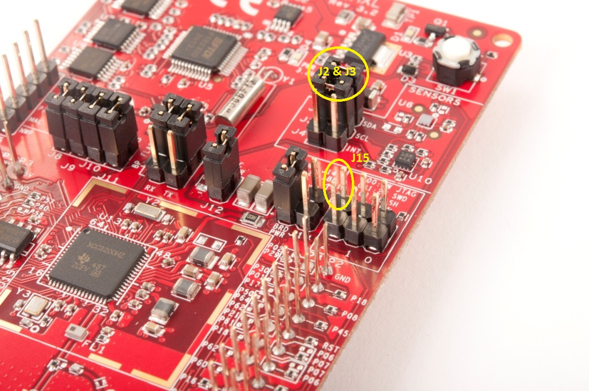
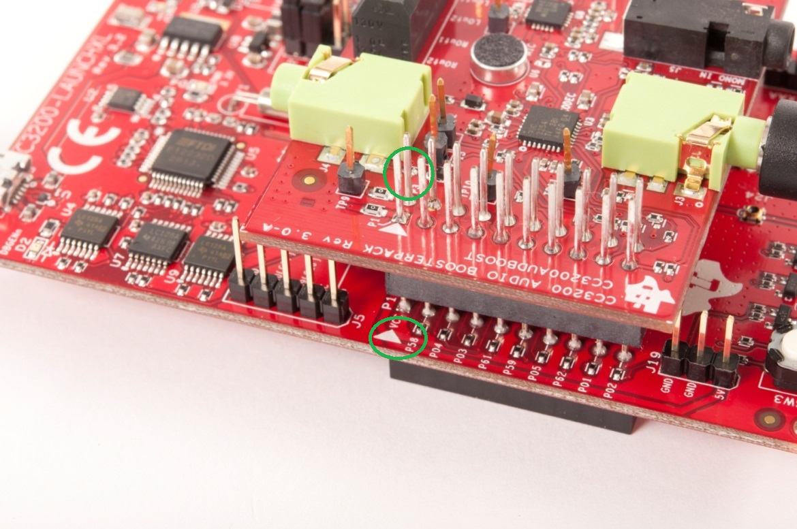
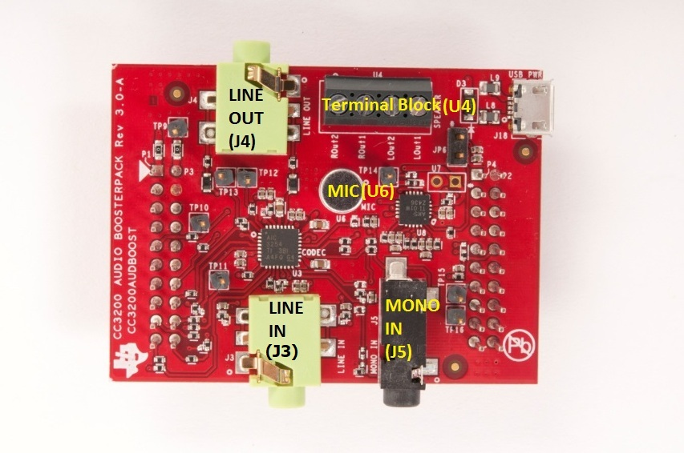
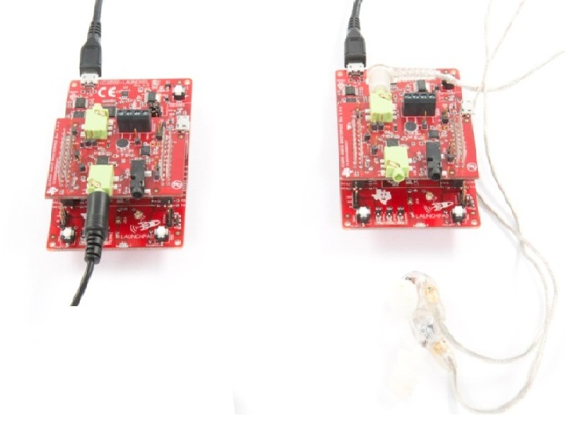

## Objective

This example demonstrates bi-directional audio Streaming and playback
on the CC3200 LaunchPad and Audio BoosterPack. The setup is composed of two LaunchPads in Station mode on the same AP network acting as both audio source and sink. The source gets audio input from the audio BoosterPack's onboard MIC, MIC IN, or LineIn input. Audio is transmitted
over Wi-Fi from source to sink. The second Launchpad receives and plays the audio data on Line Out of the audio BoosterPack.

By default, the application runs in loopback mode until a connection is established between the two LaunchPads.

## Prerequisites

### Hardware

1.  2x CC3200-LAUNCHXL
2.  2x [CC3200AUDBOOST](http://www.ti.com/tool/CC3200AUDBOOST)
3.  2x Headphones/Speakers
4.  2x Audio Sources
5.  Android/iOS Device (for provisioning)

### System Configuration

1. Jumpers J2 and J3 should be Mounted as shown in below picture:

	

2. Mount the Audio Codec BoosterPack onto the CC3200 LaunchPa' as shown below. Ensure J1 and J2 of the BoosterPack are aligned with P1-P3 and P4-P2 of the CC3200 LaunchPad  

	 

3. The different connectors on the Audio Booster Pack are detailed below for the bi-directional audio player:
	- Option 1:	
		- Connect headphone or speaker on J4 of 'Audio Codec Booster Pack'  
		- J3 on Audio Codec BP can be used for LINE -IN
	- Option 2:
		- Onboard MIC (U6) or Mono-Jack (J5) of 'Audio Codec Booster Pack' can be used for MIC-IN and U4
		- U5 can be used to connect speakers(Left & Right).

	

## Usage

1.  Setup a serial communication application. Open a serial terminal on a PC with the following settings:
	- **Port: ** Enumerated COM port
	- **Baud rate: ** 115200
	- **Data: ** 8 bit
	- **Parity: ** None
	- **Stop: ** 1 bit
	- **Flow control: ** None
2.  Run the reference application.
      - Open the project in CCS/IAR. Build the application and debug to load to the device, or flash the binary using [UniFlash](http://processors.wiki.ti.com/index.php/CC3100_%26_CC3200_UniFlash_Quick_Start_Guide).
3. The devices will try to connect to a saved AP profile. In
    case there is none or the device is not able to connect to any of
    the the saved profiles, use SmartConfig to provision both LaunchPads at the same time. See the Provisioning SmartConfig example for instructions.
4.  By default the application will start in Loopback mode (Mic-in to Audio-out) while actively scanning for a similar device. In Audio Streaming mode, the following switches on the LaunchPad start microphone and speaker on/off actions.
	- SW3: Microphone
	- SW2: Speaker
5. Ensure Line-IN and Line-OUT points are connected on the LaunchPads. Upon successful connection to AP, press SW2 on LaunchPad 1. The Red LED will switch off on LaunchPad 1.
6. Once LaunchPad 1 connects to LaunchPad 2, the red LED on LaunchPad 2 will switch off.
7. Press SW2 on LaunchPad 2 and SW3 on LaunchPad 1. The red LED will switch on LaunchPad 2.

## Limitations/Known Issues
