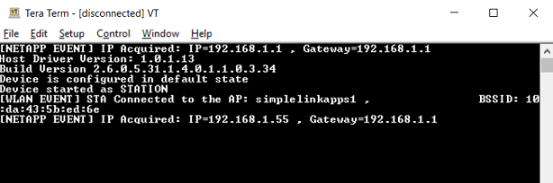
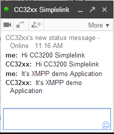

## Overview

This example code demonstrate how to connect and work with Extensible
Messaging and Presence Protocol(XMPP) server using CC32xx. Note this code
only implements a limited XMPP software library.

## Application details

### Program Flow

- Initialize the device networking layer
- Connect to Access Point with network credentials 
- Wait for the connection to the AP
- Once AP connection is done, configure the XMPP Server and logi information
- Connects to configured XMPP Server (google.com) and authenticates using the base64 encrypted login credential
- Once authentication is successful, wait for a chat message from another client
- Once a chat message is received, replies back with the same message

  
Use your own Email ID (`CLIENT_USER_NAME`) and password (`CLIENT_PASSWORD`) for this example.

## Source Files briefly explained

- **main.c** - Simple Application demonstrating XMPP Client
Functionalities.
- **netapps\\xmpp\\client** - libxmpp is Platform Independent Library
and can be Integrated to any XMPP Client Software using below APIs
	1.  sl\_NetAppXmppSet - Configure XMPP Server, Login Information
	2.  sl\_NetAppXmppConnect- Connect to XMPP Server
	3.  sl\_NetAppXmppSend - Send Chat Message to another XMPP Client
	1.  sl\_NetAppXmppRecv - Receive Chat Message from another XMPP Client

## Usage

1.  Setup a serial communication application. Open a serial terminal on a PC with the following settings:
	- **Port: ** Enumerated COM port
	- **Baud rate: ** 115200
	- **Data: ** 8 bit
	- **Parity: ** None
	- **Stop: ** 1 bit
	- **Flow control: ** None
2. Edit **common.h** and modify the values of the below macros for the device to connect to the AP:
```c
	#define SSID_NAME           "<ap_name>"    		/* AP SSID */
	#define SECURITY_TYPE       SL_SEC_TYPE_OPEN 	/* Security type (OPEN or WEP or WPA*/
	#define SECURITY_KEY        ""              	/* Password of the secured AP */
```
3. You will need two Gmail accounts for this example. Set the email username and password for one account in main.c. In this readme, we'll refer to this account as as cc32xx_example@gmail.com. This is the account the CC3200 will use as a XMPP client.
```c
	#define CLIENT_USER_NAME    "cc32xx_example"
	#define CLIENT_PASSWORD     "xxxxxx"
	#define	XMPP_DOMAIN_NAME	"gmail.com"
```
4. Login to a secondary Gmail account. In this readme, we'll refer to the second Gmail account as user_example@gmail.com. Add the first Gmail account (cc32xx_example@gmail.com) to the Contacts list.
5.  Login into the first Gmail account (cc32xx_example@gmail.com) and accept the Contacts request.
6.  From the cc32xx_example@gmail.com account, invite user_example@gmail.com to Google Hangouts.
7.  While logged into cc32xx_example@gmail.com, navigate to https://myaccount.google.com/lesssecureapps and ensure that **Allow less secure apps** is set to **ON**.
8. In the security settings, ensure two-factor authentication is turned **off**.
9. Logout from the cc32xx_example@gmail.com account.
10. Run the application.
	- Open the project in CCS/IAR. Build the application and debug to load to the device, or flash the binary using [UniFlash](http://processors.wiki.ti.com/index.php/CC3100_%26_CC3200_UniFlash_Quick_Start_Guide).
11. Wait for the CC3200 to connect to your AP and XMPP server. The red LED will turn on when the CC3200 connects to the AP. The serial terminal will display an error if the connection to the XMPP server was unsuccessful. 
	
	
12.  Log onto your user_example@gmail.com account and send a Google Hangouts message to cc32xx_example@gmail.com. The CC3200 will receive the message, and echo it back to you. The orange LED will turn on when the CC3200 receives a chat message.
    

## Limitations/Known Issues

- Does not support retrieving the full friend roster
- Does not support checking the remote friend status (online/offline) before sending a message.